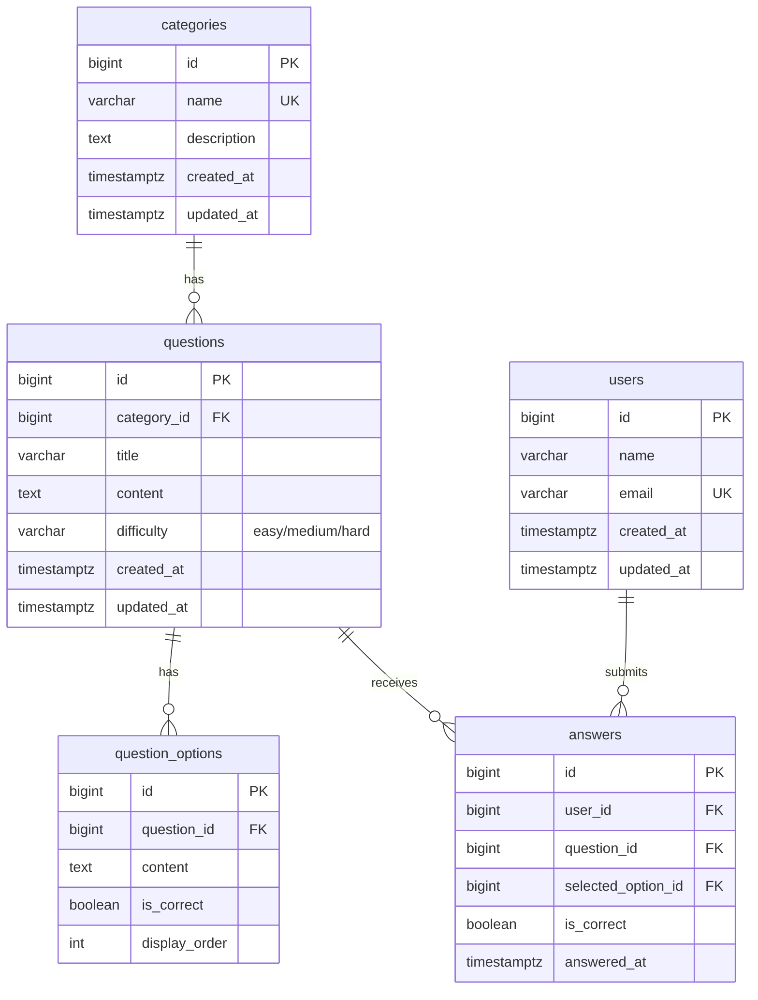
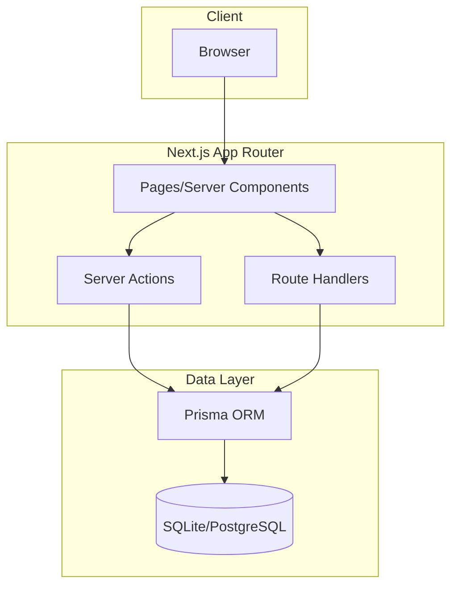
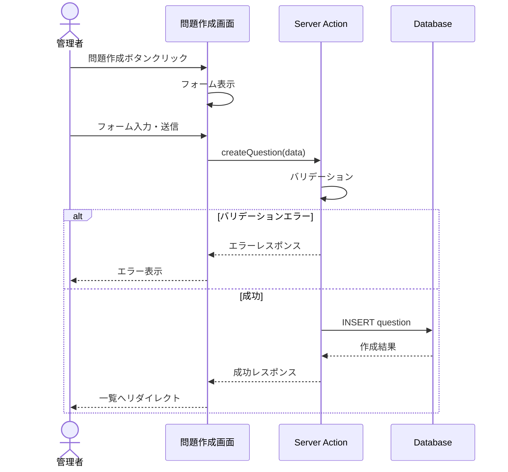
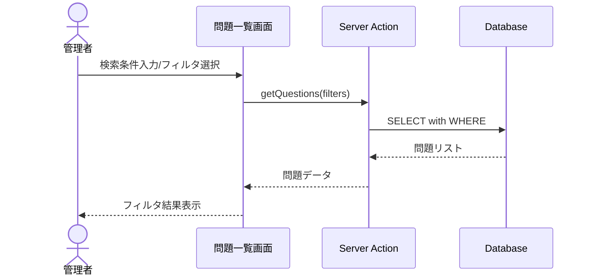
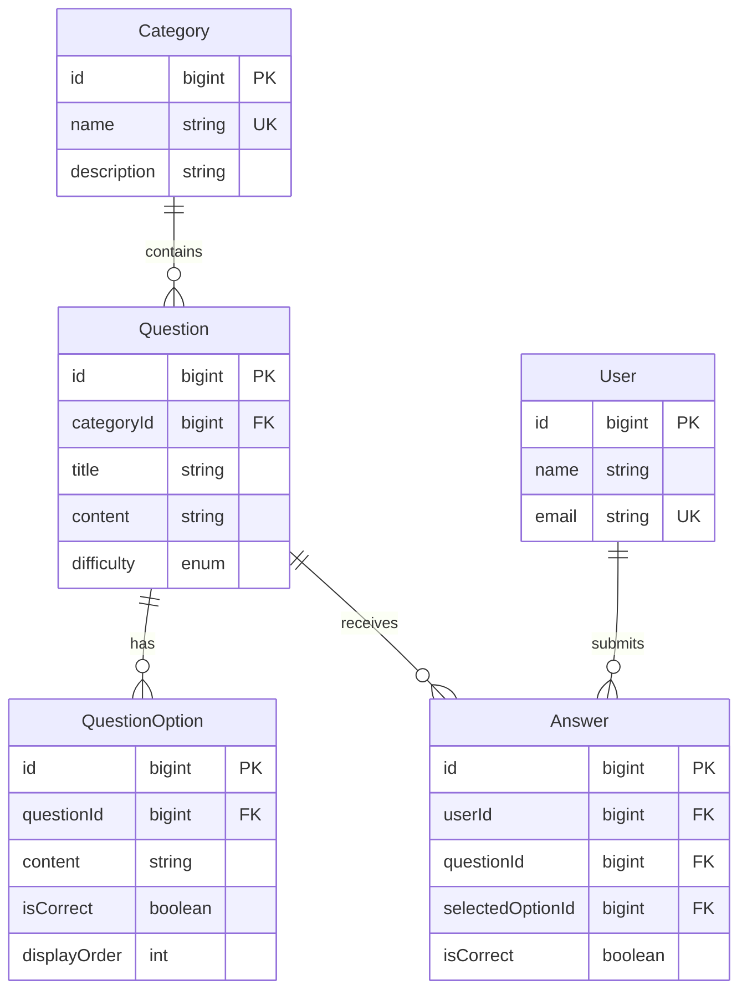

# 初めに
いや〜今年も終わりましたね〜
みなさん今年はどんな年になりましたか？
私はCursorが好きなので、Cursorの情報ばかり追いかけた1年になりました…これからもどんどん進化していくと楽しみでもあり、恐ろしいですね〜
さて話は変わりますがkiroというエディタをご存知ですか？仕様書駆動開発の先駆者とも言えるエディタです。kiroがベータ版でリリースされた時には、「Claudeでkiroの仕様書駆動開発を実現」というような記事も散見されました。その時はなにも思わなかったのですが、Cursorの進化がすごくうまく使いこなせれば、数ページのアプリならすぐに完成してしまいます。ですが自分で確認する（レビュー）時にかなり大変な思いをしました。もう少し分けてくれれば良いのに、kiroみたいにTODOを一覧に出してくれれば対応箇所も差分わかりやすいのにと思っていました。そんな時にcc-sddと出会いました。
https://github.com/gotalab/cc-sdd/tree/main
これは良いぞ！
でももう少し欲しいものがある。要件を決めた時に、テーブル定義やER図、とかも欲しいな〜コードを作成したらテスト作成して欲しいな〜
そうだ、好きなようにアップデートしたら良いんだと思いつきました。現状はまだ単体テストを書かせるルールは組み込んでいませんがそれはv2に取っておきます（言いたいだけ）ということで、CursorがVScodeをフォークしたように、私もcc-sddをフォークして、cursor-ssd-packageを作成しました〜👏👏

# 注意書き
:::message alert
codexやclaudeでの動作確認はしておりません。（アカウントを持っていないので）
このcursor-ssd-packageでは完全に自動でコード生成されるものではありません。
:::
例えば設計後にNext.jsをインストールするとします。その場合、さまざまなパッケージも一緒にインストールしますよね？（biomeとか）しかしそれをAIでやる必要があるかなと私は思っています。おそらく今までのキャリアの中で、自分がよく使うフレームワークや言語のインストールを何度かしており、インストールするだけならAIは不要という方の方が多いと思います。また個人プラン20$プランの方は特にそうだと思いますが、AIエディタを使用していく中でトークンは可能な限り減らしたいと思います。そこで、以前見かけた下記の記事を思い出しました。
https://note.com/shin_suge/n/n40a8d9de1656
こちらの記事の「余白」とは意味合いが異なりますが、手動実行という余白をあえて作りトークン消費量を減らそうとする目的もあります。

それでは改めて本日は今時点での中身と、追加したコマンドやテーブル定義のレベル感をお伝えできればと思いますので、お付き合いください！

# cursor-ssd-package
https://github.com/omegamaster86/cursor-sdd-package
いよ！初のOSS活動であるcursor-ssd-packageです！（名前が微妙なので、良いネーミングセンスある方、改名案募集しています）
まずは`npx cursor-sdd@latest`でインストールしてください。
現在のところ下記のコマンドを使用できます
| コマンド | 説明 |
|---------|------|
| `/init` | プロジェクト仕様の初期化 |
| `/requirements` | 要件定義書の生成 |
| `/requirements-import` | 既存要件のインポート |
| `/design` | 技術設計書の作成 |
| `/check-design` | 設計書の検証 |
| `/tasks` | タスクの生成 |
| `/impl` | 実装の開始 |
| `/status` | 進捗確認 |
| `/difference-check` | 差分チェック |

もう少し詳細に見ていくと
### /init - プロジェクト仕様の初期化
いつ: プロジェクト開始時、最初に1回だけ実行
結果: .sdd/specs/init.json が生成され、プロジェクトの基本情報（名前、説明、技術スタック等）が定義される。以降のすべてのコマンドはこの設定を参照する。
### /requirements - 要件定義書の生成
いつ: /init 完了後、機能の実装前
結果: .sdd/specs/requirements.md が生成される。ユーザーストーリー、機能要件、非機能要件がEARS形式で構造化され、曖昧さのない要件定義が完成する。
### /requirements-import - 既存要件のインポート
いつ: 既に要件定義書やPRDが存在する場合
結果: 既存ドキュメントをrequirements.mdに記載後に実行することで、既存の要件に沿って必要な設計をしてくれます。
### /design - 技術設計書の作成
いつ: 要件定義完了後、実装開始前
結果: .sdd/specs/design.md が生成される。アーキテクチャ、コンポーネント構成、API設計、データモデルなど技術的な設計が文書化される。
### /check-design - 設計書の検証
いつ: /design 完了後、実装開始前
結果: 設計書の整合性・完全性をチェック。要件との紐付け漏れ、矛盾点、未定義の依存関係などが検出・報告される。
### /tasks - タスクの生成
いつ: 設計書の検証完了後
結果: .sdd/specs/tasks.md が生成される。設計書から実装タスクが自動分解され、依存関係と優先度が整理される。そのまま実装に着手できる粒度になる。
### /impl - 実装の開始
いつ: タスク生成後、各タスクの実装時
結果: 選択したタスクに基づいてコード実装が開始される。設計書・タスク定義を参照しながら、仕様に沿った実装が行われる。
### /status - 進捗確認
いつ: 実装中いつでも
結果: 現在のタスク進捗状況が表示される。完了タスク、進行中タスク、残タスクが一覧化され、プロジェクト全体の進捗が把握できる。
### /difference-check - 差分チェック
いつ: 実装完了後、または定期的なレビュー時
結果: 設計書と実際の実装コードの差分を検出。仕様からの乖離や実装漏れが報告され、ドキュメントと実装の同期が保たれる。

各コマンドの実行の順番はこんな感じです
```:
/init → /requirements → /design → /tasks → /impl
                ↑                    ↓
            /status ←←←←←←←←←←←←←←←
```
:::message
ここで覚えなくても、コマンド実行後にチャットで次に実行するコマンドを教えてくれるので、大丈夫です！
:::

早速どんなふうに動作するのか見ていきましょう〜
ここからは編集せずに一発生成で作成されたコードを記載していきます。（手修正は加えません）今後の伸び代を込めて

# 動作画面
チャット欄でカスタムコマンドの/initを呼び出し、何を作成したいか記載します。

実行後のチャット欄

spec.jsonは一部抜粋ですが下記のように記載されており、今どんな段階なんだっけ？が一目でわかるようになっています。後ほど出てきますが、`-y`をつけると承認済みとなります。なくてもコマンドを入力するだけでも大丈夫です。
```:spec.json
  "project_summary": "問題演習用の管理画面",
  "created_at": "2024/12/23",
  "updated_at": "2024/12/23",
  "language": "ja",
  "phase": "initialized",
  "approvals": {
    "requirements": {
      "generated": false,
      "approved": false
    },
    "design": {
      "generated": false,
      "approved": false
    },
    "tasks": {
      "generated": false,
      "approved": false
    }
  },
```
今の段階では何も記載されていませんが、もしPJに途中アサインし、要件が決まっている場合は要件を記載 or 読み込ませてください。
```:requirements.md
# 要件ドキュメント

## プロジェクト説明（入力）
問題演習用の管理画面

## 要件
<!-- /requirements フェーズで生成 -->
<!-- もし既存PJにアサインされる場合、ここに記載してください-->

---

## 変更履歴

| 日付 | バージョン | 変更者 | 変更内容 |
| ---- | ---------- | ------ | -------- |
| 2024/12/23 | v1.0 | - | 初版作成 |

```
少しでも要件が決まっていれば、`/requirements`配下に何をしたいか記載してください。
```
/requirements
問題作成、編集、削除は可能にして
問題を解くユーザーを登録、編集、削除できるようにして
```
そうすると何やら要件を作成し始めました。
::::details requirements.md
```
# 要件ドキュメント

## はじめに
問題演習用の管理画面を提供するシステム。管理者が問題の作成・編集・削除を行い、問題を解くユーザー（学習者）のアカウント管理も行える。

## 要件

### 要件 1: 問題管理
**目的:** 管理者として、問題の作成・編集・削除を行いたい。それにより学習者に提供する問題コンテンツを柔軟に管理できる。

#### 受け入れ基準
1. When 管理者が問題作成ボタンをクリック, the 管理画面 shall 問題作成フォームを表示する
2. When 管理者が問題作成フォームを送信, the システム shall 新しい問題をデータベースに保存する
3. When 管理者が問題一覧から問題を選択, the 管理画面 shall 問題詳細・編集画面を表示する
4. When 管理者が問題編集フォームを送信, the システム shall 問題情報を更新する
5. When 管理者が問題削除ボタンをクリック, the システム shall 確認ダイアログを表示する
6. When 管理者が削除を確認, the システム shall 問題をデータベースから削除する
7. If 必須項目が未入力, then the システム shall バリデーションエラーを表示する

### 要件 2: ユーザー管理
**目的:** 管理者として、問題を解くユーザー（学習者）の登録・編集・削除を行いたい。それにより学習者のアカウントを適切に管理できる。

#### 受け入れ基準
1. When 管理者がユーザー登録ボタンをクリック, the 管理画面 shall ユーザー登録フォームを表示する
2. When 管理者がユーザー登録フォームを送信, the システム shall 新しいユーザーをデータベースに保存する
3. When 管理者がユーザー一覧からユーザーを選択, the 管理画面 shall ユーザー詳細・編集画面を表示する
4. When 管理者がユーザー編集フォームを送信, the システム shall ユーザー情報を更新する
5. When 管理者がユーザー削除ボタンをクリック, the システム shall 確認ダイアログを表示する
6. When 管理者が削除を確認, the システム shall ユーザーをデータベースから削除する
7. If メールアドレスが重複, then the システム shall 重複エラーを表示する
8. If 必須項目が未入力, then the システム shall バリデーションエラーを表示する

### 要件 3: 問題一覧表示
**目的:** 管理者として、登録済みの問題を一覧で確認したい。それにより問題の全体像を把握し効率的に管理できる。

#### 受け入れ基準
1. When 管理者が問題管理メニューを選択, the 管理画面 shall 問題一覧を表示する
2. The 問題一覧 shall 問題ID・タイトル・作成日時・更新日時を表示する
3. Where ページネーションが有効, the システム shall 1ページあたり指定件数で表示する

### 要件 4: ユーザー一覧表示
**目的:** 管理者として、登録済みのユーザーを一覧で確認したい。それによりユーザーの全体像を把握し効率的に管理できる。

#### 受け入れ基準
1. When 管理者がユーザー管理メニューを選択, the 管理画面 shall ユーザー一覧を表示する
2. The ユーザー一覧 shall ユーザーID・名前・メールアドレス・登録日時を表示する
3. Where ページネーションが有効, the システム shall 1ページあたり指定件数で表示する

---

## 変更履歴

| 日付 | バージョン | 変更者 | 変更内容 |
| ---- | ---------- | ------ | -------- |
| 2024/12/23 | v1.0 | - | 初版作成 |
| 2024/12/23 | v1.1 | - | 要件定義（問題管理・ユーザー管理）を追加 |

```
::::
変更者項目が更新されていませんね…伸び代です。
チームで使用するには必須の項目なので、今後修正していきましょう。
なんか良い感じの追加要件がきたので、それを追加していきましょう。

::::details requirements.md（追加要件実装後）
```
# 要件ドキュメント

## はじめに
問題演習用の管理画面を提供するシステム。管理者が問題の作成・編集・削除を行い、問題を解くユーザー（学習者）のアカウント管理も行える。問題にはカテゴリと難易度を設定でき、検索・フィルタ機能で効率的に管理できる。

## 要件

### 要件 1: 問題管理
**目的:** 管理者として、問題の作成・編集・削除を行いたい。それにより学習者に提供する問題コンテンツを柔軟に管理できる。

#### 受け入れ基準
1. When 管理者が問題作成ボタンをクリック, the 管理画面 shall 問題作成フォームを表示する
2. When 管理者が問題作成フォームを送信, the システム shall 新しい問題をデータベースに保存する
3. When 管理者が問題一覧から問題を選択, the 管理画面 shall 問題詳細・編集画面を表示する
4. When 管理者が問題編集フォームを送信, the システム shall 問題情報を更新する
5. When 管理者が問題削除ボタンをクリック, the システム shall 確認ダイアログを表示する
6. When 管理者が削除を確認, the システム shall 問題をデータベースから削除する
7. If 必須項目が未入力, then the システム shall バリデーションエラーを表示する
8. The 問題作成・編集フォーム shall カテゴリ選択フィールドを含む
9. The 問題作成・編集フォーム shall 難易度選択フィールド（初級/中級/上級）を含む

### 要件 2: ユーザー管理
**目的:** 管理者として、問題を解くユーザー（学習者）の登録・編集・削除を行いたい。それにより学習者のアカウントを適切に管理できる。

#### 受け入れ基準
1. When 管理者がユーザー登録ボタンをクリック, the 管理画面 shall ユーザー登録フォームを表示する
2. When 管理者がユーザー登録フォームを送信, the システム shall 新しいユーザーをデータベースに保存する
3. When 管理者がユーザー一覧からユーザーを選択, the 管理画面 shall ユーザー詳細・編集画面を表示する
4. When 管理者がユーザー編集フォームを送信, the システム shall ユーザー情報を更新する
5. When 管理者がユーザー削除ボタンをクリック, the システム shall 確認ダイアログを表示する
6. When 管理者が削除を確認, the システム shall ユーザーをデータベースから削除する
7. If メールアドレスが重複, then the システム shall 重複エラーを表示する
8. If 必須項目が未入力, then the システム shall バリデーションエラーを表示する

### 要件 3: 問題一覧表示
**目的:** 管理者として、登録済みの問題を一覧で確認したい。それにより問題の全体像を把握し効率的に管理できる。

#### 受け入れ基準
1. When 管理者が問題管理メニューを選択, the 管理画面 shall 問題一覧を表示する
2. The 問題一覧 shall 問題ID・タイトル・カテゴリ・難易度・作成日時・更新日時を表示する
3. Where ページネーションが有効, the システム shall 1ページあたり指定件数で表示する

### 要件 4: ユーザー一覧表示
**目的:** 管理者として、登録済みのユーザーを一覧で確認したい。それによりユーザーの全体像を把握し効率的に管理できる。

#### 受け入れ基準
1. When 管理者がユーザー管理メニューを選択, the 管理画面 shall ユーザー一覧を表示する
2. The ユーザー一覧 shall ユーザーID・名前・メールアドレス・登録日時を表示する
3. Where ページネーションが有効, the システム shall 1ページあたり指定件数で表示する

### 要件 5: カテゴリ管理
**目的:** 管理者として、問題のカテゴリを管理したい。それにより問題を体系的に分類できる。

#### 受け入れ基準
1. When 管理者がカテゴリ管理メニューを選択, the 管理画面 shall カテゴリ一覧を表示する
2. When 管理者がカテゴリ作成ボタンをクリック, the 管理画面 shall カテゴリ作成フォームを表示する
3. When 管理者がカテゴリ作成フォームを送信, the システム shall 新しいカテゴリをデータベースに保存する
4. When 管理者がカテゴリ編集ボタンをクリック, the 管理画面 shall カテゴリ編集フォームを表示する
5. When 管理者がカテゴリ削除ボタンをクリック, the システム shall 確認ダイアログを表示する
6. If カテゴリに紐づく問題が存在, then the システム shall 削除不可のエラーを表示する

### 要件 6: 問題検索・フィルタ
**目的:** 管理者として、問題をキーワード検索やカテゴリ・難易度でフィルタしたい。それにより目的の問題を素早く見つけられる。

#### 受け入れ基準
1. When 管理者がキーワードを入力して検索, the システム shall タイトル・本文に一致する問題を表示する
2. When 管理者がカテゴリフィルタを選択, the システム shall 選択カテゴリに属する問題のみを表示する
3. When 管理者が難易度フィルタを選択, the システム shall 選択難易度の問題のみを表示する
4. When 管理者が複数フィルタを組み合わせ, the システム shall すべての条件に一致する問題を表示する
5. When 管理者がフィルタをクリア, the システム shall すべての問題を表示する

---

## 変更履歴

| 日付 | バージョン | 変更者 | 変更内容 |
| ---- | ---------- | ------ | -------- |
| 2024/12/23 | v1.0 | - | 初版作成 |
| 2024/12/23 | v1.1 | - | 要件定義（問題管理・ユーザー管理）を追加 |
| 2024/12/23 | v1.2 | - | カテゴリ・難易度・検索フィルタ要件を追加 |

```
::::
さて良い感じにできたので、`/design -y`（-y はオプショナル)で次にいきましょう
実際に作成されたテーブル定義や設計を確認していきましょう

table-definition.mdと似たようなこと書いているんだから一緒でも良いのではと思いますが、下記のように対象者を分けているので、一応分けています。
ここは是非みなさんの意見を聞いて見たいです！
| 観点 | data-model.md | table-definition.md |
|------|---------------|---------------------|
| 抽象度 | 概念レベル（ドメインモデル） | 物理レベル（DB実装） |
| 対象者 | PO/設計者/開発者 | 開発者/DBA |
| 変更頻度 | 要件変更時 | DB設計変更時 |


::::details data-model.md
# データモデル / ERD（demo）

**目的**: 実装/レビュー/運用が同じ参照を見られるように、ドメイン境界とテーブル関係を Mermaid で固定する。
**作成/更新タイミング**: `/design` の前半（MVPの主要エンティティが見えたら）。

---

## ER 図



---

## テーブル間の関係性

### 外部キー制約一覧

| FK 制約名 | 参照元テーブル | 参照元カラム | 参照先テーブル | 参照先カラム | ON DELETE | ON UPDATE | 説明 |
| -------- | -------------- | ------------ | -------------- | ------------ | -------- | -------- | ---- |
| fk_questions_category | questions | category_id | categories | id | RESTRICT | CASCADE | カテゴリ削除を制限 |
| fk_question_options_question | question_options | question_id | questions | id | CASCADE | CASCADE | 問題削除時に選択肢も削除 |
| fk_answers_user | answers | user_id | users | id | CASCADE | CASCADE | ユーザー削除時に回答も削除 |
| fk_answers_question | answers | question_id | questions | id | CASCADE | CASCADE | 問題削除時に回答も削除 |
| fk_answers_option | answers | selected_option_id | question_options | id | SET NULL | CASCADE | 選択肢削除時はNULL |

### テーブル間の依存関係

- **categories → questions**: 1対多。カテゴリに問題が紐づいている場合、カテゴリ削除不可（要件5.6）
- **questions → question_options**: 1対多。問題削除時は選択肢もカスケード削除
- **users → answers**: 1対多。ユーザー削除時は回答履歴もカスケード削除
- **questions → answers**: 1対多。問題削除時は回答履歴もカスケード削除

### データ整合性ルール

1. **categories**: 問題が存在する限り削除不可（RESTRICT）
2. **questions**: カテゴリ必須、難易度は enum 制約
3. **users**: email はユニーク制約
4. **difficulty**: 'easy', 'medium', 'hard' のいずれか

---

## 参照
- **テーブル定義書**: `table-definition.md`
- **機能一覧**: `feature-list.md`

---

## 変更履歴

| 日付 | バージョン | 変更者 | 変更内容 |
| ---- | ---------- | ------ | -------- |
| 2024-12-23 | v1.0 | - | 初版作成 |

::::

画面機能が無駄に多く、登録、編集は1画面画面で良い気がするので、実装時にどうなるか確認して見ましょうかね〜

::::details feature-list.md
# 機能一覧（cursor-sdd-demo）

**目的**: プロダクトのスコープ（MVP/Phase）と、UI/API/バッチの一覧を"合意の一次ソース"として固定する。
**作成/更新タイミング**: `/requirements` の直後（要件ドラフトが出たらまず作る）。

---

## 画面機能

| 機能 ID | 画面名 | 説明 | 優先度 | Phase | 記載者 |
| ------- | ------ | ---- | ------ | ----- | ------ |
| UI-001  | 問題一覧 | 登録済み問題を一覧表示。検索・フィルタ・ページネーションを提供。 | High | MVP | |
| UI-002  | 問題作成 | 新規問題を作成するフォーム画面。カテゴリ・難易度を選択可能。 | High | MVP | |
| UI-003  | 問題編集 | 既存問題を編集するフォーム画面。カテゴリ・難易度を変更可能。 | High | MVP | |
| UI-004  | ユーザー一覧 | 登録済みユーザー（学習者）を一覧表示。検索・ページネーションを提供。 | High | MVP | |
| UI-005  | ユーザー登録 | 新規ユーザーを登録するフォーム画面。 | High | MVP | |
| UI-006  | ユーザー編集 | 既存ユーザーを編集するフォーム画面。 | High | MVP | |
| UI-007  | カテゴリ一覧 | 問題カテゴリを一覧表示。作成・編集・削除を提供。 | High | MVP | |
| UI-008  | カテゴリ作成・編集 | カテゴリを作成・編集するフォーム（モーダル or インライン）。 | High | MVP | |

---

## API 機能

| 機能 ID | API 名 | エンドポイント | メソッド | 説明 | レベル | 実装方法 | 優先度 | Phase | 記載者 |
| ------- | ------ | -------------- | -------- | ---- | ------ | -------- | ------ | ----- | ------ |
| API-001 | 問題一覧取得 | /api/questions | GET | 問題一覧を取得する。検索・フィルタ・ページネーション対応。 | B | Server API | High | MVP | |
| API-002 | 問題詳細取得 | /api/questions/:id | GET | 指定IDの問題詳細を取得する。 | C | Server API | High | MVP | |
| API-003 | 問題作成 | /api/questions | POST | 新規問題を作成する。カテゴリ・難易度を含む。 | C | Server API | High | MVP | |
| API-004 | 問題更新 | /api/questions/:id | PUT | 指定IDの問題を更新する。 | C | Server API | High | MVP | |
| API-005 | 問題削除 | /api/questions/:id | DELETE | 指定IDの問題を削除する。 | C | Server API | High | MVP | |
| API-006 | ユーザー一覧取得 | /api/users | GET | ユーザー一覧を取得する。ページネーション対応。 | C | Server API | High | MVP | |
| API-007 | ユーザー詳細取得 | /api/users/:id | GET | 指定IDのユーザー詳細を取得する。 | C | Server API | High | MVP | |
| API-008 | ユーザー登録 | /api/users | POST | 新規ユーザーを登録する。 | C | Server API | High | MVP | |
| API-009 | ユーザー更新 | /api/users/:id | PUT | 指定IDのユーザーを更新する。 | C | Server API | High | MVP | |
| API-010 | ユーザー削除 | /api/users/:id | DELETE | 指定IDのユーザーを削除する。 | C | Server API | High | MVP | |
| API-011 | カテゴリ一覧取得 | /api/categories | GET | カテゴリ一覧を取得する。 | C | Server API | High | MVP | |
| API-012 | カテゴリ作成 | /api/categories | POST | 新規カテゴリを作成する。 | C | Server API | High | MVP | |
| API-013 | カテゴリ更新 | /api/categories/:id | PUT | 指定IDのカテゴリを更新する。 | C | Server API | High | MVP | |
| API-014 | カテゴリ削除 | /api/categories/:id | DELETE | 指定IDのカテゴリを削除する。紐づく問題があれば拒否。 | C | Server API | High | MVP | |

---

## バッチ機能

| 機能 ID | バッチ名 | 実行タイミング | 説明 | 優先度 | Phase | 記載者 |
| ------- | -------- | -------------- | ---- | ------ | ----- | ------ |
| （なし） | - | - | MVP段階ではバッチ機能なし | - | - | |

---

## 変更履歴

| 日付 | バージョン | 変更者 | 変更内容 |
| ---- | ---------- | ------ | -------- |
| 2024/12/23 | v1.0 | - | 初版作成 |
| 2024/12/23 | v1.1 | - | カテゴリ管理・検索フィルタ機能を追加 |

::::

これは是非見ておきたいですね〜どうしても外部キーに関してはER図が欲しくなってくるので、拡張機能でER図を確認することをお勧めします。これだけでは把握しづらいので（そこを改善しろと言いたい気持ちはわかります）
::::details table-definition.md
# テーブル定義書（demo）

**目的**: DBの"契約"を明文化し、実装・レビュー・移行でブレないようにする。
**作成/更新タイミング**: `/design` の中盤〜終盤（ERDのエンティティが固まったら）。

---

## テーブル一覧

| テーブル物理名 | テーブル論理名 | 概要 | 種別 |
| -------------- | -------------- | ---- | ---- |
| categories | カテゴリ | 問題のカテゴリマスタ | マスタ |
| questions | 問題 | 問題マスタ | マスタ |
| question_options | 問題選択肢 | 問題の選択肢 | トランザクション |
| users | ユーザー | 学習者情報 | マスタ |
| answers | 回答履歴 | ユーザーの回答記録 | トランザクション |

---

## 共通カラム定義

> ここはプロジェクト標準を定義して、各テーブルの繰り返しを減らす。

| カラム名 | 論理名 | 型 | 制約 | デフォルト値 | 説明 |
| ------ | ------ | -- | ---- | ---------- | ---- |
| id | ID | bigint | PK, AUTO_INCREMENT | | |
| created_at | 作成日時 | timestamptz | NOT NULL | CURRENT_TIMESTAMP | |
| updated_at | 更新日時 | timestamptz | NOT NULL | CURRENT_TIMESTAMP | |

---

## テーブル詳細定義

### カテゴリ（categories）

**概要**: 問題を分類するためのカテゴリマスタ

#### テーブル定義

| カラム名 | 論理名 | 型 | 制約 | デフォルト値 | 説明 |
| ------ | ------ | -- | ---- | ---------- | ---- |
| id | ID | bigint | PK, AUTO_INCREMENT | | |
| name | カテゴリ名 | varchar(100) | NOT NULL, UNIQUE | | |
| description | 説明 | text | NULL | | カテゴリの説明文 |
| created_at | 作成日時 | timestamptz | NOT NULL | CURRENT_TIMESTAMP | |
| updated_at | 更新日時 | timestamptz | NOT NULL | CURRENT_TIMESTAMP | |

**インデックス**

| インデックス名 | カラム | 種別 | 備考 |
| ------------ | ------ | ---- | ---- |
| idx_categories_name | name | UNIQUE | カテゴリ名検索用 |

---

### 問題（questions）

**概要**: 学習者に出題する問題マスタ

#### テーブル定義

| カラム名 | 論理名 | 型 | 制約 | デフォルト値 | 説明 |
| ------ | ------ | -- | ---- | ---------- | ---- |
| id | ID | bigint | PK, AUTO_INCREMENT | | |
| category_id | カテゴリID | bigint | FK, NOT NULL | | categories.id |
| title | タイトル | varchar(200) | NOT NULL | | 問題のタイトル |
| content | 本文 | text | NOT NULL | | 問題の本文 |
| difficulty | 難易度 | varchar(20) | NOT NULL | 'medium' | easy/medium/hard |
| created_at | 作成日時 | timestamptz | NOT NULL | CURRENT_TIMESTAMP | |
| updated_at | 更新日時 | timestamptz | NOT NULL | CURRENT_TIMESTAMP | |

**インデックス**

| インデックス名 | カラム | 種別 | 備考 |
| ------------ | ------ | ---- | ---- |
| idx_questions_category | category_id | INDEX | カテゴリ別検索用 |
| idx_questions_difficulty | difficulty | INDEX | 難易度別検索用 |
| idx_questions_title | title | INDEX | タイトル検索用 |

**外部キー制約**

| FK 名 | 参照元カラム | 参照先テーブル | 参照先カラム | ON DELETE | ON UPDATE |
| ----- | ---------- | -------------- | ------------ | -------- | -------- |
| fk_questions_category | category_id | categories | id | RESTRICT | CASCADE |

---

### 問題選択肢（question_options）

**概要**: 問題の選択肢（複数選択問題用）

#### テーブル定義

| カラム名 | 論理名 | 型 | 制約 | デフォルト値 | 説明 |
| ------ | ------ | -- | ---- | ---------- | ---- |
| id | ID | bigint | PK, AUTO_INCREMENT | | |
| question_id | 問題ID | bigint | FK, NOT NULL | | questions.id |
| content | 選択肢内容 | text | NOT NULL | | |
| is_correct | 正解フラグ | boolean | NOT NULL | false | |
| display_order | 表示順 | int | NOT NULL | 0 | |

**インデックス**

| インデックス名 | カラム | 種別 | 備考 |
| ------------ | ------ | ---- | ---- |
| idx_options_question | question_id | INDEX | 問題別選択肢取得用 |

**外部キー制約**

| FK 名 | 参照元カラム | 参照先テーブル | 参照先カラム | ON DELETE | ON UPDATE |
| ----- | ---------- | -------------- | ------------ | -------- | -------- |
| fk_options_question | question_id | questions | id | CASCADE | CASCADE |

---

### ユーザー（users）

**概要**: 問題を解く学習者の情報

#### テーブル定義

| カラム名 | 論理名 | 型 | 制約 | デフォルト値 | 説明 |
| ------ | ------ | -- | ---- | ---------- | ---- |
| id | ID | bigint | PK, AUTO_INCREMENT | | |
| name | 名前 | varchar(100) | NOT NULL | | |
| email | メールアドレス | varchar(255) | NOT NULL, UNIQUE | | |
| created_at | 作成日時 | timestamptz | NOT NULL | CURRENT_TIMESTAMP | |
| updated_at | 更新日時 | timestamptz | NOT NULL | CURRENT_TIMESTAMP | |

**インデックス**

| インデックス名 | カラム | 種別 | 備考 |
| ------------ | ------ | ---- | ---- |
| idx_users_email | email | UNIQUE | メールアドレス検索用 |
| idx_users_name | name | INDEX | 名前検索用 |

---

### 回答履歴（answers）

**概要**: ユーザーの回答履歴（将来の学習進捗機能用）

#### テーブル定義

| カラム名 | 論理名 | 型 | 制約 | デフォルト値 | 説明 |
| ------ | ------ | -- | ---- | ---------- | ---- |
| id | ID | bigint | PK, AUTO_INCREMENT | | |
| user_id | ユーザーID | bigint | FK, NOT NULL | | users.id |
| question_id | 問題ID | bigint | FK, NOT NULL | | questions.id |
| selected_option_id | 選択した選択肢ID | bigint | FK, NULL | | question_options.id |
| is_correct | 正解フラグ | boolean | NOT NULL | | |
| answered_at | 回答日時 | timestamptz | NOT NULL | CURRENT_TIMESTAMP | |

**インデックス**

| インデックス名 | カラム | 種別 | 備考 |
| ------------ | ------ | ---- | ---- |
| idx_answers_user | user_id | INDEX | ユーザー別回答取得用 |
| idx_answers_question | question_id | INDEX | 問題別回答取得用 |
| idx_answers_user_question | user_id, question_id | INDEX | ユーザー×問題の回答取得用 |

**外部キー制約**

| FK 名 | 参照元カラム | 参照先テーブル | 参照先カラム | ON DELETE | ON UPDATE |
| ----- | ---------- | -------------- | ------------ | -------- | -------- |
| fk_answers_user | user_id | users | id | CASCADE | CASCADE |
| fk_answers_question | question_id | questions | id | CASCADE | CASCADE |
| fk_answers_option | selected_option_id | question_options | id | SET NULL | CASCADE |

---

## 変更履歴

| 日付 | バージョン | 変更者 | 変更内容 |
| ---- | ---------- | ------ | -------- |
| 2024-12-23 | v1.0 | - | 初版作成 |

::::

正直型定義までここでするかは迷っていますが、正直サッと確認して、違和感がなければ次に進んでも良いと思います
::::details design.md
# 設計ドキュメント

---
**目的**: 実装者が異なる場合でも一貫した実装を保証するために、十分な詳細を提供し、解釈のズレを防ぐ。
---

## 概要

**目的**: 本システムは管理者に問題演習コンテンツの効率的な管理機能を提供する。問題の作成・編集・削除、カテゴリ・難易度による分類、学習者アカウントの管理を一元化することで、教育コンテンツの運用効率を向上させる。

**ユーザー**: 管理者が問題演習システムの管理画面でこれを利用する。

**成果物**:
- `.cursor/cursor-sdd-demo/artifacts/feature-list.md`
- `.cursor/cursor-sdd-demo/artifacts/data-model.md`
- `.cursor/cursor-sdd-demo/artifacts/table-definition.md`

### ゴール
- 問題のCRUD操作を直感的に行える管理画面
- カテゴリ・難易度による問題の体系的な分類
- 学習者アカウントの効率的な管理
- キーワード検索・フィルタによる問題の素早い検索

### 非ゴール
- 学習者向けの問題解答画面（本スコープは管理画面のみ）
- 学習進捗の詳細分析・レポート機能
- 管理者認証・権限管理（将来拡張）
- 問題のインポート/エクスポート機能

## アーキテクチャ

詳細な調査ノートは`research.md`を参照。

### アーキテクチャパターン＆境界マップ



**アーキテクチャ統合**:
- 選択パターン: Server Components + Server Actions（Next.js App Router標準）
- ドメイン/機能境界: 問題管理・ユーザー管理・カテゴリ管理の3ドメインに分離
- 維持する既存パターン: App Router、Tailwind CSS、TypeScript strict mode
- 新コンポーネントの理由: CRUD画面とServer Actionsが必要

### 技術スタック

| レイヤー | 選択 / バージョン | 機能での役割 | 備考 |
|---------|-----------------|-------------|------|
| フロントエンド | Next.js 16.1.1, React 19.2.3 | UI描画、ルーティング | 既存 |
| スタイリング | Tailwind CSS 4 | UIスタイリング | 既存 |
| バックエンド | Next.js Server Actions | データ操作API | 既存機能活用 |
| ORM | Prisma (追加推奨) | 型安全なDB操作 | 新規追加 |
| データベース | SQLite (開発) / PostgreSQL (本番) | データ永続化 | 新規追加 |
| リンター | Biome 2.2.0 | コード品質 | 既存 |

## システムフロー

### 問題作成フロー



### 問題検索・フィルタフロー



## 要件トレーサビリティ

| 要件 | 概要 | コンポーネント | インターフェース | フロー |
|------|------|--------------|----------------|--------|
| 1.1-1.9 | 問題管理CRUD | QuestionForm, QuestionList | questionActions | 問題作成フロー |
| 2.1-2.8 | ユーザー管理CRUD | UserForm, UserList | userActions | - |
| 3.1-3.3 | 問題一覧表示 | QuestionList | getQuestions | - |
| 4.1-4.3 | ユーザー一覧表示 | UserList | getUsers | - |
| 5.1-5.6 | カテゴリ管理 | CategoryForm, CategoryList | categoryActions | - |
| 6.1-6.5 | 問題検索・フィルタ | QuestionFilter | getQuestions | 検索フィルタフロー |

## コンポーネントとインターフェース

| コンポーネント | ドメイン/レイヤー | 意図 | 要件カバレッジ | 主要な依存関係 | 契約 |
|--------------|-----------------|------|--------------|---------------|------|
| QuestionList | UI/問題管理 | 問題一覧表示・検索・フィルタ | 1.3, 3.1-3.3, 6.1-6.5 | getQuestions (P0) | State |
| QuestionForm | UI/問題管理 | 問題作成・編集フォーム | 1.1-1.2, 1.4, 1.7-1.9 | categoryActions (P1) | State |
| UserList | UI/ユーザー管理 | ユーザー一覧表示 | 2.3, 4.1-4.3 | getUsers (P0) | State |
| UserForm | UI/ユーザー管理 | ユーザー登録・編集フォーム | 2.1-2.2, 2.4, 2.7-2.8 | - | State |
| CategoryList | UI/カテゴリ管理 | カテゴリ一覧表示・管理 | 5.1-5.6 | categoryActions (P0) | State |
| questionActions | Server/問題管理 | 問題CRUDロジック | 1.1-1.9 | Prisma (P0) | Service |
| userActions | Server/ユーザー管理 | ユーザーCRUDロジック | 2.1-2.8 | Prisma (P0) | Service |
| categoryActions | Server/カテゴリ管理 | カテゴリCRUDロジック | 5.1-5.6 | Prisma (P0) | Service |

### Server / 問題管理

#### questionActions

| フィールド | 詳細 |
|----------|------|
| 意図 | 問題のCRUD操作を提供 |
| 要件 | 1.1-1.9, 3.1-3.3, 6.1-6.5 |

**責任と制約**
- 問題の作成・取得・更新・削除
- カテゴリ・難易度によるフィルタリング
- キーワード検索（タイトル・本文）

**依存関係**
- アウトバウンド: Prisma Client — DB操作 (P0)

**契約**: Service [x]

##### サービスインターフェース

```typescript
// 難易度の型定義
type Difficulty = 'easy' | 'medium' | 'hard';

// 問題フィルタ条件
interface QuestionFilter {
  keyword?: string;
  categoryId?: number;
  difficulty?: Difficulty;
  page?: number;
  pageSize?: number;
}

// 問題作成入力
interface CreateQuestionInput {
  title: string;
  content: string;
  categoryId: number;
  difficulty: Difficulty;
  options?: Array<{
    content: string;
    isCorrect: boolean;
    displayOrder: number;
  }>;
}

// 問題更新入力
interface UpdateQuestionInput {
  title?: string;
  content?: string;
  categoryId?: number;
  difficulty?: Difficulty;
}

// Server Actions
async function getQuestions(filter: QuestionFilter): Promise<{
  questions: Question[];
  total: number;
  page: number;
  pageSize: number;
}>;

async function getQuestion(id: number): Promise<Question | null>;

async function createQuestion(input: CreateQuestionInput): Promise<{
  success: boolean;
  question?: Question;
  errors?: Record<string, string[]>;
}>;

async function updateQuestion(id: number, input: UpdateQuestionInput): Promise<{
  success: boolean;
  question?: Question;
  errors?: Record<string, string[]>;
}>;

async function deleteQuestion(id: number): Promise<{
  success: boolean;
  error?: string;
}>;
```

- 事前条件: 入力バリデーション済み
- 事後条件: DB状態が更新される
- 不変条件: カテゴリIDは存在するカテゴリを参照

---

### Server / ユーザー管理

#### userActions

| フィールド | 詳細 |
|----------|------|
| 意図 | ユーザー（学習者）のCRUD操作を提供 |
| 要件 | 2.1-2.8, 4.1-4.3 |

**責任と制約**
- ユーザーの登録・取得・更新・削除
- メールアドレスの重複チェック

**依存関係**
- アウトバウンド: Prisma Client — DB操作 (P0)

**契約**: Service [x]

##### サービスインターフェース

```typescript
// ユーザーフィルタ条件
interface UserFilter {
  keyword?: string;
  page?: number;
  pageSize?: number;
}

// ユーザー作成入力
interface CreateUserInput {
  name: string;
  email: string;
}

// ユーザー更新入力
interface UpdateUserInput {
  name?: string;
  email?: string;
}

// Server Actions
async function getUsers(filter: UserFilter): Promise<{
  users: User[];
  total: number;
  page: number;
  pageSize: number;
}>;

async function getUser(id: number): Promise<User | null>;

async function createUser(input: CreateUserInput): Promise<{
  success: boolean;
  user?: User;
  errors?: Record<string, string[]>;
}>;

async function updateUser(id: number, input: UpdateUserInput): Promise<{
  success: boolean;
  user?: User;
  errors?: Record<string, string[]>;
}>;

async function deleteUser(id: number): Promise<{
  success: boolean;
  error?: string;
}>;
```

- 事前条件: 入力バリデーション済み
- 事後条件: DB状態が更新される
- 不変条件: メールアドレスはユニーク

---

### Server / カテゴリ管理

#### categoryActions

| フィールド | 詳細 |
|----------|------|
| 意図 | カテゴリのCRUD操作を提供 |
| 要件 | 5.1-5.6 |

**責任と制約**
- カテゴリの作成・取得・更新・削除
- 問題が紐づくカテゴリの削除を禁止

**依存関係**
- アウトバウンド: Prisma Client — DB操作 (P0)

**契約**: Service [x]

##### サービスインターフェース

```typescript
// カテゴリ作成入力
interface CreateCategoryInput {
  name: string;
  description?: string;
}

// カテゴリ更新入力
interface UpdateCategoryInput {
  name?: string;
  description?: string;
}

// Server Actions
async function getCategories(): Promise<Category[]>;

async function getCategory(id: number): Promise<Category | null>;

async function createCategory(input: CreateCategoryInput): Promise<{
  success: boolean;
  category?: Category;
  errors?: Record<string, string[]>;
}>;

async function updateCategory(id: number, input: UpdateCategoryInput): Promise<{
  success: boolean;
  category?: Category;
  errors?: Record<string, string[]>;
}>;

async function deleteCategory(id: number): Promise<{
  success: boolean;
  error?: string;
}>;
```

- 事前条件: 入力バリデーション済み
- 事後条件: DB状態が更新される
- 不変条件: 問題が存在するカテゴリは削除不可（要件5.6）

---

### UI / 問題管理

#### QuestionList

| フィールド | 詳細 |
|----------|------|
| 意図 | 問題一覧の表示・検索・フィルタ・ページネーション |
| 要件 | 1.3, 3.1-3.3, 6.1-6.5 |

**実装ノート**
- Server Componentとして実装
- 検索・フィルタはURL検索パラメータで状態管理
- ページネーションはサーバーサイドで処理

#### QuestionForm

| フィールド | 詳細 |
|----------|------|
| 意図 | 問題の作成・編集フォーム |
| 要件 | 1.1-1.2, 1.4, 1.7-1.9 |

**実装ノート**
- Client Component（`'use client'`）
- カテゴリ・難易度はセレクトボックス
- バリデーションエラーはフィールド単位で表示

---

### UI / ユーザー管理

#### UserList

| フィールド | 詳細 |
|----------|------|
| 意図 | ユーザー一覧の表示・ページネーション |
| 要件 | 2.3, 4.1-4.3 |

#### UserForm

| フィールド | 詳細 |
|----------|------|
| 意図 | ユーザーの登録・編集フォーム |
| 要件 | 2.1-2.2, 2.4, 2.7-2.8 |

**実装ノート**
- メールアドレス重複エラーはサーバーサイドで検証

---

### UI / カテゴリ管理

#### CategoryList

| フィールド | 詳細 |
|----------|------|
| 意図 | カテゴリ一覧の表示・インライン編集・削除 |
| 要件 | 5.1-5.6 |

**実装ノート**
- 削除時は確認ダイアログを表示
- 問題が紐づくカテゴリは削除ボタン無効化またはエラー表示

## データモデル

> 詳細は `data-model.md` / `table-definition.md` を参照。

### ドメインモデル



### ビジネスルール & 不変条件
- カテゴリ名はユニーク
- ユーザーのメールアドレスはユニーク
- 難易度は 'easy' | 'medium' | 'hard' のいずれか
- 問題が存在するカテゴリは削除不可

## エラーハンドリング

### エラー戦略
- バリデーションエラー: フィールド単位でエラーメッセージを返却
- DB制約違反: ユーザーフレンドリーなメッセージに変換
- 予期せぬエラー: エラーログ出力 + 汎用エラーメッセージ表示

### エラーカテゴリとレスポンス
- **ユーザーエラー (4xx)**: バリデーションエラー → フィールドレベル検証
- **ビジネスロジックエラー (422)**: カテゴリ削除不可 → 条件説明
- **システムエラー (5xx)**: DB接続エラー → 汎用エラーメッセージ

## テスト戦略

### ユニットテスト
- questionActions: 作成・更新・削除・検索ロジック
- userActions: 作成・更新・削除・重複チェック
- categoryActions: 作成・更新・削除制約チェック

### 統合テスト
- 問題作成→一覧表示フロー
- カテゴリ削除制約の検証
- ユーザーメールアドレス重複検証

### E2E/UIテスト
- 問題CRUD操作フロー
- 検索・フィルタ機能
- ユーザー登録・編集フロー

---

## 変更履歴

| 日付 | バージョン | 変更者 | 変更内容 |
| ---- | ---------- | ------ | -------- |
| 2024-12-23 | v1.0 | - | 初版作成 |

::::

データ永続化の検討ではprismaを結構押してくるので、/designの際に使用したい技術を入れるか、「既存技術スタックの確認」項目があるのであらかじめインストールしておくと良いですね。
「設計決定」でどうして採用したのか記載してあるのも良いですね。
::::details research.md
# 調査 & 設計決定テンプレート

---
**目的**: 技術設計に情報を提供する発見結果、アーキテクチャ調査、および根拠を記録する。
---

## 概要
- **機能**: cursor-sdd-demo（問題演習用管理画面）
- **発見スコープ**: シンプルな追加（CRUD管理画面）
- **主な発見事項**:
  - Next.js 16.1.1 + React 19.2.3 + Tailwind CSS 4 の既存スタックで十分
  - 追加パッケージ不要（既存構成で要件を満たせる）
  - Server Components + Server Actions パターンを活用

## 調査ログ

### 既存技術スタックの確認
- **コンテキスト**: package.json から現在の依存関係を把握
- **参照したソース**: `/package.json`
- **発見事項**:
  - Next.js 16.1.1（App Router）
  - React 19.2.3
  - Tailwind CSS 4
  - Biome 2.2.0（リンター/フォーマッター）
  - TypeScript 5系
- **影響**: 新規パッケージの追加不要。フォーム処理も Server Actions で対応可能。

### データ永続化の検討
- **コンテキスト**: 問題・ユーザー・カテゴリのCRUD操作に必要なDB選定
- **発見事項**:
  - MVP段階ではローカルファイルDB（SQLite）またはPostgreSQLを想定
  - Prisma ORMの導入を推奨（型安全性、マイグレーション管理）
- **影響**: `prisma` パッケージの追加を推奨

## アーキテクチャパターン評価

| オプション | 説明 | 強み | リスク / 制限 | 備考 |
|----------|------|------|--------------|------|
| Server Components + Server Actions | Next.js App Router標準パターン | シンプル、型安全、SSR最適化 | 複雑なリアルタイム処理には不向き | 採用 |
| tRPC | 型安全なAPI層 | E2E型安全性 | 学習コスト、設定オーバーヘッド | 不採用（過剰） |
| REST API + React Query | 従来型API + キャッシュ | 汎用性高 | ボイラープレート多い | 不採用 |

## 設計決定

### 決定: Server Actions によるデータ操作
- **コンテキスト**: CRUD操作のAPI設計
- **検討した代替案**:
  1. Route Handlers（API Routes）— REST APIパターン
  2. Server Actions — フォーム送信を直接サーバー処理
- **選択したアプローチ**: Server Actions
- **根拠**: 
  - Next.js 14+ の推奨パターン
  - フォームバリデーションとの統合が容易
  - 型安全性が高い
  - ボイラープレートが少ない
- **トレードオフ**: API再利用性は低下（外部クライアントからの呼び出し不可）
- **フォローアップ**: 将来的にモバイルアプリ等が必要になったら Route Handlers を追加

### 決定: Prisma ORM の採用
- **コンテキスト**: データベースアクセス層の選定
- **検討した代替案**:
  1. Prisma ORM — 型安全、マイグレーション管理
  2. Drizzle ORM — 軽量、SQL志向
  3. 直接SQLクエリ — 最小限の抽象化
- **選択したアプローチ**: Prisma ORM
- **根拠**:
  - TypeScript統合が優秀
  - スキーマ駆動開発との相性良好
  - マイグレーション管理が容易
- **トレードオフ**: バンドルサイズ増加、初期セットアップが必要

## リスク & 軽減策
- パフォーマンス（大量データ） — ページネーション必須、インデックス設計
- データ整合性（カテゴリ削除時） — 外部キー制約で保護

## 参考文献
- [Next.js App Router Docs](https://nextjs.org/docs) — Server Components, Server Actions
- [Prisma Docs](https://www.prisma.io/docs) — スキーマ定義、クエリ
- [Tailwind CSS v4 Docs](https://tailwindcss.com/docs) — スタイリング

---

## 変更履歴

| 日付 | バージョン | 変更者 | 変更内容 |
| ---- | ---------- | ------ | -------- |
| 2024-12-23 | v1.0 | - | 初版作成 |

::::
さてここまできたら大詰めです最後に`/tasks`コマンドを入力して実際のタスクを作成していきましょう。要件の数字は正直ここで見ても意味不明ですが、requirements.md を見ていただければ確認できるのと、 「_要件: 1.8, 1.9, 2.7, 5.6_ってなんだっけ？」と聞けば教えてくれます。聞いた方が早いですね〜
そしてFigmaのデザインがあるなら、FigmaMCPを使用してください。URLをタスク画面に応じて記載すると読み込んでくれます。（読み込む量が多い場合、100行しか読まないという反抗期に走るので、一度タスク実行前に読み込んだ結果どんな画面かマークダウンで出力させて、調節でも良いかもしれません。）
::::details tasks.md
# 実装計画

**成果物の参照**: `.cursor/cursor-sdd-demo/artifacts/feature-list.md` / `.cursor/cursor-sdd-demo/artifacts/data-model.md` / `.cursor/cursor-sdd-demo/artifacts/table-definition.md`

---

## タスク一覧

- [ ] 1. データベース基盤セットアップ
- [ ] 1.1 Prismaスキーマ定義
  - カテゴリ、問題、問題選択肢、ユーザー、回答履歴のモデルを定義
  - 難易度のenum型を定義（easy/medium/hard）
  - 外部キー制約とカスケード設定を実装
  - ユニーク制約（カテゴリ名、メールアドレス）を設定
  - _要件: 1.8, 1.9, 2.7, 5.6_

- [ ] 1.2 マイグレーション実行とシードデータ作成
  - 初期マイグレーションを実行
  - 開発用シードデータ（サンプルカテゴリ・問題・ユーザー）を作成
  - Prisma Clientを生成
  - _要件: 1.2, 2.2, 5.3_

---

- [ ] 2. カテゴリ管理機能
- [ ] 2.1 (P) カテゴリCRUD用Server Actionsを実装
  - カテゴリ一覧取得、詳細取得、作成、更新、削除のアクションを実装
  - 問題が紐づくカテゴリの削除を禁止するバリデーション
  - 入力バリデーションとエラーハンドリング
  - _要件: 5.1, 5.2, 5.3, 5.4, 5.5, 5.6_

- [ ] 2.2 カテゴリ一覧画面を実装
  - カテゴリ一覧をテーブル形式で表示
  - 作成・編集・削除ボタンを配置
  - 削除時の確認ダイアログを実装
  - 問題が存在するカテゴリは削除ボタン無効化またはエラー表示
  - _要件: 5.1, 5.5, 5.6_

- [ ] 2.3 カテゴリ作成・編集フォームを実装
  - カテゴリ名と説明の入力フォーム
  - バリデーションエラーのフィールド単位表示
  - 作成/編集後の一覧へのリダイレクト
  - _要件: 5.2, 5.3, 5.4_

---

- [ ] 3. 問題管理機能
- [ ] 3.1 問題CRUD用Server Actionsを実装
  - 問題一覧取得（ページネーション、フィルタ対応）
  - 問題詳細取得、作成、更新、削除のアクションを実装
  - カテゴリ・難易度によるフィルタリング
  - キーワード検索（タイトル・本文）
  - 入力バリデーションとエラーハンドリング
  - _要件: 1.2, 1.4, 1.6, 1.7, 3.1, 3.2, 3.3, 6.1, 6.2, 6.3, 6.4, 6.5_

- [ ] 3.2 問題一覧画面を実装
  - 問題ID・タイトル・カテゴリ・難易度・作成日時・更新日時を表示
  - ページネーション機能
  - 問題詳細・編集画面へのリンク
  - 削除ボタンと確認ダイアログ
  - _要件: 1.3, 1.5, 1.6, 3.1, 3.2, 3.3_

- [ ] 3.3 問題検索・フィルタ機能を実装
  - キーワード検索フィールド
  - カテゴリ選択フィルタ
  - 難易度選択フィルタ
  - 複数フィルタの組み合わせ
  - フィルタクリア機能
  - URL検索パラメータで状態管理
  - _要件: 6.1, 6.2, 6.3, 6.4, 6.5_

- [ ] 3.4 問題作成画面を実装
  - タイトル・本文・カテゴリ・難易度の入力フォーム
  - カテゴリはセレクトボックスで選択
  - 難易度は初級/中級/上級から選択
  - バリデーションエラーのフィールド単位表示
  - 作成後の一覧へのリダイレクト
  - _要件: 1.1, 1.2, 1.7, 1.8, 1.9_

- [ ] 3.5 問題編集画面を実装
  - 既存問題データの読み込みと表示
  - タイトル・本文・カテゴリ・難易度の編集
  - バリデーションエラーのフィールド単位表示
  - 更新後の一覧へのリダイレクト
  - _要件: 1.3, 1.4, 1.7, 1.8, 1.9_

---

- [ ] 4. ユーザー管理機能
- [ ] 4.1 (P) ユーザーCRUD用Server Actionsを実装
  - ユーザー一覧取得（ページネーション対応）
  - ユーザー詳細取得、登録、更新、削除のアクションを実装
  - メールアドレス重複チェック
  - 入力バリデーションとエラーハンドリング
  - _要件: 2.2, 2.4, 2.6, 2.7, 2.8, 4.1, 4.2, 4.3_

- [ ] 4.2 ユーザー一覧画面を実装
  - ユーザーID・名前・メールアドレス・登録日時を表示
  - ページネーション機能
  - ユーザー詳細・編集画面へのリンク
  - 削除ボタンと確認ダイアログ
  - _要件: 2.3, 2.5, 2.6, 4.1, 4.2, 4.3_

- [ ] 4.3 ユーザー登録画面を実装
  - 名前・メールアドレスの入力フォーム
  - メールアドレス重複エラーの表示
  - バリデーションエラーのフィールド単位表示
  - 登録後の一覧へのリダイレクト
  - _要件: 2.1, 2.2, 2.7, 2.8_

- [ ] 4.4 ユーザー編集画面を実装
  - 既存ユーザーデータの読み込みと表示
  - 名前・メールアドレスの編集
  - メールアドレス重複エラーの表示
  - バリデーションエラーのフィールド単位表示
  - 更新後の一覧へのリダイレクト
  - _要件: 2.3, 2.4, 2.7, 2.8_

---

- [ ] 5. 共通UIコンポーネントとレイアウト
- [ ] 5.1 (P) 管理画面レイアウトとナビゲーションを実装
  - サイドバーまたはヘッダーナビゲーション
  - 問題管理・ユーザー管理・カテゴリ管理へのリンク
  - レスポンシブ対応
  - _要件: 3.1, 4.1, 5.1_

- [ ] 5.2 (P) 共通UIコンポーネントを実装
  - ページネーションコンポーネント
  - 確認ダイアログコンポーネント
  - フォームフィールドコンポーネント（入力、セレクト、エラー表示）
  - テーブルコンポーネント
  - _要件: 1.5, 1.6, 2.5, 2.6, 3.3, 4.3_

---

- [ ] 6. 統合とルーティング
- [ ] 6.1 App Routerのルート構成を実装
  - `/questions` - 問題一覧
  - `/questions/new` - 問題作成
  - `/questions/[id]/edit` - 問題編集
  - `/users` - ユーザー一覧
  - `/users/new` - ユーザー登録
  - `/users/[id]/edit` - ユーザー編集
  - `/categories` - カテゴリ一覧
  - _要件: 1.1, 1.3, 2.1, 2.3, 5.1_

- [ ] 6.2 エラーハンドリングとローディング状態を実装
  - `error.tsx` によるエラーバウンダリ
  - `loading.tsx` によるローディング表示
  - `not-found.tsx` による404ページ
  - _要件: 1.7, 2.7, 2.8_

- [ ] 6.3 全機能の統合テストと動作確認
  - 問題CRUD操作フローの確認
  - ユーザーCRUD操作フローの確認
  - カテゴリCRUD操作フローの確認
  - 検索・フィルタ機能の確認
  - エラーハンドリングの確認
  - _要件: 1.1-1.9, 2.1-2.8, 3.1-3.3, 4.1-4.3, 5.1-5.6, 6.1-6.5_

---

## 要件カバレッジマトリクス

| 要件 | タスク |
|------|--------|
| 1.1 | 3.4, 6.1 |
| 1.2 | 1.2, 3.1, 3.4 |
| 1.3 | 3.2, 6.1 |
| 1.4 | 3.1, 3.5 |
| 1.5 | 3.2, 5.2 |
| 1.6 | 3.1, 3.2, 5.2 |
| 1.7 | 3.1, 3.4, 3.5, 6.2 |
| 1.8 | 1.1, 3.4, 3.5 |
| 1.9 | 1.1, 3.4, 3.5 |
| 2.1 | 4.3, 6.1 |
| 2.2 | 1.2, 4.1, 4.3 |
| 2.3 | 4.2, 4.4, 6.1 |
| 2.4 | 4.1, 4.4 |
| 2.5 | 4.2, 5.2 |
| 2.6 | 4.1, 4.2, 5.2 |
| 2.7 | 1.1, 4.1, 4.3, 4.4, 6.2 |
| 2.8 | 4.1, 4.3, 4.4, 6.2 |
| 3.1 | 3.1, 3.2, 5.1 |
| 3.2 | 3.1, 3.2 |
| 3.3 | 3.1, 3.2, 5.2 |
| 4.1 | 4.1, 4.2, 5.1 |
| 4.2 | 4.1, 4.2 |
| 4.3 | 4.1, 4.2, 5.2 |
| 5.1 | 2.1, 2.2, 5.1, 6.1 |
| 5.2 | 2.1, 2.3 |
| 5.3 | 1.2, 2.1, 2.3 |
| 5.4 | 2.1, 2.3 |
| 5.5 | 2.1, 2.2 |
| 5.6 | 1.1, 2.1, 2.2 |
| 6.1 | 3.1, 3.3 |
| 6.2 | 3.1, 3.3 |
| 6.3 | 3.1, 3.3 |
| 6.4 | 3.1, 3.3 |
| 6.5 | 3.1, 3.3 |

---

## 変更履歴

| 日付 | バージョン | 変更者 | 変更内容 |
| ---- | ---------- | ------ | -------- |
| 2024/12/23 | v1.0 | - | 初版作成 |

::::
ではタスクを実行していきましょう`/impl 1.1`と入力するとタスクの1.1を実行してくれます。ちょっとずつ実行していく方が、レビューもしやすく、確認する側も気が重くならないので、良いですよね〜