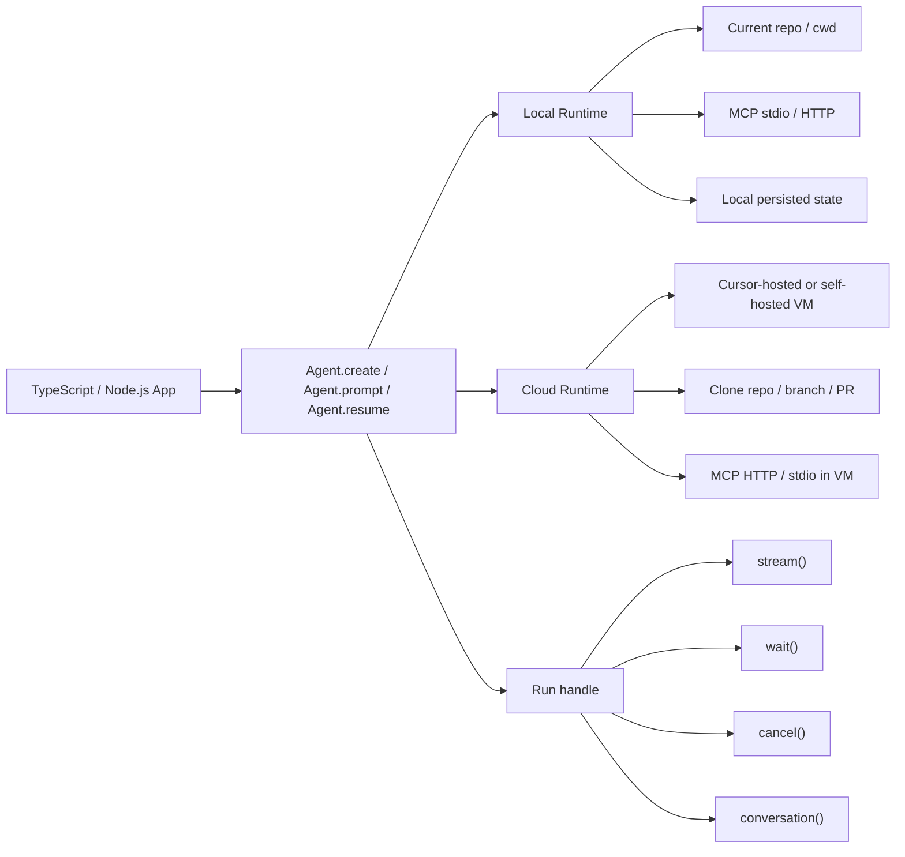
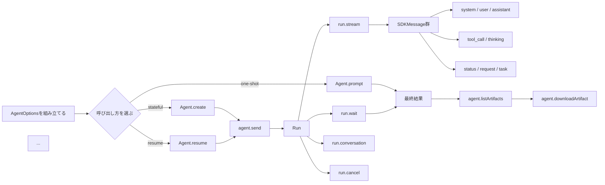

# 初めに
分割キーボードに慣れてきたオメガマスターです。
たまにHHKBが恋しくなり、タイピングしていますが、交互でも意外に使えるようになってきました。
「お前も分割ユーザーにならないか？」（猗窩座風）
「あかざ」って入力したら「猗窩座」が第一候補に出てきた…入力したことないのに…
鬼滅パワーすごいな…

:::message
この情報は2026/5/6時点での情報です。
最新情報は公式をしっかり確認するようにしてください。
また記載順はcursorのchangelogの順番に準拠します。
:::

# モデルアクセスの制御
管理者は、モデルおよびプロバイダ単位で、より細かな許可リストやブロックリストを設定できるようになりました。プロバイダ全体をブロックすることも、速度やコンテキストウィンドウのサイズが異なる特定のモデル設定をブロックすることもできます。

企業では、新しいプロバイダやモデルバージョンをデフォルトでブロックすることもできます。
[Cursor ダッシュボードのチームのモデル設定を開いて設定](https://cursor.com/ja/dashboard/team-settings#privacy)できます。
私は管理者ではないので画面が見せられませんが、「お金のかかるモデルを使用してほしくない」という企業向けにはありがたいですね。（弊社は好きなモデルを使用していいので、あまり関係なさそうですね）

# ソフト上限とインテリジェント アラート
管理者は、ユーザーがブロックされるのを防ぐために、ハード上限ではなくソフト上限を設定できるようになりました。Cursor は使用量を監視することもでき、ソフト上限またはハード上限の 50%、80%、100% に達したユーザーに自動でアラートを送信します。
[Cursor ダッシュボードのチームのspending](https://cursor.com/ja/dashboard/team-settings#spending)から設定できるようです。
管理者ではないので、画面はありませんが、各エンジニアがしっかり使用しているか確認したい方向けにいい気がしています。
ちなみに過去のcursor meetup osakaでこんな資料がありました。一定層にはありがたそうですね〜
https://speakerdeck.com/monotaro/monotaroudecursorwodao-ru-sitemitali-xiang-toxian-shi-soretowei-lai?slide=22

# 使用量分析タブの更新
管理者は、使用量を特定のユーザーで絞り込んだり、クライアント、クラウドエージェント、オートメーション、Bugbot、Security Review などの製品環境別に内訳を表示したりできるようになりました。
[Cursorダッシュボードのusageタブ](https://cursor.com/ja/dashboard/team-settings#usage)を開いてください。
ただコード生成だけで使用しているのか、cursorを使いこなしているか判断軸の起点になりそうですね〜

# Cursor Security Review
:::message
この機能は、チーム プランおよびエンタープライズ プランでのみ利用できます。
:::
Security Reviewでは常時稼働する 2 種類のセキュリティエージェント、Security Reviewer と Vulnerability Scannerがあるようです。
- Security Review は、すべてのPRを対象に、セキュリティ上の脆弱性、認証まわりのリグレッション、プライバシーやデータ処理に関するリスク、エージェントのツールの自動承認、プロンプトインジェクション攻撃をチェックします。重大度と対処方法を添えて、該当するdiffの箇所にインラインコメントを残します。
- Vulnerability Scanner は、既知の脆弱性、古くなった依存関係、設定上の問題をチェックするために、コードベースを定期的にスキャンします。指摘の更新を Slack に送信するよう設定することもできます。

Security Review を設定するには、[Security Review ダッシュボード](https://cursor.com/ja/dashboard/security-review)を開いて、最初のエージェントを作成します。


またしても管理者じゃないとダメなやつ…
でもcursor automationの応用だと思うので、automationを使用している方はそんなに苦戦することなく設定できそうです。

# Cursor SDK
@cursor/sdk パッケージを使うと、自分のコードから Cursor のエージェントを呼び出せます。Cursor IDE、CLI、Web アプリで動作するのと同じエージェントを、TypeScript からスクリプトで利用できるようになりました。開発を始める際には、Cursor ネイティブの /sdk スキルも使用できます。
Cursor の強みである、コードベース理解、ツール呼び出し、MCP、ローカル実行、クラウド実行、PR 作成まで含む“Coding Agent Harness”を丸ごと再利用できそうですね。

ワンショットの CI スクリプトや簡単なレビュー自動化には Agent.prompt()、会話継続・進捗配信・キャンセル・観測が必要なら Agent.create() と agent.send()、プロセスをまたぐ再開が必要なら Agent.resume() を選びます。ローカルは「今ある checkout と資格情報を使って速く回す」ため、クラウドは「長時間・PR・分離実行・並列化」のため、と役割分担するのが失敗しにくい設計です。

公式的に想定ユースケースとしては、CI/CD パイプライン、GitHub Action、バックエンドサービス、Webhook 駆動の自動化、リポジトリ横断のレビュー・修正・要約が明示されています。

ローカル実行では cwd 配下のワークツリーとローカルイベント／状態ストアを使い、クラウド実行では GitHub リポジトリ URL を元に VM を立ち上げ、必要なら PR を作成したり、ブランチをプッシュしたり、デモやスクリーンショットを添付したりできます。



| 実行時 | 役割 | 使用するタイミング |
| --- | --- | --- |
| Local | Node プロセス内でエージェントをインラインで実行します。ファイルはディスクから読み込まれます。 | ワーキングツリーに対する開発用スクリプトや CI チェック。 |
| Cloud (Cursor-hosted) | 分離された VM で実行され、repo はその中にクローンされます。VM の実行は Cursor が管理します。 | 呼び出し元が repo を持っていない場合、多数のエージェントを並列で実行したい場合、または呼び出し元が切断しても実行を継続する必要がある場合。 |
| Cloud (self-hosted) | 基本的な構成は同じですが、VM は セルフホスト型プール 経由で自分で実行します。 | Cursor-hosted と同じ理由に加え、コード、シークレット、ビルドアーティファクトを自分の環境に保持する必要がある場合。 |

実行時は、Agent.create() に渡すキー (local または cloud) によって決まります。どちらでも同じ CURSOR_API_KEY を使用します。

### 認証系
エージェントを作成する前に、CURSOR_API_KEY を設定するか、apiKey を渡してください。
公式 skill の auth.md は、SDK が受け付けるキーは「ユーザー API キー」と「チームの service-account キー」の二種類で、どちらも local / cloud の両方で使えると記載しています。解決優先順位は options.apiKey が最優先、その次が process.env.CURSOR_API_KEY です。共有インフラでは環境変数依存ではなく、明示的に apiKey を渡すことが推奨されています。 
Team Admin API キーはまだサポートされていないようです。
- Cursor Dashboard → Integrations の ユーザー API キー
- チーム設定 の サービスアカウントの API キー。サービスアカウント を参照してください

ローカルでは、キーは主にモデルやクラウド API への到達に使われます。クラウドでは常に必須です。さらに cloud ランでは、実行主体となるユーザーまたは service account に GitHub 接続が必要で、これが無いと ERROR_GITHUB_NO_USER_CREDENTIALS が返ります。
https://github.com/cursor/plugins/blob/main/cursor-sdk/skills/cursor-sdk/references/auth.md

### インストール
```
npm install @cursor/sdk
```
### 導入の最小手順

| 項目 | 実務上の要点 |
| --- | --- |
| パッケージ | npm install @cursor/sdk |
| Node.js | 18+ |
| 認証 | apiKey オプション、または CURSOR_API_KEY |
| ローカル実行 | local: { cwd } を明示する |
| クラウド実行 | cloud: { repos: [{ url, startingRef? }] } を明示する |
| モデル | local では必須、cloud では省略可 |
| 典型的な初手 | 一回だけなら Agent.prompt()、継続対話なら Agent.create() |

local も cloud も指定しないと local に寄ってしまう、そして cloud を使うなら repos を明示しないと意図せず local になり得るので注意が必要です。

### 典型的なワークフロー
典型的な利用フローは、AgentOptions の決定から始まります。ここで runtime を local / cloud から選び、必要なら mcpServers や agents を差し込みます。次に Agent.prompt か Agent.create か Agent.resume を選び、Run を取得したら run.stream() で live event を消費するか、run.wait() で最終結果を待つかを決めます。終わったら run.conversation() で履歴を取得し、必要に応じて agent.listArtifacts() / downloadArtifact() を呼びます。


### 使用イメージ
```ts
import { Agent } from "@cursor/sdk";

const agent = await Agent.create({
  apiKey: process.env.CURSOR_API_KEY!,
  model: { id: "composer-2" }, //モデルを選ぶ場所
  local: { cwd: process.cwd() },
});

const run = await agent.send("Summarize what this repository does");

for await (const event of run.stream()) {
  console.log(event);
}
```
## エージェントの作成

```typescript
function Agent.create(options: AgentOptions): Promise<SDKAgent>;
```

`Agent.create()` はオプションを検証し、すぐにハンドルを返します。実行時を選択するには、`local` または `cloud` のいずれかを渡します。

```typescript
// ローカルエージェント
const agent = await Agent.create({
  apiKey: process.env.CURSOR_API_KEY!,
  model: { id: "composer-2" },
  local: { cwd: "/path/to/repo" },
});

// Cloud Agent
const agent = await Agent.create({
  apiKey: process.env.CURSOR_API_KEY!,
  model: { id: "composer-2" },
  cloud: {
    repos: [{ url: "https://github.com/your-org/your-repo", startingRef: "main" }],
    autoCreatePR: true,
  },
});
```

`agent.agentId` はすぐに設定されます。ローカルエージェントには `agent-<uuid>` ID が、Cloud Agent には `bc-<uuid>` ID が割り当てられます。

SDK によって開始されたCloud Agentは、デフォルトのエージェント一覧から除外されます。これらをCursor Web または Cursor ウィンドウで表示するには、**Filter > Source > SDK** をクリックしてください。

### セッション環境変数

クラウドエージェントで、実行時に短期間だけ有効な認証情報や、そのエージェント内でのみ保持すべきその他の値が必要な場合は、`cloud.envVars` を渡します。

```typescript
const agent = await Agent.create({
  apiKey: process.env.CURSOR_API_KEY!,
  cloud: {
    repos: [{ url: "https://github.com/your-org/your-repo" }],
    envVars: {
      STAGING_API_TOKEN: process.env.STAGING_API_TOKEN!,
    },
  },
});
```

これらの値は保存時に暗号化され、Cloud Agent のシェルに渡され、エージェントの削除時に削除されます。`envVars` は、呼び出し元が指定した `agentId` と併用できません。`agentId` は省略し、`agent.agentId` からサーバーで発行された ID を読み取ってください。変数名の先頭に `CURSOR_` は使用できません。

### モデル パラメータ

`model.params` を使用して、reasoning effort や max mode などのモデルごとのオプションを渡します。パラメータ ID と値はモデルによって異なります。`Cursor.models.list()` を使用して、アカウントでサポートされているパラメータやプリセット バリアントを確認できます。

```typescript
const agent = await Agent.create({
  apiKey: process.env.CURSOR_API_KEY!,
  model: {
    id: "composer-2",
    params: [{ id: "thinking", value: "high" }],
  },
  local: { cwd: process.cwd() },
});
```

### SDKAgent

`Agent.create()` と `Agent.resume()` によって返されるハンドル。

```typescript
interface SDKAgent {
  readonly agentId: string;
  readonly model: ModelSelection | undefined;

  send(message: string | SDKUserMessage, options?: SendOptions): Promise<Run>;
  close(): void;
  reload(): Promise<void>;
  [Symbol.asyncDispose](): Promise<void>;

  listArtifacts(): Promise<SDKArtifact[]>;
  downloadArtifact(path: string): Promise<Buffer>;
}
```

| メンバー | 説明 |
| --- | --- |
| `agentId` | 安定したエージェント識別子。ローカルでは `agent-<uuid>`、クラウドでは `bc-<uuid>`。 |
| `model` | 現在選択されているモデル。`send({ model })` が成功するたびに更新されます。何らかの形で設定されるまでは `undefined` です (`model` を渡さずに再開されたエージェントを含みます) 。 |
| `send` | 指定したプロンプトで新しい実行を開始します。`Run` ハンドルを返します。 |
| `close` | 完了を待たずに破棄を開始します。Fire-and-forget。 |
| `reload` | 破棄せずに、ファイルシステム設定 (フック、プロジェクト MCP、サブエージェント) を再読み込みします。 |
| `[Symbol.asyncDispose]` | 非同期で破棄します。自動クリーンアップには `await using` と組み合わせて使用します。 |
| `listArtifacts` | エージェントが生成したファイルを一覧表示します (クラウドのみ。ローカルでは空の結果を返します) 。 |
| `downloadArtifact` | パスを指定してファイルをダウンロードします (クラウドのみ。ローカルでは例外をスローします) 。 |

### Agent.prompt()

```typescript
function Agent.prompt(message: string, options?: AgentOptions): Promise<RunResult>;
```

ワンショットで手軽に: エージェントを作成し、単一のプロンプトを送信し、実行の完了を待ってから破棄します。

```typescript
const result = await Agent.prompt("What does the auth middleware do?", {
  apiKey: process.env.CURSOR_API_KEY!,
  model: { id: "composer-2" },
  local: { cwd: process.cwd() },
});
```

## メッセージの送信

各 `agent.send()` は `Run` を返します。エージェントは複数の 実行 にわたって会話のコンテキストを保持し、実行 は1つのプロンプトに対する処理単位です。

### 実行

```typescript
type RunStatus = "running" | "finished" | "error" | "cancelled";
type RunOperation = "stream" | "wait" | "cancel" | "conversation";

interface Run {
  readonly id: string;
  readonly agentId: string;
  readonly status: RunStatus;
  readonly result?: string;
  readonly model?: ModelSelection;
  readonly durationMs?: number;
  readonly git?: RunGitInfo;
  readonly createdAt?: number;

  stream(): AsyncGenerator<SDKMessage, void>;
  wait(): Promise<RunResult>;
  cancel(): Promise<void>;
  conversation(): Promise<ConversationTurn[]>;

  supports(operation: RunOperation): boolean;
  unsupportedReason(operation: RunOperation): string | undefined;
  onDidChangeStatus(listener: (status: RunStatus) => void): () => void;
}

interface RunGitInfo {
  branches: Array<{ repoUrl: string; branch?: string; prUrl?: string }>;
}

interface RunResult {
  id: string;
  status: "finished" | "error" | "cancelled";
  result?: string;
  model?: ModelSelection;
  durationMs?: number;
  git?: RunGitInfo;
}
```

### ストリーミング

```typescript
const run = await agent.send("Find the bug in src/auth.ts");

for await (const event of run.stream()) {
  switch (event.type) {
    case "assistant":
      for (const block of event.message.content) {
        if (block.type === "text") process.stdout.write(block.text);
      }
      break;
    case "thinking":
      process.stdout.write(event.text);
      break;
    case "tool_call":
      console.log(`[tool] ${event.name}: ${event.status}`);
      break;
    case "status":
      console.log(`[status] ${event.status}`);
      break;
  }
}

// フォローアップ。コンテキストは完全に保持されます。
const run2 = await agent.send("Fix it and add a regression test");
await run2.wait();
```

テキストと一緒に画像を送信するには:

```typescript
const run = await agent.send({
  text: "What's in this screenshot?",
  images: [{ data: base64Png, mimeType: "image/png" }],
});
```

### ストリーミングなしで待機する

```typescript
const result = await run.wait();

console.log(result.status);      // "finished" | "error" | "cancelled"
console.log(result.result);      // アシスタントの最終テキスト（存在する場合）
console.log(result.model);       // この実行に使用された解決済みのModelSelection
console.log(result.durationMs);
console.log(result.git);         // { branches: [{ repoUrl, branch?, prUrl? }] } クラウド上
```

### run のキャンセル

```typescript
await run.cancel();
```

run をキャンセルします。ステータスは `"cancelled"` に変わり、ライブストリームは中断され、進行中のツール呼び出しは停止し、`run.wait()` は `status: "cancelled"` で完了します。部分的な出力 (assistant がそれまでに書き込んだテキスト) は Run オブジェクトに保持されます。

Cancel は実行中のローカル実行とクラウド実行でサポートされており、run がすでに終了している場合は何も起こりません。

### run の状態を取得する

```typescript
console.log(run.status);  // "running" | "finished" | "error" | "cancelled"

const stop = run.onDidChangeStatus((status) => {
  console.log(`status changed to ${status}`);
});
// リスナーを削除するには `stop()` を呼び出します。

// このrunで蓄積された会話をターンごとに構造化したビュー
const turns = await run.conversation();
```

`run.conversation()` は、run の `ConversationTurn[]` (steps を含むエージェントの turn、または command と出力を含むシェルの turn) を返します。ライブストリームを購読しなくても、これを使って run の構造化された履歴を表示または保存できます。

### 実行ごとのモデル上書き

`agent.send()` に渡した `model` は、その実行ではエージェントの選択を上書きし、その後はその設定が維持されます。以降は、上書きを指定せずに送信しても新しいモデルが引き続き使用されます。元に戻すには、別の `model` 上書きを渡すか、`agent.model` から現在の選択を確認します。

```typescript
const run = await agent.send("Plan the refactor", {
  model: { id: "composer-2", params: [{ id: "thinking", value: "high" }] },
});

console.log(agent.model);  // 送信成功後、オーバーライドした値に更新される
```

`run.model` と `result.model` は、この run で実際に使用されたモデル選択を反映しており、run の開始後は変更できません。

### 生の差分ストリーミング

`run.stream()` は正規化された `SDKMessage` イベントを返します。より低レベルの更新 (トークンごとのテキスト、ツール呼び出し引数のストリーミング、思考の差分、ステップの区切り) を受け取るには、`send()` に `onDelta` と `onStep` のコールバックを渡します:

```typescript
const run = await agent.send("Refactor the utils module", {
  onDelta: ({ update }) => {
    if (update.type === "text-delta") process.stdout.write(update.text);
    if (update.type === "thinking-delta") process.stdout.write(update.text);
  },
  onStep: ({ step }) => {
    console.log(`[step] ${step.type}`);
  },
});
```

コールバックは次の更新が処理される前に await されるため、バックプレッシャーをかけられます。`InteractionUpdate` には `text-delta`、`thinking-delta`、`thinking-completed`、`tool-call-started`、`tool-call-completed`、`partial-tool-call`、`token-delta`、`step-started`、`step-completed`、`turn-ended` に加え、summary と shell-output の差分もいくつか含まれます。

### 送信ごとのオプション

| プロパティ | 型 | 説明 |
| --- | --- | --- |
| `model` | `ModelSelection` | 送信ごとのモデル上書き設定です。省略した場合は `agent.model` を使用します。継続適用: 送信が成功すると `agent.model` が更新されます。 |
| `mcpServers` | `Record<string, McpServerConfig>` | インラインの MCP server 定義です。この実行では、作成時に設定した server を完全に置き換えます。 |
| `onStep` | `(args: { step }) => void \| Promise<void>` | 各会話ステップ (テキスト、思考、または tool バッチ) が完了するたびに呼び出されるコールバックです。 |
| `onDelta` | `(args: { update }) => void \| Promise<void>` | 生の `InteractionUpdate` ごとに呼び出されるコールバックです。 |
| `local.force` | `boolean` | ローカル エージェントのみ。デフォルトは `false` です。このメッセージを開始する前に、停止したままのアクティブな run を終了させます。Cloud ではサーバー側で `409 agent_busy` が返されるため、同等の仕組みは不要です。 |

***

次の3つのセクションでは、`SDKMessage`、`InteractionUpdate`、`ConversationTurn` の詳細なリファレンスを説明します。初読ではざっと目を通すか、読み飛ばしてかまいません。エージェントの再開で本題に戻ります。

## ストリームイベント

`run.stream()` からのイベントです。`type` で区別します。すべてのイベントには `agent_id` と `run_id` が含まれます。

```typescript
type SDKMessage =
  | SDKSystemMessage
  | SDKUserMessageEvent
  | SDKAssistantMessage
  | SDKThinkingMessage
  | SDKToolUseMessage
  | SDKStatusMessage
  | SDKTaskMessage
  | SDKRequestMessage;
```

| `type` | 説明 | 主なフィールド |
| --- | --- | --- |
| `"system"` | 初期化メタデータ。実行の開始時に一度だけ出力されます。 | `subtype?` (`"init"`), `model?`, `tools?` |
| `"user"` | この実行におけるユーザープロンプトのエコー。 | `message.content: TextBlock[]` |
| `"assistant"` | モデルのテキスト出力。 | `message.content: (TextBlock \| ToolUseBlock)[]` |
| `"thinking"` | 思考内容。 | `text`, `thinking_duration_ms?` |
| `"tool_call"` | ツール呼び出しのライフサイクル。開始時に `args` とともに出力され、完了時に `result` とともに再度出力されます。 | `call_id`, `name`, `status`, `args?`, `result?`, `truncated?` |
| `"status"` | クラウド実行のライフサイクル遷移。 | `status`, `message?` |
| `"task"` | タスクレベルのマイルストーンと要約。 | `status?`, `text?` |
| `"request"` | ユーザー入力または承認を待機中。 | `request_id` |

結果データ (最終テキスト、モデル、所要時間、git メタデータ) は、ストリーム完了後に `Run` オブジェクトに格納されます。読み取るには `run.wait()` を使用します。

> **ツール呼び出しのスキーマは安定していません。** `tool_call` イベントの `args` と `result` のペイロードは各ツールの内部構造を反映しており、ツールの進化に伴って変わる可能性があります。ツール名も変更または置き換えられることがあります。`args` と `result` は `unknown` として扱い、防御的にパースしてください。イベントのエンベロープ (`type`, `call_id`, `name`, `status`) は安定しています。

### メッセージの種類

```typescript
interface SDKSystemMessage {
  type: "system";
  subtype?: "init";
  agent_id: string;
  run_id: string;
  model?: ModelSelection;
  tools?: string[];
}

interface SDKUserMessageEvent {
  type: "user";
  agent_id: string;
  run_id: string;
  message: { role: "user"; content: TextBlock[] };
}

interface SDKAssistantMessage {
  type: "assistant";
  agent_id: string;
  run_id: string;
  message: {
    role: "assistant";
    content: Array<TextBlock | ToolUseBlock>;
  };
}

interface SDKThinkingMessage {
  type: "thinking";
  agent_id: string;
  run_id: string;
  text: string;
  thinking_duration_ms?: number;
}

interface SDKToolUseMessage {
  type: "tool_call";
  agent_id: string;
  run_id: string;
  call_id: string;
  name: string;
  status: "running" | "completed" | "error";
  args?: unknown;
  result?: unknown;
  truncated?: { args?: boolean; result?: boolean };
}

interface SDKStatusMessage {
  type: "status";
  agent_id: string;
  run_id: string;
  status: "CREATING" | "RUNNING" | "FINISHED" | "ERROR" | "CANCELLED" | "EXPIRED";
  message?: string;
}

interface SDKTaskMessage {
  type: "task";
  agent_id: string;
  run_id: string;
  status?: string;
  text?: string;
}

interface SDKRequestMessage {
  type: "request";
  agent_id: string;
  run_id: string;
  request_id: string;
}

interface TextBlock {
  type: "text";
  text: string;
}

interface ToolUseBlock {
  type: "tool_use";
  id: string;
  name: string;
  input: unknown;
}
```

ほとんどのツール呼び出しでは、`SDKToolUseMessage` は2回出力されます。最初は `status: "running"` で `args` が設定され、次に完了時に `status: "completed"` (または `"error"`) で `result` が設定された状態でもう一度出力されます。`truncated` は、ペイロードが大きすぎるために SDK が `args` または `result` を切り詰めたかどうかを示します。

`SDKStatusMessage` は、Cloud 側のライフサイクルの遷移を扱います。`CREATING` は VM のプロビジョニングと repo のクローンを表し、`RUNNING` はエージェントが処理を実行中であることを表します。残りはすべて終端状態です。

## インタラクションの更新

`InteractionUpdate` は、`agent.send()` の `onDelta` コールバックに渡される生の差分型です。更新は `SDKMessage` イベントよりも粒度が細かく、テキストはトークン単位でストリーミングされ、ツール呼び出しは引数が蓄積されるにつれて部分的な状態を報告し、思考は発生と同時に届きます。

```typescript
type InteractionUpdate =
  | TextDeltaUpdate
  | ThinkingDeltaUpdate
  | ThinkingCompletedUpdate
  | ToolCallStartedUpdate
  | ToolCallCompletedUpdate
  | PartialToolCallUpdate
  | TokenDeltaUpdate
  | StepStartedUpdate
  | StepCompletedUpdate
  | TurnEndedUpdate
  | UserMessageAppendedUpdate
  | SummaryUpdate
  | SummaryStartedUpdate
  | SummaryCompletedUpdate
  | ShellOutputDeltaUpdate;
```

### 更新タイプ

```typescript
interface TextDeltaUpdate {
  type: "text-delta";
  text: string;
}

interface ThinkingDeltaUpdate {
  type: "thinking-delta";
  text: string;
}

interface ThinkingCompletedUpdate {
  type: "thinking-completed";
  thinkingDurationMs: number;
}

interface ToolCallStartedUpdate {
  type: "tool-call-started";
  callId: string;
  toolCall: ToolCall;
  modelCallId: string;
}

interface PartialToolCallUpdate {
  type: "partial-tool-call";
  callId: string;
  toolCall: ToolCall;
  modelCallId: string;
}

interface ToolCallCompletedUpdate {
  type: "tool-call-completed";
  callId: string;
  toolCall: ToolCall;
  modelCallId: string;
}

interface TokenDeltaUpdate {
  type: "token-delta";
  tokens: number;
}

interface StepStartedUpdate {
  type: "step-started";
  stepId: number;
}

interface StepCompletedUpdate {
  type: "step-completed";
  stepId: number;
  stepDurationMs: number;
}

interface TurnEndedUpdate {
  type: "turn-ended";
  usage?: {
    inputTokens: number;
    outputTokens: number;
    cacheReadTokens: number;
    cacheWriteTokens: number;
  };
}

interface UserMessageAppendedUpdate {
  type: "user-message-appended";
  userMessage: UserMessage;
}

interface SummaryUpdate {
  type: "summary";
  summary: string;
}

interface SummaryStartedUpdate {
  type: "summary-started";
}

interface SummaryCompletedUpdate {
  type: "summary-completed";
}

interface ShellOutputDeltaUpdate {
  type: "shell-output-delta";
  event: Record<string, unknown>;
}
```

`PartialToolCallUpdate` は、モデルがコミット前にツール呼び出しへ引数をストリーミングしている間に生成されます。`SDKToolUseMessage.args` に適用されるのと同じ安定性に関する免責事項が、ここにも適用されます。

## 会話の型

`run.conversation()` によって返され、`onStep` callback の引数として使用される、run の各ターンを構造化して表したビューです。

```typescript
type ConversationTurn =
  | { type: "agentConversationTurn"; turn: AgentConversationTurn }
  | { type: "shellConversationTurn"; turn: ShellConversationTurn };

interface AgentConversationTurn {
  userMessage?: UserMessage;
  steps: ConversationStep[];
}

interface ShellConversationTurn {
  shellCommand?: ShellCommand;
  shellOutput?: ShellOutput;
}

type ConversationStep =
  | { type: "assistantMessage"; message: AssistantMessage }
  | { type: "toolCall"; message: ToolCall }
  | { type: "thinkingMessage"; message: ThinkingMessage };

interface AssistantMessage {
  text: string;
}

interface ThinkingMessage {
  text: string;
  thinkingDurationMs?: number;
}

interface UserMessage {
  text: string;
}

interface ShellCommand {
  command: string;
  workingDirectory?: string;
}

interface ShellOutput {
  stdout: string;
  stderr: string;
  exitCode: number;
}
```

`ToolCall` は、すべての組み込みツール (shell、edit、read、write、glob、grep、ls、semSearch、mcp、task など) に対する判別共用体です。その構造は内部実装向けです。

## エージェントを再開する

```typescript
function Agent.resume(agentId: string, options?: Partial<AgentOptions>): Promise<SDKAgent>;
```

既存のエージェントに ID を指定して再接続するには、`Agent.resume()` を使用します。一般的なケース: 以前に開始した長時間実行中のクラウド エージェントに再接続する、またはローカル プロセスの再起動後に会話を続ける。実行時は ID の接頭辞から自動検出されます (`bc-` は cloud、それ以外は local) 。

```typescript
await using agent = await Agent.resume("bc-abc123", {
  apiKey: process.env.CURSOR_API_KEY!,
});

const run = await agent.send("Also update the changelog");
await run.wait();
```

`agent.model` は、resume 時に `model` を再度渡さない限り `undefined` になります。インラインの `mcpServers` は resume をまたいで保持されません。シークレットを含むことが多く、メモリ内にのみ存在するためです。resume 時に再度渡すか、保持させたいサーバーには file-based MCP config (`.cursor/mcp.json` + `local.settingSources`) を使用してください。

## エージェントと実行の確認

過去のエージェントを一覧表示、取得、再読み込みできます。一覧エンドポイントは、カーソルベースのページネーション用に `{ items, nextCursor? }` を返します。

### Agent.list()

```typescript
function Agent.list(options?: ListAgentsOptions): Promise<ListResult<SDKAgentInfo>>;

type ListAgentsOptions = {
  limit?: number;
  cursor?: string;
} & (
  | { runtime?: undefined }
  | { runtime: "local"; cwd?: string }
  | {
      runtime: "cloud";
      prUrl?: string;
      includeArchived?: boolean;
      apiKey?: string;
    }
);
```

```typescript
const { items, nextCursor } = await Agent.list({
  runtime: "local",
  cwd: process.cwd(),
});
```

### Agent.get()

```typescript
function Agent.get(agentId: string, options?: GetAgentOptions): Promise<SDKAgentInfo>;

interface GetAgentOptions {
  cwd?: string;       // ローカルルーティング
  apiKey?: string;    // クラウドルーティング
}
```

実行時は、エージェント ID の接頭辞 (`bc-` ならクラウド、それ以外はローカル) から自動検出されます。

### Agent.listRuns()

```typescript
function Agent.listRuns(agentId: string, options?: ListRunsOptions): Promise<ListResult<Run>>;

type ListRunsOptions = {
  limit?: number;
  cursor?: string;
} & (
  | { runtime?: "local"; cwd?: string }
  | { runtime: "cloud"; apiKey?: string }
);
```

### Agent.getRun()

```typescript
function Agent.getRun(runId: string, options?: GetRunOptions): Promise<Run>;

type GetRunOptions =
  | { runtime?: "local"; cwd?: string }
  | { runtime: "cloud"; agentId: string; apiKey?: string };
```

Cloud の `getRun` には親の `agentId` が必要です。

### Cloud Agent のライフサイクル

Cloud Agent は、アーカイブまたは削除するまでチームのワークスペースに残ります。`Agent.list({ runtime: "cloud" })` はデフォルトでアーカイブ済みのエージェントを非表示にします。表示するには `includeArchived: true` を渡してください。`prUrl` で絞り込むと、特定のプルリクエストを作成したエージェントを見つけられます。

```typescript
function Agent.archive(agentId: string, options?: AgentOperationOptions): Promise<void>;
function Agent.unarchive(agentId: string, options?: AgentOperationOptions): Promise<void>;
function Agent.delete(agentId: string, options?: AgentOperationOptions): Promise<void>;

interface AgentOperationOptions {
  cwd?: string;
  apiKey?: string;
}
```

```typescript
await Agent.archive(agentId);     // ソフト削除。トランスクリプトは引き続き参照可能
await Agent.unarchive(agentId);   // アーカイブ済みエージェントを復元
await Agent.delete(agentId);      // 完全削除。以降の読み取りは404を返す
```

### SDKAgentInfo

`Agent.list()` と `Agent.get()` が返すメタデータの型。

```typescript
type SDKAgentInfo = {
  agentId: string;
  name: string;
  summary: string;
  lastModified: number;
  status?: "running" | "finished" | "error";
  createdAt?: number;
  archived?: boolean;
} & (
  | { runtime?: undefined }
  | { runtime: "local"; cwd?: string }
  | {
      runtime: "cloud";
      env?: { type: "cloud" | "pool" | "machine"; name?: string };
      repos?: string[];
    }
);
```

## Cursor 名前空間

アカウントレベルとカタログの読み取り。すべてのメソッドは省略可能な `{ apiKey }` を受け取り、指定しない場合は `CURSOR_API_KEY` が使用されます。

### Cursor.me()

```typescript
function Cursor.me(options?: CursorRequestOptions): Promise<SDKUser>;

interface CursorRequestOptions {
  apiKey?: string;
}

interface SDKUser {
  apiKeyName: string;
  userEmail?: string;
  createdAt: string;
}
```

### Cursor.models.list()

```typescript
function Cursor.models.list(options?: CursorRequestOptions): Promise<SDKModel[]>;

type SDKModel = ModelListItem;

interface ModelListItem {
  id: string;
  displayName: string;
  description?: string;
  parameters?: ModelParameterDefinition[];
  variants?: ModelVariant[];
}

interface ModelParameterDefinition {
  id: string;
  displayName?: string;
  values: Array<{ value: string; displayName?: string }>;
}

interface ModelVariant {
  params: ModelParameterValue[];
  displayName: string;
  description?: string;
  isDefault?: boolean;
}
```

`Agent.create()` または `agent.send()` を呼び出す前に、`Cursor.models.list()` を使用して、有効な `model` ID と、モデルごとの `params` を確認してください。パラメータはモデル固有です。一般的な例としては、推論量 や max mode があります。

```typescript
const models = await Cursor.models.list();
const composer = models.find((model) => model.id === "composer-2");

console.log(composer?.parameters);
// [
//   {
//     id: "thinking",
//     displayName: "Thinking",
//     values: [
//       { value: "low", displayName: "Low" },
//       { value: "high", displayName: "High" },
//     ],
//   },
// ]
```

選択したパラメータ値は `model.params` で渡します。プリセットの `variants` には有効な `params` がすでに含まれているため、それらをモデル選択にコピーして使えます。

```typescript
const agent = await Agent.create({
  apiKey: process.env.CURSOR_API_KEY!,
  model: {
    id: "composer-2",
    params: [{ id: "thinking", value: "high" }],
  },
  local: { cwd: process.cwd() },
});
```

### Cursor.repositories.list()

```typescript
function Cursor.repositories.list(options?: CursorRequestOptions): Promise<SDKRepository[]>;

interface SDKRepository {
  url: string;
}
```

呼び出し元ユーザーのチームに連携されている GitHub リポジトリを返します。Cloud のみ。

## MCPサーバー

エージェントは、複数のソースからMCPサーバーを検出できます。最も一般的なのは、`Agent.create()` または `agent.send()` でのインライン定義です。ファイルベースの設定やダッシュボードで管理される設定にも対応しています。

### 読み込まれるもの

**ローカル エージェント** は最大 5 つのソースからサーバーを読み込み、名前が競合する場合は最初に一致したものが優先されます。

1. `agent.send()` の `mcpServers`。その実行では、作成時のサーバーを完全に置き換えます (マージされません) 。
2. `Agent.create()` の `mcpServers`。送信ごとの 上書き がない場合に使用されます。
3. `local.settingSources` に `"plugins"` が含まれている場合は、プラグインのサーバー。
4. `local.settingSources` に `"project"` が含まれている場合は、`.cursor/mcp.json` のプロジェクト サーバー。
5. `local.settingSources` に `"user"` が含まれている場合は、`~/.cursor/mcp.json` のユーザー サーバー。

`local.settingSources` を指定しない場合は、インライン サーバーのみが読み込まれます。ローカル MCP サーバーで OAuth ログインが必要な場合、SDK からサインインを促すことはできません。すでに Cursor アプリからそのサーバーにサインインしている場合にのみ動作し、その場合 SDK は保存されたログインを再利用します。

**Cloud Agent** は次のソースからサーバーを読み込みます。

1. `agent.send()` の `mcpServers`。その実行では、作成時のサーバーを完全に置き換えます (マージされません) 。
2. `Agent.create()` の `mcpServers`。送信ごとの 上書きがない場合に使用されます。
3. cursor.com/agents 上の、ユーザーおよびチームの MCP サーバー。

インライン サーバーに `auth` または `headers` が含まれておらず、以前に cursor.com/agents でそのサーバー URL を認可している場合、個人用 API トークンで認証された実行では、それらの OAuth トークンが自動的に再利用されます。サービスアカウントの API キーはユーザーに関連付けられていないため、ユーザー auth にフォールバックすることはできません。

`local.settingSources` は Cloud Agent には適用されません。

### ローカル

```typescript
const agent = await Agent.create({
  apiKey: process.env.CURSOR_API_KEY!,
  model: { id: "auto" },
  local: { cwd: process.cwd() },
  mcpServers: {
    docs: {
      type: "http",
      url: "https://example.com/mcp",
      auth: {
        CLIENT_ID: "client-id",
        scopes: ["read", "write"],
      },
    },
    filesystem: {
      type: "stdio",
      command: "npx",
      args: ["-y", "@modelcontextprotocol/server-filesystem", process.cwd()],
      cwd: process.cwd(),
    },
  },
});
```

### Cloud

Cloud Agentにも、認証済みの MCP 設定をインラインで渡せます。Cursor がバックエンド経由でリモート MCP をプロキシする場合は、HTTP 認証を使用します。サーバーがクラウド VM 内で動作し、環境変数から認証情報を読み取る場合は、stdio `env` を使用します。

```typescript
const agent = await Agent.create({
  apiKey: process.env.CURSOR_API_KEY!,
  model: { id: "composer-2" },
  cloud: {
    repos: [{ url: "https://github.com/your-org/your-repo", startingRef: "main" }],
  },
  mcpServers: {
    linear: {
      type: "http",
      url: "https://mcp.linear.app/sse",
      headers: {
        Authorization: `Bearer ${process.env.LINEAR_API_KEY!}`,
      },
    },
    figma: {
      type: "http",
      url: "https://api.figma.com/mcp",
      auth: {
        CLIENT_ID: process.env.FIGMA_CLIENT_ID!,
        CLIENT_SECRET: process.env.FIGMA_CLIENT_SECRET!,
        scopes: ["file_content:read"],
      },
    },
    github: {
      type: "stdio",
      command: "npx",
      args: ["-y", "@modelcontextprotocol/server-github"],
      env: {
        GITHUB_TOKEN: process.env.GITHUB_TOKEN!,
      },
    },
  },
});
```

静的な API キー や Bearer token には `headers` を使用してください。Cursor はそれらをすべてのリクエストでそのまま渡します。OAuth で保護されたサーバーには `auth` を使用してください。Cloud では、Cursor がサーバー側で OAuth フローを一度実行し、実行をまたいで token を再利用します。ローカルでは、SDK はサインインのためにブラウザを開けません。Cursor アプリを通じてサインインしてすでに取得済みの token だけを再利用できます。

- HTTP の `headers` と `auth` は Cursor のバックエンドで処理されます。機密フィールドはマスクされ、VM には入りません。
- Stdio の `env` 値は、サーバーがそこで実行されるため、VM に渡されます。他の実行時シークレットと同様に扱ってください。
- cursor.com/agents で設定された MCPサーバーの OAuth は、チームレベルのサーバーであってもユーザーごとに維持されます。

## サブエージェント

メインエージェントが `Agent` ツール経由で呼び出す、名前付きのサブエージェントを定義します。インラインで指定します:

```typescript
const agent = await Agent.create({
  model: { id: "composer-2" },
  apiKey: process.env.CURSOR_API_KEY!,
  local: { cwd: process.cwd() },
  agents: {
    "code-reviewer": {
      description: "Expert code reviewer for quality and security.",
      prompt: "Review code for bugs, security issues, and proven approaches.",
      model: "inherit",
    },
    "test-writer": {
      description: "Writes tests for code changes.",
      prompt: "Write comprehensive tests for the given code.",
    },
  },
});
```

リポジトリ内の `.cursor/agents/*.md` にコミットされたサブエージェント (`name`、`description`、および省略可能な `model` のフロントマターを含む) も検出されます。同名の場合、インライン定義がファイルベースの定義より優先されます。

## フック

フックはファイルベースのみです。プログラムから利用できるフックのコールバックはありません。フックは実行ごとに切り替える設定項目ではなく、プロジェクトのポリシー境界です。

- **ローカル:** `local.cwd` として渡されたリポジトリに `.cursor/hooks.json` を追加するか、user-level フック用に `~/.cursor/hooks.json` を追加します。
- **Cloud:** `cloud.repos` で渡されたリポジトリに `.cursor/hooks.json` とそのスクリプトをコミットします。SDK で作成された Cloud Agent はプロジェクトフックを自動的に読み込みます。エンタープライズプランでは、チームフックとエンタープライズ管理フックも実行します。

## アーティファクト

エージェントのワークスペース内のファイルを一覧表示してダウンロードします。

```typescript
interface SDKArtifact {
  path: string;
  sizeBytes: number;
  updatedAt: string;
}
```

```typescript
const artifacts: SDKArtifact[] = await agent.listArtifacts();

for (const artifact of artifacts) {
  console.log(artifact.path, artifact.sizeBytes);
}

const buffer = await agent.downloadArtifact(artifacts[0].path);
```

アーティファクトのサポートは実行時によって異なります。Local SDK エージェントは現在、アーティファクトを返さず、`downloadArtifact` は例外をスローします。

## リソース管理

エージェントは、使い終わったら必ず破棄してください。最も簡潔な方法は `await using` です：

```typescript
await using agent = await Agent.create({ /* ... */ });
// ブロックを抜けると自動的に破棄される
```

明示的に破棄するには:

```typescript
await agent[Symbol.asyncDispose]();
```

`agent.close()` は、await せずに破棄を開始します。`agent.reload()` は、破棄せずにファイルシステム設定の変更 (フック、プロジェクトのMCP、サブエージェント) を取り込みます。

## 設定リファレンス

### AgentOptions

| プロパティ | 型 | デフォルト | 説明 |
| --- | --- | --- | --- |
| `model` | `ModelSelection` | ローカルでは必須。Cloud ではサーバーで解決されたデフォルトにフォールバック | 使用するモデル。`ModelSelection`を参照してください。 |
| `apiKey` | `string` | `CURSOR_API_KEY` env | ユーザー API キーまたはサービスアカウントキー。チーム Admin キーはまだサポートされていません。 |
| `name` | `string` | 自動生成 | `Agent.list()` / `Agent.get()` で `title` として表示される、人が読めるエージェント名。 |
| `local` | `{ cwd?: string \| string[]; settingSources?: SettingSource[]; sandboxOptions?: { enabled: boolean } }` |  | ローカルエージェント の設定。`settingSources` は環境設定レイヤー (`"project"`、`"user"`、`"team"`、`"mdm"`、`"plugins"`、`"all"`) を選択します。 |
| `cloud` | `CloudOptions` |  | Cloud Agent の設定。 |
| `mcpServers` | `Record<string, McpServerConfig>` |  | インライン MCP サーバー定義。 |
| `agents` | `Record<string, AgentDefinition>` |  | サブエージェント定義。 |
| `agentId` | `string` | 自動生成 | 永続的なエージェント ID。invocation 間で安定した ID を維持するには指定してください。 |

### CloudOptions

| プロパティ | 型 | デフォルト | 説明 |
| --- | --- | --- | --- |
| `env` | `{ type: "cloud"; name?: string } \| { type: "pool"; name?: string } \| { type: "machine"; name?: string }` | `{ type: "cloud" }` | 実行環境。`cloud` は Cursor がホストする VM を使用します。`pool` と `machine` は セルフホスト型プールを対象とします。 |
| `repos` | `Array<{ url: string; startingRef?: string; prUrl?: string }>` |  | VM にクローンするリポジトリ。既存の PR にエージェントを紐付けるには、`prUrl` を渡します。 |
| `workOnCurrentBranch` | `boolean` | `false` | 新しいブランチではなく、既存のブランチにコミットをプッシュします。 |
| `autoCreatePR` | `boolean` | `false` | 実行完了時に PR を作成します。 |
| `skipReviewerRequest` | `boolean` | `false` | 呼び出し元のユーザーを PR のレビュアーとして依頼する処理をスキップします。 |

### AgentDefinition

| Property | Type | Default | Description |
| --- | --- | --- | --- |
| `description` | `string` | *required* | このサブエージェントを使用する場面。親エージェントに表示され、いつ起動すべきかを判断するために使われます。 |
| `prompt` | `string` | *required* | サブエージェント用のシステムプロンプト。 |
| `model` | `ModelSelection \| "inherit"` | `"inherit"` | モデルの上書き設定。親の選択を使用するには `"inherit"` を指定します。 |
| `mcpServers` | `Array<string \| Record<string, McpServerConfig>>` |  | このサブエージェントで利用できる MCP サーバー。名前には親の `mcpServers` で定義されたサーバーを指定します。 |

### ModelSelection

```typescript
interface ModelSelection {
  id: string;
  params?: ModelParameterValue[];
}

interface ModelParameterValue {
  id: string;
  value: string;
}
```

`id` はモデル識別子です (例: `"composer-2"`) 。`params` には、推論量などのモデルごとのパラメータを指定します。有効な id、パラメータ定義、アカウントで利用可能なプリセット バリアントを確認するには、`Cursor.models.list()` を使用します。

### McpServerConfig

```typescript
type McpServerConfig =
  // stdio
  | {
      type?: "stdio";
      command: string;
      args?: string[];
      env?: Record<string, string>;
      cwd?: string;       // ローカルのみ。クラウドではこのフィールドは無効
    }
  // HTTP / SSE
  | {
      type?: "http" | "sse";
      url: string;
      headers?: Record<string, string>;   // そのまま転送される。Authorization ヘッダーも有効
      auth?: {
        CLIENT_ID: string;
        CLIENT_SECRET?: string;
        scopes?: string[];
      };
    };
```

クラウドで実行される HTTP サーバーでは、`headers` と `auth` は Cursor のバックエンドで処理されます。機密性の高いフィールドは、VM に渡る前にマスクされます。クラウド上の stdio サーバーでは、`env` の値が VM に渡されます (ほかの実行時シークレットと同様に扱ってください) 。

### SDKUserMessage

```typescript
interface SDKUserMessage {
  text: string;
  images?: SDKImage[];
}
```

`agent.send()` の message 引数の構造化形式です。テキストと一緒に画像を送信する際に使用します。

### SDKImage

```typescript
type SDKImage =
  | { url: string; dimension?: SDKImageDimension }
  | { data: string; mimeType: string; dimension?: SDKImageDimension };

interface SDKImageDimension {
  width: number;
  height: number;
}
```

リモートの`url`またはbase64の`data`のいずれかを、`mimeType`とともに渡します。

### SettingSource

```typescript
type SettingSource =
  | "project"
  | "user"
  | "team"
  | "mdm"
  | "plugins"
  | "all";
```

ローカルエージェントがディスク上のどの設定レイヤーを読み込むかを制御します。Cloud Agent では常に `project` / `team` / `plugins` が読み込まれ、このフィールドは無視されます。

| 値 | ソース |
| --- | --- |
| `"project"` | ワークスペース内の `.cursor/` |
| `"user"` | `~/.cursor/` |
| `"team"` | ダッシュボードから同期されるチーム設定 |
| `"mdm"` | MDM で管理されるエンタープライズ設定 |
| `"plugins"` | プラグインによって提供される設定 |
| `"all"` | 上記すべての簡略記法 |

### ListResult

```typescript
interface ListResult<T> {
  items: T[];
  nextCursor?: string;
}
```

`Agent.list()` と `Agent.listRuns()` の戻り値です。以降のページがない場合、`nextCursor` は含まれません。

## エラー

すべての SDK エラーは `CursorAgentError` を継承します。再試行ロジックの判定には `isRetryable` を使用してください。

```typescript
class CursorAgentError extends Error {
  readonly isRetryable: boolean;
  readonly code?: string;
  readonly cause?: unknown;
  readonly protoErrorCode?: string;
}
```

| エラー | 発生する状況 |
| --- | --- |
| `AuthenticationError` | API キー が無効、未ログイン、または権限不足。 |
| `RateLimitError` | リクエストが多すぎる、または利用制限を超過。 |
| `ConfigurationError` | モデルが無効、またはリクエスト パラメータが不正。 |
| `IntegrationNotConnectedError` | SCMプロバイダが接続されていないリポジトリに対して Cloud Agent を作成した場合。 |
| `NetworkError` | サービスを利用できない、またはタイムアウト。 |
| `UnknownAgentError` | サーバーまたは実行時の未分類エラー全般。 |

### IntegrationNotConnectedError

```typescript
class IntegrationNotConnectedError extends ConfigurationError {
  readonly provider: string;   // 例: "github", "gitlab", "azuredevops"
  readonly helpUrl: string;    // 再接続用のダッシュボードリンク
}
```

`helpUrl` を使って、ユーザーを適切な再接続フローに誘導します。新しいプロバイダーは SDK のリリースを待たずに追加されます。

### UnsupportedRunOperationError

```typescript
class UnsupportedRunOperationError extends Error {
  readonly operation: RunOperation;
}
```

現在の実行時環境で `Run` 操作を使用できない場合にスローされます。呼び出す前に、`run.supports(operation)` と `run.unsupportedReason(operation)` で確認してください。

## 既知の制限

- Inline `mcpServers` は `Agent.resume()` をまたいで保持されません。必要な場合は、再開時にもう一度渡してください。
- ローカルエージェントでのアーティファクトのダウンロードは未実装です (`agent.listArtifacts()` は空のリストを返し、`agent.downloadArtifact()` は例外をスローします) 。
- `local.settingSources` (およびこれで有効化されるファイルベースの MCP / サブエージェント パス) は Cloud Agent には適用されません。Cloud では常に `project` / `team` / `plugins` が読み込まれます。
- フックはファイルベースのみです (`.cursor/hooks.json`) 。プログラムによるコールバックには対応していません。


# 今回は割愛したもの、一言メモを添えておきます（書くの疲れたのは内緒で）
[チームマーケットプレイスの更新](https://cursor.com/ja/changelog#:~:text=%E6%9C%881%E6%97%A5-,%E3%83%81%E3%83%BC%E3%83%A0%E3%83%9E%E3%83%BC%E3%82%B1%E3%83%83%E3%83%88%E3%83%97%E3%83%AC%E3%82%A4%E3%82%B9%E3%81%AE%E6%9B%B4%E6%96%B0,-%E7%AE%A1%E7%90%86%E8%80%85%E3%81%AF%E3%80%81%E5%85%88%E3%81%AB)
管理者は、先にリポジトリを接続しなくても、チームマーケットプレイスを作成できるようになりました。

[キャンバス](https://cursor.com/ja/changelog/page/2#:~:text=%E6%9C%8815%E6%97%A5-,%E3%82%AD%E3%83%A3%E3%83%B3%E3%83%90%E3%82%B9,-Cursor%20%E3%81%AF%E3%80%81%E5%AF%BE%E8%A9%B1)
Cursor は、対話型のキャンバスを作成して応答できるようになりました。
こうしたビジュアル表現には、テーブル、ボックス、図、グラフなどの標準コンポーネントを使って構築されたダッシュボードやカスタムインターフェースに加え、diff や ToDo リストなど、既存の Cursor コンポーネントも含めることができます。

[CLI の Debug Mode と /btw サポート](https://cursor.com/ja/changelog/page/2#:~:text=CLI%20%E3%81%AE%20Debug%20Mode%20%E3%81%A8%20/btw%20%E3%82%B5%E3%83%9D%E3%83%BC%E3%83%88)
Debug ModeはEditorで実装されて長いので、みなさん知ってる前提でスルーします。
/btw を使うと、現在の実行を止めずに、Cursor が行っている変更について確認できます。


[マルチタスク、ワークツリー、マルチルートワークスペース](https://cursor.com/ja/changelog#:~:text=%E3%83%9E%E3%83%AB%E3%83%81%E3%82%BF%E3%82%B9%E3%82%AF%E3%80%81%E3%83%AF%E3%83%BC%E3%82%AF%E3%83%84%E3%83%AA%E3%83%BC%E3%80%81%E3%83%9E%E3%83%AB%E3%83%81%E3%83%AB%E3%83%BC%E3%83%88%E3%83%AF%E3%83%BC%E3%82%AF%E3%82%B9%E3%83%9A%E3%83%BC%E3%82%B9)
この辺はすでにEditorでできていることが、Agentでもできるようになったというだけですが、Editorよりわかりやすいので、積極的に使用したいですね〜

# 最後に
いや〜SDK重かったですね〜
初めてちゃんと見たので、個人的に激重でした…もちろん全て覚えるより、skill化して対応していきたいですね。