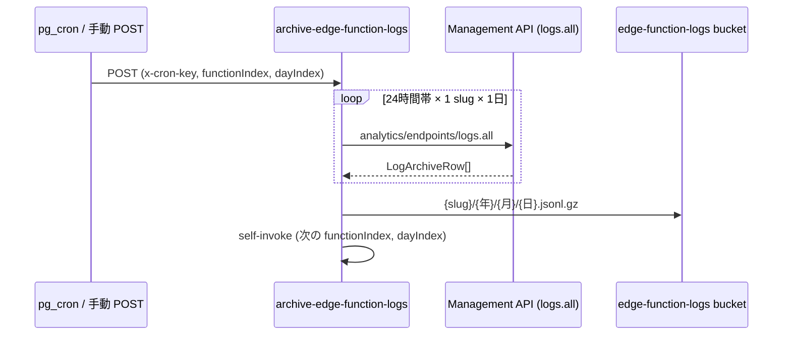
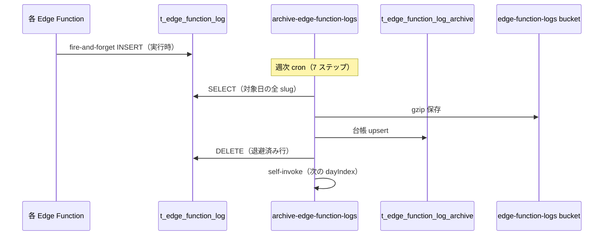

# はじめに
いや〜夏ですね〜
職場から駅に向かうだけでも汗をかいてしまいます…熱中症には気を付けてください。

さてSupabase Edge Function のログは、Dashboard（Logs Explorer）上では **プランごとに決まった期間しか残りません**。
[公式の料金ページ](https://supabase.com/pricing) では、API・Database ログを含む保持期間は次のとおりです。

| プラン | ログ保持期間 |
| --- | --- |
| Free | **1 日** |
| Pro | **7 日** |
| Team | **28 日** |
| Enterprise | **90 日** |

:::message
上記は Supabase Platform 全体のログ保持期間です。Edge Function の実行ログ（`function_logs` / `function_edge_logs`）もこの枠に含まれます。長期保存が必要な場合は [Log Drains](https://supabase.com/docs/guides/telemetry/log-drains)（Pro 以上）で外部へ送出するか、自前で Storage 等に退避する必要があります。
:::

Pro プランであっても **7 日を過ぎたログは Dashboard からは参照できません**。
 **ログを長期保存したい** という会社からの依頼があったので、まず [Management API](#management-api-とは) から取得する方式を実装しました。

ところが運用してみると、想定以上に複雑で、失敗時にログが永久に失われるリスクもありました。
そこで **「実行時に DB に書き込み → 週次で Storage に退避」** する方式へ切り替えました。
この記事では、旧方式の課題と新方式の設計を整理します。

:::message
この記事は実際のプロジェクトで検討・実装した内容をもとにしています。Edge Function の数や関数名はプロジェクトごとに異なります。
:::

# やりたいこと

やりたいこと自体はシンプルです。

1. 各 Edge Function が構造化ログを出力する
2. 週 1 回、cron で直近 7 日分のログを Storage に gzip 保存する
3. 長期保管は Storage、短期参照は DB に置く
4. さらに長期保存する場合は、storageからgzipをダウンロードし、SharePoint 等に保存（弊社では SharePoint 等を使用しているため）

# 事前情報

弊社で 1 番ログが動いている Supabase プロジェクトを確認し、**gzip 退避した場合の容量と Storage 上の保存可能年数** を見積もりました。
対象は次の 2 プロジェクトです。（proプラン）

| プロジェクト | Edge Function 数 | 月間 EF 呼び出し |
| --- | --- | --- |
| PJ1 | **53** | **589,564 回**|
| PJ2 | **24** | **285,000 回**|

## 見積もりの前提

記事後半で説明する退避形式（`{年}/{月}/{日}/{slug}.jsonl.gz`）に基づき、次を仮定しています。

| 項目 | 値 |
| --- | --- |
| 1 リクエストあたりのログ行数 | **約 3 行**（`request_start` + `LoggingInfo` 等 + `request_end`）。`logger.ts` はすべての `log()` 呼び出しを DB 永続化する |
| 1 行あたりのサイズ | `request_end` 等は **約 250 バイト**。`request_start` は headers / body / query を metadata に含むため **リクエスト内容次第で増加**（数百バイト〜） |
| gzip 圧縮率 | **約 7 倍**（JSONL の一般的な値） |

以下の容量見積もりは、**3 行/req・1 リクエストあたり約 930 バイト**（`request_start` 約 400 + 中間ログ約 280 + `request_end` 約 250）を前提としています。エラー時は `LoggingWarn` / `LoggingError` が加わり、さらに増えます。

## 圧縮後の容量見積もり

### PJ1

月間ログ行数 = 589,564 × 3 = **1,768,692 行** → 非圧縮 約 523 MB/月 → gzip 後 **約 75 MB/月**

| 期間 | 圧縮後 |
| --- | --- |
| 1 日 | 約 2.5 MB |
| 1 週間 | 約 19 MB |
| 1 ヶ月 | 約 75 MB |
| 1 年 | 約 0.9 GB |

現在の Storage 使用量は **0.37 GB**（CSV 等の既存バケット。ログアーカイブ分は含まない）。

### PJ2

月間ログ行数 = 285,000 × 3 = **855,000 行** → 非圧縮 約 252 MB/月 → gzip 後 **約 36 MB/月**

| 期間 | 圧縮後 |
| --- | --- |
| 1 日 | 約 1.2 MB |
| 1 週間 | 約 8 MB |
| 1 ヶ月 | 約 36 MB |
| 1 年 | 約 0.43 GB |

Storage バケットは調査時点で **0 件**（ログ以外の用途も未使用）。

## Storage 上で何年保存できるか

[Pro プラン](https://supabase.com/pricing) の File Storage 枠は **組織全体で 100 GB** です。超過分は $0.0213/GB/月。

| 対象 | 年間増加（3 行/req） | 100 GB 枠だけ使った場合 | 実運用の目安 |
| --- | --- | --- | --- |
| PJ1 のみ | 約 0.9 GB/年 | 約 111 年 | **70〜100 年**（他データ・他 PJ 分を差し引き） |
| PJ2 のみ | 約 0.43 GB/年 | 約 232 年 | **150 年以上** |
| **両方合計** | 約 1.3 GB/年 | 約 77 年 | **50〜70 年** |

トラフィックが 2 倍になっても、両プロジェクト合計でおおよそ **25〜35 年分** は Pro 枠内に収まる見込みです。

:::message alert
`request_start` の metadata にリクエスト body や headers を載せると、さらに **1.5〜2 倍** に膨らむ可能性があります。初回アーカイブ後に 1 週間分の実ファイルサイズで再計算するのが確実です。また、さらに長期の保管が必要な場合は、Storage から gzip をダウンロードして SharePoint 等へ退避する運用（やりたいこと 4）を想定しています。
:::

# 旧方式：Management API からログを引っこ抜く

最初は **Supabase の短期ログ → Storage への長期保存** という方針で、`archive-edge-function-logs` という Edge Function を作りました。

## Management API とは

[Management API](https://supabase.com/docs/reference/api/introduction) は、`api.supabase.com` 向けの REST API です。プロジェクトの `anon` / `service_role` キーで叩く **データ用 API**（PostgREST や Storage など）とは別物で、プロジェクトの作成・設定変更・Edge Function デプロイ、**ログのプログラム取得** など、Dashboard と同等の操作をコードから行えます。

認証には [Personal Access Token（PAT）](https://supabase.com/dashboard/account/tokens) を使います。旧方式では `analytics_logs_read` スコープ付き PAT を Edge Function の Secret（`SUPABASE_ACCESS_TOKEN`）に置き、週次アーカイブから呼び出していました。

ログ取得に使うのは [`GET /v1/projects/{ref}/analytics/endpoints/logs.all`](https://supabase.com/docs/reference/api/v1-get-project-logs-all) です。Dashboard の Logs Explorer と同じログ基盤に対し、**SQL を投げて結果を JSON で受け取る** 形になります。

```sh
# 概念イメージ（curl）
curl 'https://api.supabase.com/v1/projects/{ref}/analytics/endpoints/logs.all' \
  --get \
  --header 'Authorization: Bearer YOUR_PAT' \
  --data-urlencode 'sql=SELECT timestamp, event_message FROM edge_logs WHERE ... LIMIT 1000' \
  --data-urlencode 'iso_timestamp_start=2026-05-30T00:00:00Z' \
  --data-urlencode 'iso_timestamp_end=2026-05-30T23:59:59Z'
```

主な制約は次のとおりです。

| 制約 | 内容 | 旧方式での影響 |
| --- | --- | --- |
| 取得期間 | 1 リクエストあたり **最大 24 時間**（分単位に丸め） | 1 日分を **24 回に分割** して取得 |
| 返却件数 | **1000 行上限** | 1 時間帯でも超えると欠損 → 例外で検知 |
| 保持期間 | Dashboard と同じ（Pro なら 7 日） | 期限切れ後は **永久に取り戻せない** |

:::message
Management API のログ取得は、Dashboard に表示されている短期保持のログと同じソースです。あくまで「残っているうちに引っこ抜く」手段であり、長期保存の仕組みそのものではありません。
:::

## 全体像



- **取得元**: Supabase Dashboard ではなく Management API（`analytics/endpoints/logs.all`）
- **保存先**: private Storage バケット `edge-function-logs`
- **認証**: `SUPABASE_ACCESS_TOKEN`（PAT、`analytics_logs_read` スコープ）

## 1 回の実行フロー

1. `x-cron-key === CRON_KEY` で認証（`--no-verify-jwt` デプロイ想定）
2. `rangeEnd`（省略時は UTC 昨日）、`functionIndex`、`dayIndex`（0〜6）を正規化
3. **1 ステップ = 1 slug × 1 日**（例: index 0 + day 0 → 最古の 1 日分）
4. Management API で **24 時間帯に分けて取得** → JSONL → gzip → Storage
5. self-invoke で次の `(functionIndex, dayIndex)` を fire-and-forget 起動
6. 週次全体は **39 slug × 7 日 = 273 ステップ**

## ログの絞り込み

Management API への SQL 絞り込みは `buildFunctionLogsSql` で行います。

- **主**: `"function":"{slug}"`（構造化ログ）
- **移行期**: `"path":"/functions/v1/{slug}"` / `"/{slug}"`（旧形式）

そのため `logger.ts` に `function` フィールドを追加し、slug で検索できるようにしていました。

## 保存形式

Storage 上のパスは次の形式です。

```
{slug}/{年}/{月}/{日}.jsonl.gz
```

gzip 解凍後は JSONL（1 行 1 ログ）です。

```jsonl
{"level":"info","ts":"2026-05-30T10:15:00.000Z","function":"EF名","requestId":"abc-123","message":"request_start","metadata":{"method":"GET"}}
{"level":"info","ts":"2026-05-30T10:15:00.120Z","function":"EF名","requestId":"abc-123","message":"request_end","metadata":{"status":200,"durationMs":120}}
```

# 旧方式が複雑になる理由

「週 1 回ログを残す」だけなのに、次の 3 層の回避策が積み上がっていました。

## 1. 273 回の self-invoke チェーン

1 ジョブで全部やると Edge Function がタイムアウトするため、**小分けにして連鎖起動**しています。ここが一番「複雑」(コード的)に見える部分です。

## 2. 1 日を 24 回に分割

1 日まとめて取ると、ログが多い関数で **1000 行上限で切れて欠損**するため、時間単位に割っています。

## 3. JSON を LIKE 検索

`event_message` 内の JSON 文字列を LIKE で絞り込む必要があり、ログ形式の変更に弱いです。

### 規模感

| 項目 | 値 |
| --- | --- |
| 週次ステップ数 | 273 |
| 1 ステップあたりの API 呼び出し | 最大 24 回 |
| 週次全体の API 呼び出し | 最大 **6,552 回** |

cron は最初の 1 POST だけ送り、残り 272 ステップは Edge Function が自分で連鎖起動します。cron は step 1 の 200 レスポンスを受け取った時点で「起動成功」とみなし、全 273 ステップの完了は待ちません。

# 旧方式の失敗リスク

## 欠損の単位

欠損の単位は「日」全体ではなく **1 slug × 1 日** です。
`〇〇（EF名）/2026/05/21.jsonl.gz` だけ欠けて、別 slug の同じ日は保存されている、という状態になり得ます。

## なぜ欠損が残るか

### 1. 失敗すると self-invoke が走らない

`collect` が成功したときだけ次ステップを起動します。`archiveFunctionLogsForDate` が例外を投げると 500 を返すだけで、以降のステップは自動実行されません。

失敗例:

- Management API エラー（トークン切れ、レート制限など）
- Storage アップロード失敗
- 1 時間帯が 1000 行上限に達した（欠損検知のため意図的に例外）

1000 行超過時は、途中まで取得しても Storage には保存されません（1 日分が全部終わってから upload する設計だった…）。

### 2. self-invoke 自体の失敗もリトライなし

collect は成功しても、次の POST が失敗するとチェーンはそこで止まります。自動再試行はありません。

### 3. Management API 側の保持期限

週次 cron が止まると、**プランの保持期間を過ぎたログは永久に取り戻せません**（Free: 1 日 / Pro: 7 日 / Team: 28 日 / Enterprise: 90 日）。

次の週次実行は「昨日を含む直近 7 日」にウィンドウがずれるため、失敗した日が次の週の 7 日に入らなければ、自動では二度と拾われません。

## 「ログがない日」と「取得失敗」の見分け

| 状態 | HTTP | Storage | 意味 |
| --- | --- | --- | --- |
| ログ 0 件 | 200 + `skipped: true` | ファイルなし | 正常（元ログも 0 件） |
| 取得失敗 | 500 | ファイルなし | 障害（Dashboard にはまだ残っている可能性あり） |

## 復旧方法（旧方式）

自動リトライはないので、**手動 POST** が想定されています。
失敗した `(functionIndex, dayIndex)` を指定して再実行すれば、upsert で上書き保存されます。

ただし Management API にまだログが残っている間だけ有効です。期限を過ぎると永久欠損になります。

# 新方式：DB ホットテーブル → 週次 Storage 退避

旧方式の課題を踏まえ、次の方針に切り替えました。めっちゃ楽になりました〜

> **最初から自分の DB に書いて、後で退避する**

## 全体像



アーカイブ処理が不要になるもの:

- Management API / PAT（`SUPABASE_ACCESS_TOKEN`）
- 24 時間分割（1000 行上限回避）
- 273 回 self-invoke
- `event_message` の LIKE 検索

## テーブル設計

### ホットテーブル（`t_edge_function_log`）

Edge Function 実行のたびにログを INSERT する **作業用テーブル** です。
永久保存用ではなく、**短期バッファ** として使います。

```sql
-- 概念イメージ（実際の migration はプロジェクトに合わせて調整）
CREATE TABLE t_edge_function_log (
  id          uuid PRIMARY KEY DEFAULT gen_random_uuid(),
  function    text NOT NULL,
  level       text NOT NULL,
  message     text NOT NULL,
  request_id  text,
  metadata    jsonb,
  logged_at   timestamptz NOT NULL DEFAULT now()
);
```

RLS は `service_role` のみ INSERT/SELECT（クライアントから読めないようにする）。

### アーカイブ台帳（`t_edge_function_log_archive`）

「Storage に本当に載ったか」を後から確認するための **台帳テーブル** です。
記録単位は **slug × 日**（各ログ行ごとではない）。

```sql
-- 概念イメージ
CREATE TABLE t_edge_function_log_archive (
  function_slug  text NOT NULL,
  target_date    date NOT NULL,
  storage_path   text,
  row_count      int NOT NULL DEFAULT 0,
  skipped        boolean NOT NULL DEFAULT false,
  cron_run_id    text NOT NULL,
  archived_at    timestamptz NOT NULL DEFAULT now(),
  PRIMARY KEY (function_slug, target_date)
);
```

週次終了後に「273 件中何件完了？」を SQL 一発で確認できます。

```sql
-- 今週の完了件数
SELECT count(*) FROM t_edge_function_log_archive
WHERE cron_run_id = 'run-2026-06-06';

-- 未アーカイブの slug×日（台帳にない組み合わせ）
-- ※ 実際のクエリはプロジェクトの slug 一覧と突合
```

:::message alert
`skipped: true`（ログ 0 件）も成功として台帳に記録してください。ファイルがなくても `archived_at` を入れないと「未処理」と区別できません。
:::

## logger.ts の改修

`createRequestLogger` は `log()` が呼ばれるたびに DB へ fire-and-forget で INSERT します（`request_start` / `request_end` だけでなく、`LoggingInfo` / `LoggingWarn` / `LoggingError` も対象）。レスポンス返却を待たないため、レイテンシへの影響を抑えられます。

```typescript
// 概念イメージ（成功パスでは 3 行が DB に残る）
logger.LoggingStart({ function: "EF名" });
logger.LoggingInfo("user_retrieved", { recordCount: 1 });
logger.LoggingEnd(200);
// → 各呼び出しが console 出力 + t_edge_function_log へ非同期 INSERT
```

`persistToDb` オプションで、アーカイブ EF 自身は DB に書き込まない（ノイズ・再帰回避）ようにしています。(logger が t_edge_function_log に INSERT するかどうかを切り替えるオプションです。)

## 週次アーカイブ（7 ステップ）

旧方式の 273 ステップから **7 ステップ**（1 日 × 全 slug）に簡略化しました。

1. `dayIndex`（0〜6）で対象日を決定
2. DB から対象日の全 slug のログを SELECT
3. slug ごとに JSONL → gzip → Storage 保存
4. 台帳テーブルに upsert（`cron_run_id` を初回 POST から self-invoke まで引き回し）
5. 退避済み行を DB から DELETE
6. 次の `dayIndex` を self-invoke（最大 7 回で完了）

# 現方式との比較

| 観点 | 旧方式（Management API） | 新方式（DB ホットテーブル） |
| --- | --- | --- |
| ログの取得元 | Management API | ホットテーブル（t_edge_function_log） |
| 週次ステップ数 | 273 | 7 |
| 週次 API 呼び出し | 最大 6,552 回 | 通常の SQL |
| PAT 管理 | 必要 | 不要 |
| 失敗時の復旧 | 手動 POST + API 保持期限内のみ | SQL 再実行で済む |
| 1000 行上限 | 24 時間分割で回避 | LIMIT + ページネーション |
| 実行時コスト | 低い | DB INSERT が増える |
| DB 容量 | 増えない | ホットテーブルが一時的に増える(30日後に削除する設計) |

## メリット

- アーカイブが読みやすい（273 連鎖 + 24 分割が不要）
- 失敗時の復旧が簡単
- `function` フィールド改修が不要（slug はカラム）
- PAT 管理が不要
- 台帳テーブルでアーカイブ成否を SQL で即確認

## デメリットと対策

| デメリット | 対策 |
| --- | --- |
| リクエストレイテンシ増 | fire-and-forget INSERT |
| テーブル肥大化 | 週次退避後の数日後に DELETE |
| INSERT 失敗 = ログ欠損 | `LoggingError` で console に残す |
| logger 未対応 EF は記録されない | 全 EF で logger 必須の運用 |
| PII が DB に残る | RLS + マスキング + service role のみ |

# ホットテーブルとコールドストレージ

用語の整理です。

| 用語 | 意味 |
| --- | --- |
| **ホットテーブル** | 今まさに書き込み・読み取りが頻繁に起きているテーブル。短期バッファ。 |
| **コールドストレージ** | 長期保管用。今回は Storage の `edge-function-logs` バケット。 |

「DB に溜める → 週次で Storage に出す → DB から消す」という二段構成が基本です。

ホットテーブルに削除せず永久 INSERT し続けると、ディスク容量・INSERT 速度・バックアップコスト・VACUUM 負荷が増えます。週次 DELETE（またはパーティション DROP）は必須です。

# まとめ

Edge Function のログ長期保存は、一見シンプルな要件ですが、Supabase の制約（EF タイムアウト、Management API の 1000 行上限、短期保持）をそのまま使うと複雑になります。

| | 旧方式 | 新方式 |
| --- | --- | --- |
| 設計思想 | Supabase 標準ログを無理やり引っこ抜く | 最初から自分の DB に書いて後で退避 |
| 週次処理 | 273 ステップ・約 6,500 回 API | 7 ステップ・通常の SQL |
| 運用 | PAT 管理・手動再 POST・永久欠損リスク | 台帳 SQL で確認・週次 DELETE |

**「週 1 回のバッチを簡単にしたい」** なら DB ホットテーブル方式は合理的です。
逆に **「EF の応答速度・DB 負荷を増やしたくない」** ならトレードオフになります。

採用するなら決めるべきは次の 3 点です。

1. INSERT は同期か非同期か（レイテンシ vs 確実性）
2. 1 リクエスト何行書くか（start/end 両方 vs end のみ）
3. アーカイブ後の DELETE タイミング（テーブル肥大防止）

要件の優先度（全関数 vs 重要関数だけ、7 日 vs 3 日、自前 vs 外部サービス）が決まれば、さらに簡略化もできます。

# おわりに

Management API 方式は制約の中では合理的でしたが、シンプルではありませんでした。
DB ホットテーブル方式に切り替えることで、アーカイブ処理と運用の両方をかなり楽にできました。
この記事が誰かの役に立てれば幸いです。