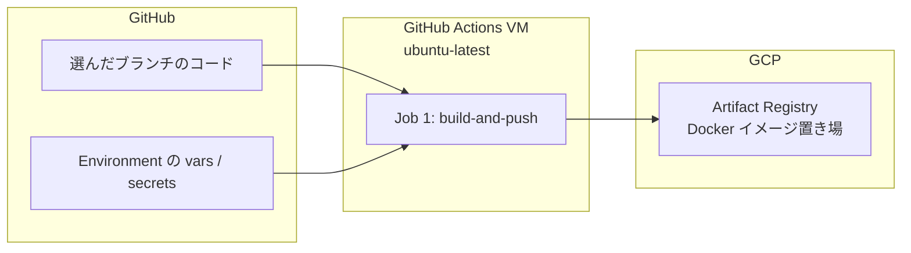
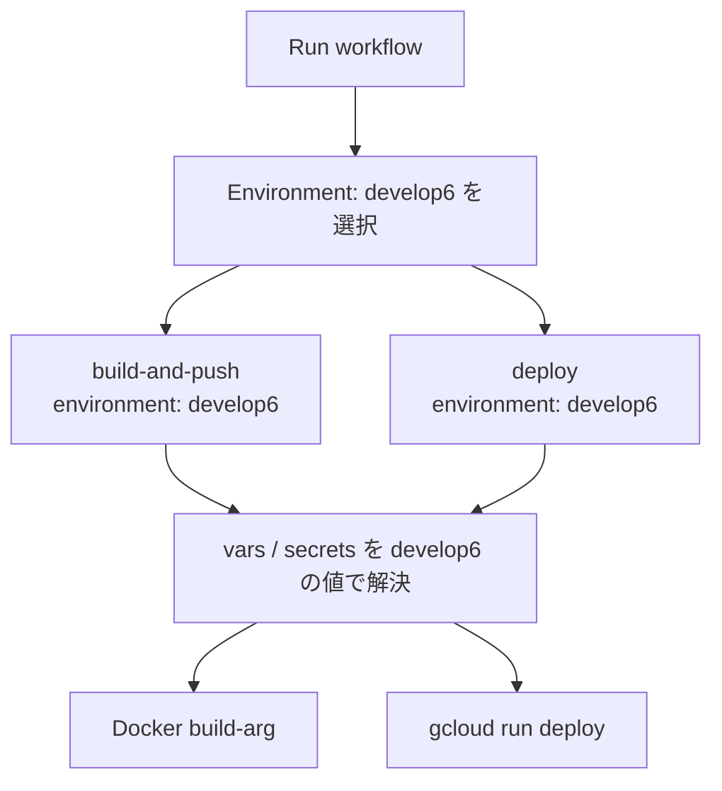

# 初めに

いや〜もう9月も半ばですね〜
今年の夏は去年ほど暑くなくてよかったなと思っているオメガマスターです〜

今回担当しているプロジェクトでは、検証環境が **develop1〜６ / staging1〜６ / production** と複数並立しています。そんなにいる？って意見はまともです実際は月日が経つにつれて現在は**develop5、６ / staging5、６ / production**の5つのみ動いております。
今までやったことある環境分けはVercelの環境で、**develop,uat,production**の３つの環境分けだったので、かなり新鮮でした。
今回は実際に運用している**手動トリガー + GitHub Environments** という方式で、任意のブランチを任意の環境に載せる設計について解説していきたいと思います。

# やりたかったこと

やりたかったこと自体はシンプルです。

1. 複数の検証環境（dev5 / dev6 / staging6 など）を並行運用する
2. feature ブランチ・統合ブランチ・release ブランチを、目的に応じて好きな環境にデプロイする
3. 環境ごとに API URL や Cloud Run サービス名を切り替える
4. 間違ったブランチが本番に行く事故を防ぐ

## 全体の流れ


ポイントは次の2つです。

1. **push では自動デプロイしない** — `workflow_dispatch` で手動実行
2. **環境ごとの設定は GitHub Environments に集約** — Variables / Secrets で切り替え

「ブランチ名 = 環境」という自動マッピングは **ありません**。
任意のブランチを、手動で選んだ環境にデプロイする設計です。

# ワークフローの定義

`.github/workflows/deploy.yml` のトリガー部分はこうなっています。

```yaml
on:
  workflow_dispatch:
    inputs:
      environment:
        description: 'Target environment for deployment'
        required: true
        type: environment
```

`type: environment` を指定すると、GitHub Actions の実行画面で **Environment のドロップダウン** が表示されます。

登録されている環境の例:

| GitHub Environment | 用途（概略） |
| --- | --- |
| `develop5` | dev5 検証環境 |
| `develop6` | dev6 検証環境 |
| `staging5` | stg5 統合検証環境 |
| `staging6` | stg6 統合検証環境 |
| `production` | 本番環境 |

# ジョブ構成（2段階）

デプロイは2段階のジョブで実行されます。Job 1 で Artifact Registry にイメージを push し、Job 2 が `needs: build-and-push` で **同じ commit SHA タグのイメージ** を Cloud Run に載せます。両ジョブに `environment: ${{ inputs.environment }}` を付け、選択した Environment の設定を参照します（仕組みの詳細は [GitHub Environments の役割](#github-environments-の役割)）。

## Job 1: Build and Push

```yaml
build-and-push:
  runs-on: ubuntu-latest
  environment: ${{ inputs.environment }}
```

Job 1 は **「GitHub の一時 VM 上で、選んだブランチのコードを、選んだ Environment の設定でビルドし、GCP のイメージ置き場に保存する」** ジョブです。上の「全体の流れ」図の **D（Docker ビルド）〜 E（Artifact Registry に push）** がこの Job 1 の仕事です。

### 登場人物（どこで何が動くか）



| 場所 | 役割 |
| --- | --- |
| **GitHub リポジトリ** | Run workflow で選んだ **Branch** のソースコード |
| **GitHub Environment** | Run workflow で選んだ **Environment** の Variables / Secrets |
| **GitHub Actions VM** | Job 1 が動く一時的な Linux マシン。ここで `docker build` する（終わったら消える） |
| **Artifact Registry** | ビルドした Docker イメージ（箱）の保管庫（GCP 上） |

### なぜDockerが必要？

上の図に「Docker ビルド」が出てきますが、ローカル開発では Docker を使っていません。CI/CD で Docker が出てくるのは、**デプロイ先が Cloud Run だから**です。

Cloud Run は **コンテナしか受け付けない** プラットフォームです。Next.js アプリを載せるには、動かせる形（Docker イメージ）にパッケージする必要があります。Docker は開発ツールではなく、**本番に載せるための箱**です。

`Dockerfile` はこの「箱づくり」の手順書です。`next.config.ts` の `output: 'standalone'` により本番用の `server.js` が生成され、CI 上で `docker build` → Artifact Registry → Cloud Run という流れになります。

### 4ステップの詳細

#### 1. 選択されたブランチを checkout

Run workflow で選んだブランチ（例: `BBB`）のソースが、Job 1 の最初のステップ `actions/checkout@v4` により VM の作業ディレクトリに checkout されます。内部的には `git clone` + `checkout` と同じ動きです。

```
GitHub リポジトリ
  BBB  ← Branch で選んだ
        │
        ▼ actions/checkout
  VM: /home/runner/work/frontend/frontend/
```

1. 空の Ubuntu VM（`ubuntu-latest`）が起動する
2. `actions/checkout` が GitHub からリポジトリを取得する
3. 選んだブランチ `BBB` の最新コミットのファイル一式が VM 上に置かれる
4. 置き場所は `/home/runner/work/<リポジトリ名>/<リポジトリ名>/`（本プロジェクトでは `frontend/frontend`）

ローカルで `git clone` して `git checkout BBB` したときと同様に、VM 上に `package.json`・`src/`・`Dockerfile` などが揃います。その後、同じディレクトリで `docker build` が実行されるので、**ビルド対象は選んだブランチ `BBB` のコード**になります。Job が終わったら VM ごと破棄されます。

Branch は「どのコードをビルドするか」、Environment は「どの設定値でビルド・デプロイするか」——別々に選びます。

#### 2. GCP 認証（`secrets.GCP_SERVICE_ACCOUNT_KEY`）

VM が GCP に「自分は push 権限を持つサービスアカウントです」と証明します。これがないと Artifact Registry に `docker push` できません。

```
Environment の Secrets
  GCP_SERVICE_ACCOUNT_KEY（JSON 鍵）
        │
        ▼ google-github-actions/auth
  gcloud コマンドが使える状態になる
        │
        ▼ gcloud auth configure-docker
  docker push も通る
```

#### 3. `${{ vars.* }}` / `${{ secrets.* }}` を build-arg に渡して Docker イメージをビルド

ここが一番ポイントです。build-arg に渡す値は、Run workflow で選んだ Environment の vars / secrets から解決されます（仕組みは [GitHub Environments の役割](#github-environments-の役割) の章）。

```yaml
docker build \
  --build-arg NEXT_PUBLIC_API_BASE_URL=${{ vars.NEXT_PUBLIC_API_BASE_URL }} \
  --build-arg NEXT_PUBLIC_APP_URL=${{ vars.NEXT_PUBLIC_APP_URL }} \
  # ... 他の build-arg
  -t "$IMAGE_TAG" .
```

`Dockerfile` 側では、build-arg → ENV → `npm run build` という流れです。

```
develop6 の Variables / Secrets
  NEXT_PUBLIC_API_BASE_URL = https://dev6-api.example.com
  NEXT_PUBLIC_APP_URL      = https://dev6.example.com
  KEYCLOAK_CLIENT_SECRET   = (秘密)
        │
        ▼ --build-arg で渡す
  Docker builder ステージ
    ENV に設定 → npm run build
    → .next/ に dev6 向けの JS が生成される
        │
        ▼
  Docker runner ステージ
    node server.js が動く最小イメージ
```

`NEXT_PUBLIC_*` はビルド時に Next.js の成果物へ埋め込まれるため、**環境ごとに別イメージ** をビルドする必要があります。

#### 4. Artifact Registry に push（タグは commit の short SHA）

ビルドしたイメージに名前を付けて GCP にアップロードします。

```
asia-northeast1-docker.pkg.dev/dev6/my-repo/frontend:a1b2c3d
│                              │            │         │      └─ git rev-parse --short HEAD
│                              │            │         └─ イメージ名（frontend）
│                              │            └─ リポジトリ名（Environment の vars）
│                              └─ GCP プロジェクト（Environment の vars）
└─ リージョン付きレジストリ URL（Environment の vars）
```

- **レジストリの場所** → Environment の `ARTIFACT_REGISTRY_URL` / `GCP_PROJECT_ID` / `ARTIFACT_REGISTRY_REPO`
- **タグ** → commit の short SHA（例: `a1b2c3d`）
- Job 2 はこのタグを指定して Cloud Run に載せる

## Job 2: Deploy to Cloud Run

```yaml
deploy:
  needs: build-and-push
  environment: ${{ inputs.environment }}
```

`gcloud run deploy` で Environment ごとの Cloud Run サービスへ反映します。

```yaml
gcloud run deploy ${{ vars.CLOUD_RUN_SERVICE_NAME }} \
  --image=.../frontend:${{ needs.build-and-push.outputs.sha_short }} \
  --region=${{ vars.GCP_REGION }} \
  --memory=${{ vars.MEMORY }} \
  --cpu=${{ vars.CPU }} \
  --update-env-vars="INTERNAL_TOKEN=..." \
  --update-env-vars="INTERNAL_API_BASE_URL=..." \
  # ...
```

環境ごとに **別の Cloud Run サービス**（例: `dev5-run-frontend` / `dev6-run-frontend`）にデプロイされます。

# GitHub Environments の役割

各 Environment には **Variables**（`${{ vars.* }}`）と **Secrets**（`${{ secrets.* }}`）が紐づきます。**キー名は全 Environment で共通、値だけ環境ごとに異なる**運用です。

## 「集約」とは具体的に何が起きるか

前章の `environment: ${{ inputs.environment }}` により、選んだ Environment の vars / secrets だけが両ジョブに渡されます。YAML 側に環境ごとの URL やサービス名は書きません。



## Variables と Secrets の使い分け

| 種類 | 参照 | 向き | 例 |
| --- | --- | --- | --- |
| **Variables** | `${{ vars.XXX }}` | 非機密の設定値 | API URL、Cloud Run サービス名、GCP リージョン |
| **Secrets** | `${{ secrets.XXX }}` | 機密情報 | GCP SA 鍵、Keycloak client secret、内部トークン |

Secrets は GitHub UI 上で値を再表示できず、Actions ログでもマスクされます。パスワードや JSON 鍵は Variables ではなく Secrets に入れます。

## ビルド時注入 vs ランタイム注入

Environment の値は、**いつアプリに渡すか**でも分かれています。

| 段階 | ジョブ | 渡し方 | 代表例 |
| --- | --- | --- | --- |
| **ビルド時** | Job 1: build-and-push | Docker `--build-arg` → イメージに焼き込み | `NEXT_PUBLIC_*`, `KEYCLOAK_CLIENT_SECRET` |
| **ランタイム** | Job 2: deploy | `gcloud run deploy --update-env-vars` | `INTERNAL_TOKEN`, `INTERNAL_API_BASE_URL` |

## YAML にベタ書きしない理由

やらない例:

```yaml
# 環境ごとに if 分岐で URL を書く — こうしない
if: inputs.environment == 'develop5'
  run: docker build --build-arg NEXT_PUBLIC_API_BASE_URL=https://dev5-api.example.com
```

- 環境が増えるたび YAML が肥大化する
- URL や鍵が Git 履歴に残るリスクがある
- dev5 / dev6 の差分がコードレビューで追いにくい

やっている例:

- **ワークフロー**: 「何を参照するか」だけ（`${{ vars.CLOUD_RUN_SERVICE_NAME }}`）
- **GitHub Environments**: 「各環境の実際の値」

新しい検証環境を足すときは、Environment を 1 つ作って Variables / Secrets を登録すればよく、ワークフロー変更は最小で済みます。

## Environment ごとの値のイメージ

同じキー名で、値だけ Environment ごとに変える例です（値は架空）。

| Variable | develop5 | develop6 |
| --- | --- | --- |
| `CLOUD_RUN_SERVICE_NAME` | `dev5-run-frontend` | `dev6-run-frontend` |
| `NEXT_PUBLIC_API_BASE_URL` | `https://dev5-api.example.com` | `https://dev6-api.example.com` |
| `GCP_PROJECT_ID` | `dev5` | `dev6` |

ワークフロー側は常に `${{ vars.CLOUD_RUN_SERVICE_NAME }}` のまま。切り替えは Run workflow の Environment 選択だけです。

## ローカル開発との対応

ローカルと CI/CD で設定の置き場が違うだけで、キー名は揃えています。

| ローカル | CI/CD |
| --- | --- |
| `npm run dev:dev6` | Run workflow で Environment = `develop6` を選ぶ |
| `.env.local.dev6` など | GitHub Environment の Variables / Secrets |
| `npm run build` | Job 1: Docker 内の `npm run build` |
| `npm start` | Job 2: Cloud Run が `node server.js` を起動 |

`NEXT_PUBLIC_API_BASE_URL` など **キー名を揃えておく**と、どの環境の値か追いやすくなります。

## 将来足せる安全装置（任意）

GitHub Environments には、デプロイ前の **Required reviewers**（承認必須）や **Deployment branches**（特定ブランチのみ許可）も設定できます。

本番 `production` Environment に Required reviewers を付けるのは、手動デプロイ運用でもよくある次の一手です。

## 設定場所

GitHub リポジトリ → **Settings** → **Environments** → 対象環境 → **Environment variables** / **Environment secrets**

:::message
メンテナンス用の環境変数（`MAINTENANCE_*` など）だけは Cloud Run 側で直接管理しており、CD ワークフローでは上書きしません。
:::

# 実際のデプロイ手順

1. GitHub → **Actions** → **CD - Frontend Deployment**
2. **Run workflow** をクリック
3. **Branch**: デプロイしたいブランチを選択（例: `AAA`）
4. **Environment**: デプロイ先を選択（例: `staging6`）
5. **Run workflow** で実行

:::message
PR をマージしただけではデプロイされません。「今 dev6 に何が載っているか」は Actions の実行履歴（Branch・Environment・commit SHA）や、完了時の Deployment summary（Service URL など）を確認します。
:::

# 他のデプロイ方式との比較

| 方式 | よくある場面 | 本プロジェクト |
| --- | --- | --- |
| push/merge で自動デプロイ | SaaS、小〜中規模、CI/CD が成熟したチーム | 使っていない |
| 手動 + 環境選択 | 複数検証環境、統合ブランチ運用 | **採用** |
| GitOps (Argo CD 等) | K8s、大規模インフラ | 使っていない |
| タグ/リリースで本番のみ自動 | 本番は自動、検証は手動 | 使っていない |

## メリット

- **任意ブランチを任意環境に載せられる** — 統合ブランチや feature ブランチを柔軟に検証できる
- **事故が少ない** — push 連動だと「間違ったブランチが本番に行く」リスクがある
- **複数 feature の統合テスト向き** — `AAA` のような統合ブランチ運用と相性が良い
- **環境ごとの設定が GitHub に集約** — コードとインフラ設定の対応が明確

## デメリット

- 毎回人手が必要（「デプロイして」がボトルネックになりやすい）
- ブランチと環境の対応は運用ルール依存（自動化されていない）
- PR マージ ≠ デプロイなので、「今 dev6 に何が載っているか」は Actions の履歴を確認する必要がある

# まとめ

- **手動 `workflow_dispatch` + GitHub Environments** で、任意ブランチを任意環境に載せる
- Job 1（ビルド時注入）と Job 2（ランタイム注入）の2段階で Cloud Run にデプロイ
- 環境差分は Variables / Secrets に集約し、YAML に if 分岐は書かない

同じように複数検証環境を運用している方の参考になれば嬉しいです。

# 参考

- [GitHub Environments ドキュメント](https://docs.github.com/ja/actions/deployment/targeting-different-environments/using-environments-for-deployment)
- [workflow_dispatch イベント](https://docs.github.com/ja/actions/using-workflows/events-that-trigger-workflows#workflow_dispatch)
- [Google Cloud Run デプロイ](https://cloud.google.com/run/docs/deploying)
