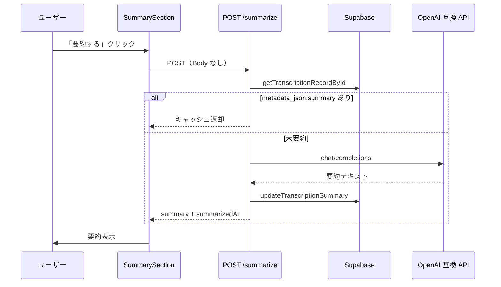

# 初めに
この記事はZennfes Spring 2026「音声認識AmiVoice APIと生成AIで作る音声体験」エントリ記事です。

AmiVoice API と LLM を組み合わせて「音声を取り込み → テキスト化 → 要約」する流れを作る前提で書いていきます。まずは同じ **Speech-to-Text（音声認識）** の領域で、AmiVoice と並んで検討される製品・サービスを整理しておきます。
そしておそらく多くの方はCursor、Claude Code、Codex、Devin等を使用しながら開発していると勝手に思っているので、新しいAPIを試す時にもうドキュメントを1から読むこともないかなと思っています。なのでここではAIに指示出ししながら実装して、エラーになったことを記載していきます。

# `received illegal service authorization`エラー
AmiVoice API の同期 HTTP を Next.js の Route Handler（BFF）から `fetch` + `FormData` で呼んだとき、**curl では成功するのにアプリだけ認証エラー**になる、という話です。

## 想定読者・環境

- AmiVoice API をサーバー側（BFF）から呼びたい方
- Next.js App Router + `fetch` + `FormData` で `/v1/recognize` に POST している方
- ブラウザ録音（WebM）をそのまま API に渡している構成
本記事のコード例は TypeScript / Node.js 前提です。他言語でも **「マルチパートの最後に音声を置く」** ルールは同じです。

## 症状

AmiVoice から次のような JSON が返ることがあります。

```json
{
  "text": "",
  "code": ":-",
  "message": "received illegal service authorization"
}
```

Next.js で BFF に包んでいる場合は、例えば次のように見えます。

- ターミナル: `POST /api/speech/transcribe 502 in 600ms` 前後
- レスポンス body: `{ "error": "received illegal service authorization" }`

**502 は AmiVoice サーバーそのものではなく、BFF が「外部 API（AmiVoice / LLM）の失敗」として返している** ことが多いです。まず Network タブの `error` 本文を確認してください。

## 切り分け：curl は成功するのにアプリだけ失敗

API キーが本当に有効かは、**アプリを通さず curl で先に確認**するのが早いです。

```bash
export AMIVOICE_API_KEY='ここにマイページのAPIキー'

curl https://acp-api.amivoice.com/v1/nolog/recognize \
  -F "u=${AMIVOICE_API_KEY}" \
  -F "d=-a-general" \
  -F "a=@./test.wav"
```

| curl の結果 | 次に疑う場所 |
|-------------|----------------|
| `code` が空で `text` に認識文 | キーは有効 → **アプリのリクエスト組み立て** |
| 同じ `illegal service authorization` | キー・アカウント（本登録・IP 制限など） |
| `curl: (26) Failed to open/read local data` | `@` のパスが存在しない（AmiVoice 未到達） |

:::message alert
`@/path/to/test.wav` のような**存在しないパス**を指定すると `(26)` で止まります。認証エラーとは別問題です。
:::

## 原因① multipart の順序（いちばん見落としがち）

[同期 HTTP インタフェース](https://docs.amivoice.com/amivoice-api/manual/sync-http-interface) には、次の注意があります。

> **`a` パラメータの後に設定されたパラメータは無視されます。**

公式例の正しい順序は **`u`（認証）→ `d`（エンジン）→ `a`（音声）** です。

```bash
# ✅ 正しい例（a が最後）
curl ... -F u={APIキー} -F d=-a-general -F a=@test.wav
```

### 認証エラーになる並び

`a` の**後**に `u` を付けると、認証パラメータが無視され、次のエラーになります。

```bash
# ❌ u が a より後 → illegal service authorization
curl ... -F d=-a-general -F a=@test.wav -F u={APIキー}
```

### 修正前のコード例（問題あり）

BFF から AmiVoice を呼ぶ処理で、次のように **`a` のあとに `d` を付けている** と、`d` は無視されます。環境によっては認証まわりも意図どおり効かず、先のエラーになります。

```typescript
const form = new FormData();
form.append("u", apiKey);
form.append("a", blob, "audio.webm");
form.append("d", "-a-general"); // ❌ a より後

const response = await fetch("https://acp-api.amivoice.com/v1/recognize", {
  method: "POST",
  body: form,
});
```

### 修正後のコード例

**`a` を最後に append** します。キーは `.trim()` しておくと `.env` の改行混入を防げます。

```typescript
const apiKey = process.env.AMIVOICE_API_KEY?.trim();
if (!apiKey) {
  throw new Error("AMIVOICE_API_KEY が設定されていません");
}

const engine = "-a-general";
const blob = new Blob([new Uint8Array(audioBuffer)], {
  type: mimeType, // 例: audio/webm
});

const form = new FormData();
form.append("u", apiKey);
form.append("d", engine);
form.append("a", blob, "audio.webm"); // ✅ 必ず最後

const response = await fetch("https://acp-api.amivoice.com/v1/recognize", {
  method: "POST",
  body: form,
});
```

# 音声認識履歴を LLM で要約する — Next.js BFF + metadata_json キャッシュ
AmiVoice で音声認識したテキストを DB に保存し、履歴詳細画面から **OpenAI 互換 API（Gemini / OpenAI など）で要約** する機能の実装メモです。フェーズ1の英→日翻訳と同じ `LLM_*` 環境変数を流用し、**専用カラムを増やさず `metadata_json` にキャッシュ** する構成にしています。

## 機能概要

| 項目 | 内容 |
| ---- | ---- |
| 画面 | `/speech/history/{id}`（変換履歴詳細） |
| 操作 | 「要約する」ボタンをクリック |
| 要約対象 | `final_text`（表示・保存用の最終テキスト） |
| LLM | OpenAI 互換 API（Gemini / OpenAI など） |
| 保存先 | `t_transcription_record.metadata_json`（JSONB） |

## 処理フロー



要点は次の 3 点です。

1. **BFF 経由** — クライアントは `/api/speech/history/{id}/summarize` を叩くだけ。API キーはサーバー側のみ。
2. **キャッシュ優先** — `metadata_json.summary` があれば LLM を呼ばない。
3. **翻訳と同型** — `llm-summarizer.ts` は `llm-translator.ts` と同じ fetch パターン。

## 環境変数

フェーズ1（英→日翻訳）と同じ `LLM_*` を流用します。**追加の env は不要** です。

| 変数 | 用途 |
| ---- | ---- |
| `LLM_API_KEY` | API キー（Gemini は [Google AI Studio](https://aistudio.google.com/) から取得） |
| `LLM_API_BASE_URL` | OpenAI 互換ベース URL |
| `LLM_MODEL` | モデル名 |

## 実装の構成

| 役割 | 配置例 |
| ---- | ------ |
| LLM アダプター | `features/speech/adapters/llm-summarizer.ts` |
| DB 更新 | `features/speech/adapters/transcription-repository.ts` |
| API Route | `app/api/speech/history/[id]/summarize/route.ts` |
| UI（Client） | `app/(dashboard)/speech/history/[id]/_components/SummarySection.tsx` |
| 詳細ページ | `app/(dashboard)/speech/history/[id]/page.tsx` |

### LLM アダプター

翻訳用アダプターと同型の fetch 実装です。エンドポイントは `${LLM_API_BASE_URL}/chat/completions`、temperature は `0.2` に固定しています。

```typescript
const MAX_INPUT_LENGTH = 8000;

export async function summarizeText(text: string): Promise<string> {
  const trimmed = text.trim();
  if (!trimmed) {
    throw new LlmSummarizationError("要約対象テキストが空です");
  }

  const input =
    trimmed.length > MAX_INPUT_LENGTH
      ? trimmed.slice(0, MAX_INPUT_LENGTH)
      : trimmed;

  const apiKey = process.env.LLM_API_KEY;
  const baseUrl =
    process.env.LLM_API_BASE_URL?.replace(/\/$/, "") ??
    "https://api.openai.com/v1";
  const model = process.env.LLM_MODEL ?? "gpt-4o-mini";

  if (!apiKey) {
    throw new LlmSummarizationError("LLM_API_KEY が設定されていません");
  }

  const response = await fetch(`${baseUrl}/chat/completions`, {
    method: "POST",
    headers: {
      "Content-Type": "application/json",
      Authorization: `Bearer ${apiKey}`,
    },
    body: JSON.stringify({
      model,
      messages: [
        {
          role: "system",
          content:
            "音声認識テキストを日本語で3〜5行に要約してください。箇条書き可。説明や前置きは不要です。",
        },
        { role: "user", content: input },
      ],
      temperature: 0.2,
    }),
  });

  if (!response.ok) {
    throw new LlmSummarizationError(
      `要約 API がエラーを返しました (${response.status})`,
    );
  }

  const json = (await response.json()) as {
    choices?: Array<{ message?: { content?: string } }>;
  };

  const summary = json.choices?.[0]?.message?.content?.trim();
  if (!summary) {
    throw new LlmSummarizationError("要約結果が空です");
  }

  return summary;
}
```

- 入力が空 → `LlmSummarizationError`
- 8000 文字超 → 先頭 8000 文字に truncate（トークン超過防止）

### Route Handler（キャッシュ返却）

POST 時に DB からレコードを取得し、**既存の要約があれば LLM を呼ばず** 返します。

```typescript
export async function POST(_request: Request, context: RouteContext) {
  try {
    const { id } = await context.params;
    const parsed = RecordIdParamsSchema.safeParse({ id });

    if (!parsed.success) {
      return jsonError("ID が不正です", 400);
    }

    const record = await getTranscriptionRecordById(parsed.data.id);

    if (!record) {
      return jsonError("レコードが見つかりません", 404);
    }

    const cached = readCachedSummary(record.metadata_json);
    if (cached) {
      return Response.json({
        summary: cached.summary,
        summarizedAt: cached.summarizedAt,
        recordId: record.id,
      });
    }

    const summary = await summarizeText(record.final_text);
    const updated = await updateTranscriptionSummary(record.id, summary);

    return Response.json({
      summary,
      summarizedAt: new Date().toISOString(),
      recordId: updated.id,
    });
  } catch (error) {
    if (error instanceof LlmSummarizationError) {
      return jsonError(error.message, 502);
    }
    return jsonError("要約処理に失敗しました", 500);
  }
}
```

### DB 保存（metadata_json マージ）

専用カラムは追加せず、既存の `metadata_json` にマージします。

```typescript
const metadataJson: Record<string, unknown> = {
  ...(existing.metadata_json ?? {}),
  summary,
  summarizedAt: new Date().toISOString(),
};
```

保存形式:

```json
{
  "summary": "要約テキスト",
  "summarizedAt": "2026-05-31T12:00:00.000Z"
}
```

- 2 回目以降の POST は LLM を呼ばず、保存済み `summary` を返します（再生成ボタンは未実装）。
- ページ再読み込み時は Server Component が `metadata_json.summary` を読み、Client Component に `initialSummary` として渡します。

## API 仕様

### `POST /api/speech/history/{id}/summarize`

**リクエスト**

- Body なし
- `id`: UUID（パスパラメータ）

**成功レスポンス（200）**

```json
{
  "summary": "・要点1\n・要点2",
  "summarizedAt": "2026-05-31T12:00:00.000Z",
  "recordId": "019..."
}
```

**エラー**

| ステータス | 条件 |
| ---------- | ---- |
| 400 | ID が UUID 形式でない |
| 404 | レコードが存在しない |
| 502 | LLM エラー（キー未設定、API 失敗、結果が空など） |
| 500 | その他のサーバーエラー |

502 時はレスポンス JSON の `error` フィールドにメッセージが入ります。

## UI 仕様

詳細ページの「最終テキスト」直下に「要約」セクションを配置しています。

| 状態 | 表示 |
| ---- | ---- |
| 未要約 | 「要約する」ボタン |
| 要約中 | ボタン disabled + 「要約中…」 |
| 成功 | 要約テキスト（border 付きブロック） |
| 失敗 | 赤文字のエラーメッセージ |
| 保存済み | 要約テキストのみ（ボタン非表示） |

クライアントからの呼び出し例:

```typescript
const res = await fetch(`/api/speech/history/${recordId}/summarize`, {
  method: "POST",
});
const data = await res.json();
// data.summary
```

Client Component 側では `initialSummary` を state の初期値にし、要約済みならボタンを出さないようにしています。

```typescript
export function SummarySection({
  recordId,
  initialSummary,
}: SummarySectionProps) {
  const [summary, setSummary] = useState<string | null>(
    initialSummary ?? null,
  );
  // ...
}
```

要約機能は **既存の翻訳インフラをそのまま流用** し、DB スキーマを増やさず `metadata_json` に結果を蓄積する、デモ向けの最小構成です。本番で再生成や要約バージョン管理が必要になったら、専用テーブルや `summaryVersion` フィールドの追加を検討した方が良いですね。


# 他製品紹介
最後にAmiVoice と同じく **音声をテキストに変換する API / SDK / サービスを紹介させてください**、大きく次の4系統に分かれます。

| 系統 | 代表例 | AmiVoice との関係 |
| --- | --- | --- |
| 国内・日本語特化 | AmiVoice、Voioi、ReazonSpeech | 日本語ビジネス会話・専門用語向け |
| グローバルクラウド API | Google / Azure / AWS / Deepgram / AssemblyAI など | 開発者向け STT API として直接競合 |
| OSS / 自前ホスト | Whisper、ReazonSpeech、Kotoba-Whisper | API ではなく自前運用。データ持ち出し制約向き |
| SaaS（完成プロダクト） | Notta、Rimo Voice、LINE WORKS AiNote | API 統合ではなく GUI で完結 |

## 国内・日本語特化

| サービス | ストリーミング | 主な特徴 |
| --- | --- | --- |
| [AmiVoice Cloud Platform](https://www.advanced-media.co.jp/amivoice/cloud/) | ✅ | 国内シェア No.1。医療・金融など領域特化エンジン、専用環境構築、日本語サポート、**発話時間のみ課金** |
| Voioi | ✅ | 93言語対応。リアルタイム・ファイル両方。国内向け |
| [ReazonSpeech](https://github.com/reazon-research/ReazonSpeech) | △ | 日本語特化 OSS。自前ホスト or API 利用 |

AmiVoice の強みは **日本語精度**、**専門用語辞書**、**国内サポート**、**オンプレ / 専用環境** あたり。海外 API と比べて、日本語のビジネス会話や専門分野では依然有力です。

:::message
AmiVoice 提供元のアドバンスト・メディアは、[音声認識 API 主要 7 社の価格・機能比較表（2026 年版）](https://www.advanced-media.co.jp/newsrelease/11316/) を公開しています。客観的な比較資料として参考になります。
:::

## グローバルクラウド STT API

AmiVoice と同じく **REST / WebSocket API + ストリーミング** で使える開発者向けサービスです。

| サービス | ストリーミング | 日本語 | ざっくり特徴 |
| --- | --- | --- | --- |
| [Google Cloud Speech-to-Text](https://cloud.google.com/speech-to-text) | ✅ | ✅ | 125+ 言語。話者分離・カスタム語彙。設定はやや複雑 |
| [Azure Speech Services](https://azure.microsoft.com/products/ai-services/speech-to-text) | ✅ | ✅ | エンタープライズ向け。価格競争力あり |
| [AWS Transcribe](https://aws.amazon.com/transcribe/) | ✅ | ✅ | AWS 連携が前提なら自然。カスタム語彙対応 |
| [Deepgram](https://deepgram.com/) | ✅ | ✅ | **低遅延（~300ms）**・低コスト。ライブ字幕向き |
| [AssemblyAI](https://www.assemblyai.com/) | ✅ | ✅ | 開発者体験が良い。要約・感情分析など付加機能も |
| [OpenAI Whisper API](https://platform.openai.com/docs/guides/speech-to-text) | ❌ | ✅ | 精度は高いが **バッチのみ**（リアルタイム向きではない） |
| [Rev AI](https://www.rev.ai/) | ✅ | △ | 精度重視だが **高コスト** |
| [Speechmatics](https://www.speechmatics.com/) | ✅ | ✅ | 英語・多言語で精度評価が高い |
| [Soniox](https://soniox.com/) | ✅ | △ | 新興。低コスト・低遅延を謳う |

ストリーミング API の比較記事としては、[ストリーミング音声認識 API/SDK の最新比較（2025 年）](https://zenn.dev/kennejima/articles/56f60e1962291e) も参考になります。

## OSS / 自前ホスト

API ではなく、自前で STT 基盤を組む選択肢です。

| 選択肢 | 特徴 |
| --- | --- |
| [OpenAI Whisper](https://github.com/openai/whisper) | 精度は高い。GPU 推奨。**ストリーミング非対応**（バッチ向き） |
| [ReazonSpeech](https://github.com/reazon-research/ReazonSpeech) | 日本語特化 OSS |
| [Kotoba-Whisper](https://huggingface.co/kotoba-tech/kotoba-whisper-v2.0) | 日本語 Whisper 派生 |
| faster-whisper + pyannote | 話者分離を自前で組み合わせる構成 |

**データを外に出せない**（オンプレ・ローカル必須）場合は、AmiVoice の専用環境構築 or Whisper 自前運用が現実的な選択肢になります。

## SaaS（API ではないが用途は近い）

Cursor SDK で要約までやるなら、API 統合ではなく **完成プロダクト** として検討する選択肢もあります。

| サービス | 特徴 |
| --- | --- |
| [Notta](https://www.notta.ai/ja) | 58 言語。Zoom 連携。個人向け月額あり |
| [Rimo Voice](https://rimo.app/) | 日本語精度が高め。編集 UI が使いやすい |
| [LINE WORKS AiNote](https://line-works.com/ai-note/) | 無料枠あり（月 300 分）。手軽 |
| Google AI Studio (Gemini) | ファイルアップロードで文字起こし + 要約。API というより GUI |

## どれを選ぶか

用途別のざっくり目安です。

```
リアルタイム文字起こし（ストリーミング）
  ├─ 日本語・専門用語・国内サポート重視 → AmiVoice
  ├─ 低遅延・低コスト重視             → Deepgram / AssemblyAI
  └─ 既存クラウド統合                → Azure / Google / AWS

ファイル文字起こし（バッチ）
  ├─ 手軽さ重視                      → OpenAI Whisper API
  └─ 日本語精度重視                  → AmiVoice / ReazonSpeech

データを外に出せない
  └─ AmiVoice 専用環境 or Whisper 自前ホスト
```
