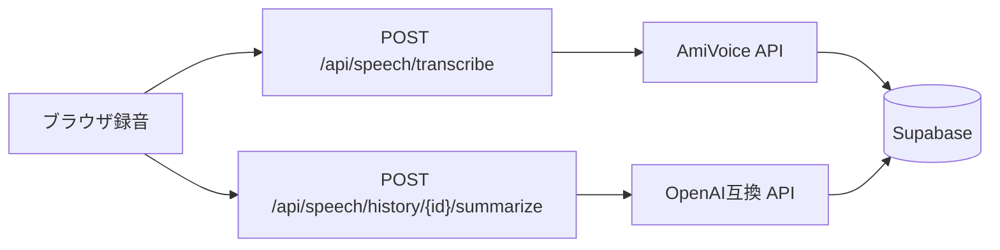
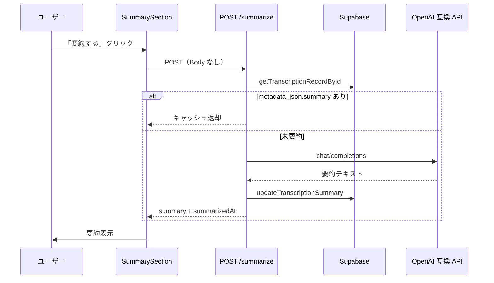

# 初めに
この記事はZennfes Spring 2026「音声認識AmiVoice APIと生成AIで作る音声体験」エントリ記事です。

AmiVoice API と LLM を組み合わせて「録音 → 文字起こし → 要約」するデモを Next.js で作りました。AmiVoice 連携で認証エラーにハマったのでその解決方法も共有します。

- **対象読者:** AmiVoice API を BFF から初めて触る方
- **環境:** Next.js App Router / TypeScript / Supabase

## 記事の構成

1. [AmiVoice とは](#amivoice-とは) — 製品・API の概要
2. [作ったもの](#作ったもの-音声--文字起こし--要約) — 全体像と文字起こしの正常系
3. [AmiVoice 連携でハマった点](#amivoice-連携でハマった-multipart-の順序) — `illegal service authorization` の原因と修正
4. [LLM で要約する](#音声認識履歴を-llm-で要約する--nextjs-bff--metadata_json-キャッシュ) — 履歴画面から要約
5. [なぜ AmiVoice か](#なぜ-amivoice-か) — 他 STT とのざっくり比較

# AmiVoice とは

[アドバンスト・メディア](https://www.advanced-media.co.jp/)が提供する日本語音声認識（Speech to Text）エンジンです。**AmiVoice API** はその HTTP / WebSocket 向け API で、自社アプリや BFF から音声を送るとテキストが返ります。会議の文字起こし、音声ボット、LLM への入力などに使われます。

AmiVoice API で主にできることは次のとおりです。

- **音声ファイルの文字起こし** — 同期 HTTP（今回の `/v1/recognize`）や非同期バッチ
- **リアルタイム認識** — WebSocket ストリーミング（今回のデモでは未使用）
- **用途別エンジンの選択** — 汎用（`-a-general`）、医療・金融・保険など業界向け
- **ユーザー辞書** — 固有名詞・専門用語を登録して認識精度を上げる

:::message
AmiVoice Cloud Platform では API のほか Web SDK や Private 環境も提供されていますが、本記事では **同期 HTTP API だけ** を Next.js BFF から呼ぶ構成に絞っています。
:::

詳細は [AmiVoice API 公式](https://acp.amivoice.com/amivoice_api/) と [開発ガイド](https://docs.amivoice.com/amivoice-api/manual/user-guide) を参照してください。

# 作ったもの: 音声 → 文字起こし → 要約

ブラウザで録音した音声を AmiVoice API でテキスト化し、履歴画面から LLM で要約するデモです。
作成理由としては下記の３つが私のやりたいことだったので、これを機に作成してみました。
- 対面商談で営業がなんと言ったか確認したい
- 対面商談のメモを用件定義にも組み込みたい
- エンジニアイベントで英語を日本語に翻訳したいし、まとめたい

## アーキテクチャ



## 技術スタック

| レイヤ | 技術 |
|--------|------|
| フロント | Next.js App Router + ブラウザ MediaRecorder |
| BFF | Route Handler（API キーはサーバー側のみ） |
| STT | AmiVoice 同期 HTTP `/v1/recognize` |
| 生成AI | OpenAI 互換 `chat/completions` |
| DB | Supabase（`t_transcription_record`） |

## 環境変数（AmiVoice）

| 変数 | 用途 |
| ---- | ---- |
| `AMIVOICE_API_KEY` | AmiVoice API キー（マイページから取得） |

## 文字起こしの正常系

ブラウザから `multipart/form-data` で音声 Blob を BFF に送り、BFF が AmiVoice 同期 HTTP を呼びます。**FormData は `u` → `d` → `a` の順**（`a` 以降のパラメータは無視される点に注意。[後述](#原因-multipart-の順序)）。

### BFF（Route Handler）

```typescript
// app/api/speech/transcribe/route.ts（抜粋）
const apiKey = process.env.AMIVOICE_API_KEY?.trim();
if (!apiKey) {
  return jsonError("AMIVOICE_API_KEY が設定されていません", 500);
}

const formData = await request.formData();
const audio = formData.get("audio");
if (!(audio instanceof Blob)) {
  return jsonError("音声データがありません", 400);
}

const form = new FormData();
form.append("u", apiKey);
form.append("d", "-a-general");
form.append("a", audio, "audio.webm"); // ✅ 必ず最後

const response = await fetch("https://acp-api.amivoice.com/v1/recognize", {
  method: "POST",
  body: form,
});

const result = await response.json();
// result.text を DB に保存して返却
```

### クライアント（録音 → 送信）

```typescript
// MediaRecorder で WebM を取得したあと
const body = new FormData();
body.append("audio", audioBlob, "recording.webm");

const res = await fetch("/api/speech/transcribe", {
  method: "POST",
  body,
});
```

AmiVoice から `text` が返れば `t_transcription_record.final_text` に保存し、履歴一覧・詳細画面から参照します。

# AmiVoice 連携でハマった: multipart の順序

[文字起こしの正常系](#文字起こしの正常系) を実装したあと、**curl では成功するのにアプリだけ認証エラー**になる事象に遭遇しました。

## 想定読者

AmiVoice API を Next.js BFF + `fetch` + `FormData` で `/v1/recognize` に POST している方。TypeScript / Node.js 前提ですが、他言語でも **「マルチパートの最後に音声を置く」** ルールは同じです。

## 症状

AmiVoice から次のような JSON が返ることがあります。

```json
{
  "text": "",
  "code": ":-",
  "message": "received illegal service authorization"
}
```

Next.js で BFF に包んでいる場合は、例えば次のように見えます。

- ターミナル: `POST /api/speech/transcribe 502 in 600ms` 前後
- レスポンス body: `{ "error": "received illegal service authorization" }`

**502 は AmiVoice サーバーそのものではなく、BFF が「外部 API（AmiVoice / LLM）の失敗」として返している** ことが多いです。まず Network タブの `error` 本文を確認してください。

## 切り分け：curl は成功するのにアプリだけ失敗

API キーが本当に有効かは、**アプリを通さず curl で先に確認**するのが早いです。

```bash
export AMIVOICE_API_KEY='ここにマイページのAPIキー'

curl https://acp-api.amivoice.com/v1/nolog/recognize \
  -F "u=${AMIVOICE_API_KEY}" \
  -F "d=-a-general" \
  -F "a=@./test.wav"
```

| curl の結果 | 次に疑う場所 |
|-------------|----------------|
| `code` が空で `text` に認識文 | キーは有効 → **アプリのリクエスト組み立て** |
| 同じ `illegal service authorization` | キー・アカウント（本登録・IP 制限など） |
| `curl: (26) Failed to open/read local data` | `@` のパスが存在しない（AmiVoice 未到達） |

:::message alert
`@/path/to/test.wav` のような**存在しないパス**を指定すると `(26)` で止まります。認証エラーとは別問題です。
:::

## 原因: multipart の順序

[同期 HTTP インタフェース](https://docs.amivoice.com/amivoice-api/manual/sync-http-interface) には、次の注意があります。

> **`a` パラメータの後に設定されたパラメータは無視されます。**

公式例の正しい順序は **`u`（認証）→ `d`（エンジン）→ `a`（音声）** です。

```bash
# ✅ 正しい例（a が最後）
curl ... -F u={APIキー} -F d=-a-general -F a=@test.wav
```

### 認証エラーになる並び

`a` の**後**に `u` を付けると、認証パラメータが無視され、次のエラーになります。

```bash
# ❌ u が a より後 → illegal service authorization
curl ... -F d=-a-general -F a=@test.wav -F u={APIキー}
```

### 修正前のコード例（問題あり）

BFF から AmiVoice を呼ぶ処理で、次のように **`a` のあとに `d` を付けている** と、`d` は無視されます。環境によっては認証まわりも意図どおり効かず、先のエラーになります。

```typescript
const form = new FormData();
form.append("u", apiKey);
form.append("a", blob, "audio.webm");
form.append("d", "-a-general"); // ❌ a より後

const response = await fetch("https://acp-api.amivoice.com/v1/recognize", {
  method: "POST",
  body: form,
});
```

### 修正後

正常系の実装は [文字起こしの正常系](#文字起こしの正常系) を参照。**`a` を最後に append** し、キーは `.trim()` して `.env` の改行混入を防ぎます。

# 音声認識履歴を LLM で要約する — Next.js BFF + metadata_json キャッシュ
AmiVoice で音声認識したテキストを DB に保存し、履歴詳細画面から **OpenAI 互換 API（Gemini / OpenAI など）で要約** する機能の実装メモです。フェーズ1の英→日翻訳と同じ `LLM_*` 環境変数を流用し、**専用カラムを増やさず `metadata_json` にキャッシュ** する構成にしています。

## 機能概要

| 項目 | 内容 |
| ---- | ---- |
| 画面 | `/speech/history/{id}`（変換履歴詳細） |
| 操作 | 「要約する」ボタンをクリック |
| 要約対象 | `final_text`（表示・保存用の最終テキスト） |
| LLM | OpenAI 互換 API（Gemini / OpenAI など） |
| 保存先 | `t_transcription_record.metadata_json`（JSONB） |

## 処理フロー



要点は次の 3 点です。

1. **BFF 経由** — クライアントは `/api/speech/history/{id}/summarize` を叩くだけ。API キーはサーバー側のみ。
2. **キャッシュ優先** — `metadata_json.summary` があれば LLM を呼ばない。
3. **翻訳と同型** — `llm-summarizer.ts` は `llm-translator.ts` と同じ fetch パターン。

## 環境変数

フェーズ1（英→日翻訳）と同じ `LLM_*` を流用します。**追加の env は不要** です。

| 変数 | 用途 |
| ---- | ---- |
| `LLM_API_KEY` | API キー（Gemini は [Google AI Studio](https://aistudio.google.com/) から取得） |
| `LLM_API_BASE_URL` | OpenAI 互換ベース URL |
| `LLM_MODEL` | モデル名 |

## 実装の構成

| 役割 | 配置例 |
| ---- | ------ |
| LLM アダプター | `features/speech/adapters/llm-summarizer.ts` |
| DB 更新 | `features/speech/adapters/transcription-repository.ts` |
| API Route | `app/api/speech/history/[id]/summarize/route.ts` |
| UI（Client） | `app/(dashboard)/speech/history/[id]/_components/SummarySection.tsx` |
| 詳細ページ | `app/(dashboard)/speech/history/[id]/page.tsx` |

### LLM アダプター

翻訳用アダプターと同型の fetch 実装です。エンドポイントは `${LLM_API_BASE_URL}/chat/completions`、temperature は `0.2` に固定しています。

```typescript
const MAX_INPUT_LENGTH = 8000;

export async function summarizeText(text: string): Promise<string> {
  const trimmed = text.trim();
  if (!trimmed) {
    throw new LlmSummarizationError("要約対象テキストが空です");
  }

  const input =
    trimmed.length > MAX_INPUT_LENGTH
      ? trimmed.slice(0, MAX_INPUT_LENGTH)
      : trimmed;

  const apiKey = process.env.LLM_API_KEY;
  const baseUrl =
    process.env.LLM_API_BASE_URL?.replace(/\/$/, "") ??
    "https://api.openai.com/v1";
  const model = process.env.LLM_MODEL ?? "gpt-4o-mini";

  if (!apiKey) {
    throw new LlmSummarizationError("LLM_API_KEY が設定されていません");
  }

  const response = await fetch(`${baseUrl}/chat/completions`, {
    method: "POST",
    headers: {
      "Content-Type": "application/json",
      Authorization: `Bearer ${apiKey}`,
    },
    body: JSON.stringify({
      model,
      messages: [
        {
          role: "system",
          content:
            "音声認識テキストを日本語で3〜5行に要約してください。箇条書き可。説明や前置きは不要です。",
        },
        { role: "user", content: input },
      ],
      temperature: 0.2,
    }),
  });

  if (!response.ok) {
    throw new LlmSummarizationError(
      `要約 API がエラーを返しました (${response.status})`,
    );
  }

  const json = (await response.json()) as {
    choices?: Array<{ message?: { content?: string } }>;
  };

  const summary = json.choices?.[0]?.message?.content?.trim();
  if (!summary) {
    throw new LlmSummarizationError("要約結果が空です");
  }

  return summary;
}
```

- 入力が空 → `LlmSummarizationError`
- 8000 文字超 → 先頭 8000 文字に truncate（トークン超過防止）

### Route Handler（キャッシュ返却）

POST 時に DB からレコードを取得し、**既存の要約があれば LLM を呼ばず** 返します。

```typescript
export async function POST(_request: Request, context: RouteContext) {
  try {
    const { id } = await context.params;
    const parsed = RecordIdParamsSchema.safeParse({ id });

    if (!parsed.success) {
      return jsonError("ID が不正です", 400);
    }

    const record = await getTranscriptionRecordById(parsed.data.id);

    if (!record) {
      return jsonError("レコードが見つかりません", 404);
    }

    const cached = readCachedSummary(record.metadata_json);
    if (cached) {
      return Response.json({
        summary: cached.summary,
        summarizedAt: cached.summarizedAt,
        recordId: record.id,
      });
    }

    const summary = await summarizeText(record.final_text);
    const updated = await updateTranscriptionSummary(record.id, summary);

    return Response.json({
      summary,
      summarizedAt: new Date().toISOString(),
      recordId: updated.id,
    });
  } catch (error) {
    if (error instanceof LlmSummarizationError) {
      return jsonError(error.message, 502);
    }
    return jsonError("要約処理に失敗しました", 500);
  }
}
```

### DB 保存（metadata_json マージ）

専用カラムは追加せず、既存の `metadata_json` にマージします。

```typescript
const metadataJson: Record<string, unknown> = {
  ...(existing.metadata_json ?? {}),
  summary,
  summarizedAt: new Date().toISOString(),
};
```

保存形式:

```json
{
  "summary": "要約テキスト",
  "summarizedAt": "2026-05-31T12:00:00.000Z"
}
```

- 2 回目以降の POST は LLM を呼ばず、保存済み `summary` を返します（再生成ボタンは未実装）。
- ページ再読み込み時は Server Component が `metadata_json.summary` を読み、Client Component に `initialSummary` として渡します。

## API 仕様

### `POST /api/speech/history/{id}/summarize`

**リクエスト**

- Body なし
- `id`: UUID（パスパラメータ）

**成功レスポンス（200）**

```json
{
  "summary": "・要点1\n・要点2",
  "summarizedAt": "2026-05-31T12:00:00.000Z",
  "recordId": "019..."
}
```

**エラー**

| ステータス | 条件 |
| ---------- | ---- |
| 400 | ID が UUID 形式でない |
| 404 | レコードが存在しない |
| 502 | LLM エラー（キー未設定、API 失敗、結果が空など） |
| 500 | その他のサーバーエラー |

502 時はレスポンス JSON の `error` フィールドにメッセージが入ります。

## UI 仕様

詳細ページの「最終テキスト」直下に「要約」セクションを配置しています。

| 状態 | 表示 |
| ---- | ---- |
| 未要約 | 「要約する」ボタン |
| 要約中 | ボタン disabled + 「要約中…」 |
| 成功 | 要約テキスト（border 付きブロック） |
| 失敗 | 赤文字のエラーメッセージ |
| 保存済み | 要約テキストのみ（ボタン非表示） |

クライアントからの呼び出し例:

```typescript
const res = await fetch(`/api/speech/history/${recordId}/summarize`, {
  method: "POST",
});
const data = await res.json();
// data.summary
```

Client Component 側では `initialSummary` を state の初期値にし、要約済みならボタンを出さないようにしています。

```typescript
export function SummarySection({
  recordId,
  initialSummary,
}: SummarySectionProps) {
  const [summary, setSummary] = useState<string | null>(
    initialSummary ?? null,
  );
  // ...
}
```

要約機能は **既存の翻訳インフラをそのまま流用** し、DB スキーマを増やさず `metadata_json` に結果を蓄積する、デモ向けの最小構成です。本番で再生成や要約バージョン管理が必要になったら、専用テーブルや `summaryVersion` フィールドの追加を検討した方が良いですね。

# なぜ AmiVoice か

今回は **日本語のビジネス会話** と **同期 HTTP によるファイル認識（WebM）** が要件だったため AmiVoice を採用しました。

| 観点 | AmiVoice | 他候補（例） |
|------|----------|-------------|
| 日本語・専門用語 | 領域特化エンジン（`-a-general` など） | Whisper API は汎用的 |
| 連携方式 | 同期 HTTP + ストリーミング | Deepgram は低遅延向き |
| 今回の用途 | ブラウザ録音 WebM のバッチ認識 | SaaS（Notta 等）は API 統合不要な場合向き |
| データ持ち出し | 専用環境構築可 | Whisper 自前ホストも選択肢 |

:::message
詳細な比較表は AmiVoice 提供元の [音声認識 API 主要 7 社の価格・機能比較表（2026 年版）](https://www.advanced-media.co.jp/newsrelease/11316/) が参考になります。ストリーミング API 全般の比較は [こちら](https://zenn.dev/kennejima/articles/56f60e1962291e) もどうぞ。
:::

# 最後に
この記事が誰かの役に立てれば幸いです。