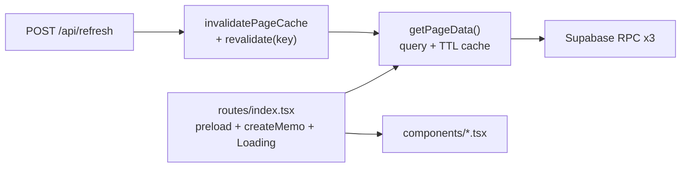

GenAi TECH BLOG は **Next.js 16 App Router** から **Solid 2.0 RC + Vite start mode** へ移行した。

シングルページ + Supabase RPC + revalidate だけの構成だったため、Next.js のフルスタック機能は過剰と判断し、Solid 2 start mode を直接採用した。

## このブログの構成

移行前後で変わっていない要件は次のとおり。

- **シングルページ**（トップのみ）
- Supabase RPC 3本（`fetch_categories`, `fetch_users`, `fetch_items`）
- 86400秒 TTL 相当のキャッシュ + `POST /api/refresh` によるオンデマンド更新
- SEO メタ（title, OGP, Google Search Console 検証）
- UI: 記事一覧、タグフィルタ、ページネーション、メンバーカルーセル

## なぜ Solid 2 start mode か

| 要件 | Next.js | Solid 2 start mode |
|------|---------|---------------------|
| SSR | Server Component + `force-static` | Vite SSR + route `preload` |
| API Route | `app/api/refresh/route.ts` | `src/routes/api/refresh.ts` + middleware |
| データ取得 | Server Component で RPC | `query()` + `preload` + `createMemo` |
| キャッシュ | `revalidate: 86400` + `revalidatePath` | 自前 TTL + `revalidate(key)` |
| ビルド | `next build` | `vite build` → `dist/client` + `dist/server` |

**SolidStart は使わない。** Solid チームは「Start mode replaces SolidStart」と説明しており、Solid 2 移行の正本は `@solidjs/vite-plugin` の `start` オプション。

| 名称 | 実体 |
|------|------|
| **SolidStart**（Vinxi / Nitro） | 旧フレームワーク。Solid 2 移行では経由しない |
| **SolidStart v2** | Solid **1.x** 向け。Node **24** 必須。メンテナンスモード |
| **Solid 2 start mode** | `@solidjs/vite-plugin` の `start`。Node **>=22.12.0** |

## スタック

**主要依存:**

- `solid-js@^2.0.0-rc.9`
- `@solidjs/web`（JSX / SSR）
- `@solidjs/vite-plugin`（start + ssr + serverFunctions）
- `@solidjs/router@^2.0.0-next.26`
- `@solidjs/meta@^1.0.0-next.2`
- `filesystem-routing`, `vite@^8.1.5`, `@tailwindcss/vite`

**使わないもの:** `@solidjs/start`, `vinxi`, Nitro

## 設定の要点

移行で触る設定ファイルは、役割ごとに 1:1 で対応しているわけではない。Next.js は `app/` にページ・レイアウト・API をまとめる一方、Solid 2 start mode は **Vite 設定 + エントリ 3 枚 + ファイルベースルート** に分かれる。

### ファイル対応一覧

| 役割 | Next.js | Solid 2 start mode |
|------|---------|---------------------|
| ビルド・SSR 設定 | `next.config.ts` | `vite.config.ts` |
| ルート定義 | `app/` ディレクトリ（規約ベース） | `src/routes/` + `filesystem-routing` |
| HTML シェル（`<html>` / `<body>`） | `app/layout.tsx` の外側 | `src/Document.tsx` |
| 共通レイアウト・メタ・Router | `app/layout.tsx` の内側 | `src/App.tsx` |
| トップページ | `app/page.tsx`（Server Component） | `src/routes/index.tsx` |
| API Route | `app/api/refresh/route.ts` | `src/routes/api/refresh.ts` |
| エッジ / サーバー middleware | `middleware.ts`（任意） | `src/middleware.ts`（API ハンドラ登録） |
| サーバー関数の初期化 | 不要（RSC がそのままサーバー実行） | `src/server-config.ts` |
| Router インスタンス | フレームワーク内蔵 | `src/router.ts` |

---

### `vite.config.ts` → `next.config.ts`

**Next.js では:** `next.config.ts` に `images`, `rewrites`, `experimental` などを書く。ビルドは `next build` が内部で webpack / Turbopack を呼ぶ。SSR・静的生成・API Route はすべて Next のランタイムが担う。

**Solid 2 では:** Vite の設定ファイルがビルドの中心。`@solidjs/vite-plugin` の `start` オプションで SSR サーバーと Node 本番起動を有効化し、`filesystem-routing` で `src/routes/` をルートに変換する。

```ts
// vite.config.ts
export default defineConfig({
  plugins: [
    tailwindcss(),                    // Next の PostCSS 設定に相当（Tailwind v4 は @tailwindcss/vite）
    solid({
      start: {
        middleware: "./src/middleware.ts",  // API ハンドラの登録先
        node: true,                           // dist/server/node.js を生成（本番は npm start）
      },
      ssr: true,                              // SSR を有効化（Next のデフォルト SSR に相当）
      serverFunctions: {
        configure: "./src/server-config.ts",  // "use server" 関数のサーバー側初期化
      },
    }),
    fileRoutes({ httpMethods: true }),  // routes/api/*.ts を HTTP メソッド別ハンドラに変換
  ],
});
```

| オプション | Next.js での相当 | このプロジェクトでの用途 |
|-----------|-----------------|------------------------|
| `start.node` | `next start` の Node サーバ | `node dist/server/node.js` で本番起動 |
| `start.middleware` | `middleware.ts` + Route Handlers | `POST /api/refresh` を Node サーバに載せる |
| `ssr: true` | App Router の SSR / SSG | トップページをサーバー描画 |
| `serverFunctions` | Server Component / Server Actions | `getPageData()` の `"use server"` を有効化 |
| `fileRoutes` | `app/**/page.tsx`, `route.ts` | `routes/index.tsx` → `/`、`routes/api/refresh.ts` → `/api/refresh` |

---

### `src/routes/` → `app/`

**Next.js では:** `app/page.tsx` が `/`、`app/api/refresh/route.ts` が `/api/refresh` になる。ディレクトリ名とファイル名が URL に直結する（App Router の規約ルーティング）。

**Solid 2 では:** `filesystem-routing` が `src/routes/` を走査し、`virtual:file-routes` として Vite に注入する。ページはデフォルト export、API は `GET` / `POST` などの名前付き export。

| URL | Next.js | Solid 2 |
|-----|---------|---------|
| `/` | `app/page.tsx` | `src/routes/index.tsx` |
| `/api/refresh` | `app/api/refresh/route.ts` | `src/routes/api/refresh.ts`（`export const POST`） |

#### トップページ: `app/page.tsx` → `src/routes/index.tsx`

Next.js は async Server Component で Supabase RPC を直呼びし、`export const revalidate` で ISR を宣言する。

```tsx
// app/page.tsx（移行前）
export const dynamic = "force-static";
export const revalidate = 86400; // 1 day (on-demand revalidate for instant updates)

export default async function Home() {
	const { data: tags } = await supabase.rpc("fetch_categories");
	const { data: members } = await supabase.rpc("fetch_users");
	const { data: articles } = await supabase.rpc("fetch_items");

	return (
		<main
			className="min-h-screen mx-auto px-4"
			style={{
				backgroundImage: "url(/images/tech-blog-bg.png)",
				backgroundSize: "cover",
				backgroundPosition: "center",
				backgroundRepeat: "no-repeat",
				backgroundAttachment: "fixed",
			}}
		>
			<div className="max-w-[960px] mx-auto">
				<Header />
				<HeroSection />
				<Menbers members={members} />
				<Articles tags={tags} articles={articles} />
				<Footer />
			</div>
		</main>
	);
}
```

Solid 2 は通常の関数コンポーネント。データは `query()` で包んだサーバー関数（`getPageData`）を `route.preload` で先行取得し、`createMemo(() => getPageData())` で参照する。未解決中は `<Loading>` がフォールバック UI になる。

```tsx
// src/routes/index.tsx（移行後）
export const route = {
	preload: () => {
		void getPageData();
	},
} satisfies RouteDefinition;

export default function Home() {
	const data = createMemo(() => getPageData());

	return (
		<main
			class="min-h-screen mx-auto px-4"
			style={{
				"background-image": "url(/images/tech-blog-bg.png)",
				"background-size": "cover",
				"background-position": "center",
				"background-repeat": "no-repeat",
				"background-attachment": "fixed",
			}}
		>
			<div class="max-w-[960px] mx-auto">
				<Header />
				<HeroSection />
				<Loading>
					<Show when={data()}>
						{(home) => (
							<>
								<Members members={home().members} />
								<Articles tags={home().tags} articles={home().articles} />
							</>
						)}
					</Show>
				</Loading>
				<Footer />
			</div>
		</main>
	);
}
```

| Next.js | Solid 2 |
|---------|---------|
| `export const revalidate = 86400` | `page-cache.ts` のプロセス内 TTL（86400秒） |
| `async function Home()` + `await supabase.rpc(...)` | `route.preload` + `query()` サーバー関数 |
| データ取得完了までサーバーでブロック | `<Loading>` でストリーミング的に描画 |

#### API Route: `app/api/refresh/route.ts` → `src/routes/api/refresh.ts`

Next.js は `route.ts` に `export async function POST` を書き、`revalidatePath` で ISR キャッシュを破棄する。

```ts
// app/api/refresh/route.ts（移行前）
import { revalidatePath } from "next/cache";
import { type NextRequest, NextResponse } from "next/server";

export async function POST(req: NextRequest) {
	const auth = req.headers.get("authorization");
	const bearer = auth?.startsWith("Bearer ") ? auth.slice(7) : undefined;
	let token = bearer;

	const url = new URL(req.url);
	const qpToken = url.searchParams.get("token") ?? undefined;
	if (!token && qpToken) token = qpToken;

	if (!token) {
		try {
			const body = await req.json();
			token = body?.token;
		} catch {
			// ignore
		}
	}

	if (!token || token !== process.env.REFRESH_SECRET) {
		return NextResponse.json({ message: "Unauthorized" }, { status: 401 });
	}

	const path = url.searchParams.get("path") || "/";
	const allowed = new Set(["/"]);
	if (!allowed.has(path)) {
		return NextResponse.json({ message: "Path not allowed", path }, { status: 400 });
	}

	try {
		revalidatePath(path, "page");
		return NextResponse.json({ refreshed: true, path, now: Date.now() });
	} catch (e) {
		return NextResponse.json(
			{ refreshed: false, error: (e as Error).message },
			{ status: 500 },
		);
	}
}
```

Solid 2 は同名パスに `export const POST: APIHandler` を書く。自前 TTL キャッシュの `invalidatePageCache()` と、Router の `revalidate(getPageData.key)` を呼ぶ。

```ts
// src/routes/api/refresh.ts（移行後）
import { revalidate } from "@solidjs/router";
import type { APIHandler } from "filesystem-routing/api";
import { getPageData, invalidatePageCache } from "@/lib/page-data";

function json(data: unknown, status: number) {
	return new Response(JSON.stringify(data), {
		status,
		headers: { "Content-Type": "application/json" },
	});
}

async function readToken(request: Request): Promise<string | undefined> {
	const auth = request.headers.get("authorization");
	const bearer = auth?.startsWith("Bearer ") ? auth.slice(7) : undefined;
	let token = bearer;

	const url = new URL(request.url);
	const qpToken = url.searchParams.get("token") ?? undefined;
	if (!token && qpToken) token = qpToken;

	if (!token) {
		try {
			const body = (await request.json()) as { token?: string };
			token = body?.token;
		} catch {
			// ignore invalid or empty JSON
		}
	}

	return token;
}

export const POST: APIHandler = async ({ request }) => {
	const url = new URL(request.url);
	const token = await readToken(request);

	if (!token || token !== process.env.REFRESH_SECRET) {
		return json({ message: "Unauthorized" }, 401);
	}

	const path = url.searchParams.get("path") || "/";
	const allowed = new Set(["/"]);
	if (!allowed.has(path)) {
		return json({ message: "Path not allowed", path }, 400);
	}

	try {
		invalidatePageCache();
		revalidate(getPageData.key);
		return json({ refreshed: true, path, now: Date.now() }, 200);
	} catch (e) {
		return json({ refreshed: false, error: (e as Error).message }, 500);
	}
};
```

| Next.js | Solid 2 |
|---------|---------|
| `export async function POST(req)` | `export const POST: APIHandler` |
| `NextResponse.json(...)` | `new Response(JSON.stringify(...))` |
| `revalidatePath(path, "page")` | `invalidatePageCache()` + `revalidate(getPageData.key)` |

ルートごとのデータ取得は `export const route = { preload: ... }` で宣言する。Next の `page.tsx` が async Server Component だった部分に相当する（詳細は後述のデータ取得セクション）。

---

### `src/Document.tsx` → `app/layout.tsx`（HTML 外側）

**Next.js では:** `app/layout.tsx` が `<html>` / `<head>` / `<body>` を含む。`metadata` export や `next/font` もここに置くことが多い。

**Solid 2 では:** HTML ドキュメントの骨格だけを `Document.tsx` に分離する。SSR 時にサーバーがこのコンポーネントで `<html>` を描画し、クライアントでは `<HydrationScript />` でハイドレーション用スクリプトを差し込む。

```tsx
// Document.tsx — Next の layout.tsx から <html>〜<body> 部分を切り出したイメージ
export default function Document(props: ParentProps) {
  return (
    <html lang="ja">
      <head>
        <meta charset="utf-8" />
        <meta name="viewport" content="width=device-width, initial-scale=1" />
        <link rel="icon" href="/favicon.ico" />
        <HydrationScript />
      </head>
      <body>{props.children}</body>
    </html>
  );
}
```

SEO メタ（title, OGP）は Document ではなく `App.tsx` 側の `@solidjs/meta` に置く。Next の `export const metadata = { ... }` に相当する。

---

### `src/App.tsx` → `app/layout.tsx`（共通 UI 内側）

**Next.js では:** `layout.tsx` の `{children}` 周りにヘッダー・フッター・フォント・グローバル CSS を置く。全ページ共通のラッパー。

**Solid 2 では:** `App.tsx` がアプリのルートコンポーネント。`<Router>` をマウントし、サイト共通のメタタグ・グローバルスタイル・`<Loading>` フォールバックをここで定義する。各ルートの `children` は Router 経由で流れ込む。

```tsx
// App.tsx — layout.tsx の {children} より外側（Router + 共通メタ）
export default function App() {
  return (
    <Router>
      {(props) => (
        <>
          <Title>GenAi TECH BLOG | ...</Title>
          <Meta name="description" content="..." />
          {/* OGP, Twitter Card, google-site-verification など */}
          <div class="font-sans antialiased min-h-screen ...">
            <Loading>{props.children}</Loading>
          </div>
        </>
      )}
    </Router>
  );
}
```

| Next.js | Solid 2 |
|---------|---------|
| `export const metadata = { title, openGraph, ... }` | `<Title>` + `<Meta>`（`@solidjs/meta`） |
| `import "./globals.css"` | `import "./app.css"` |
| `{children}` をそのまま描画 | `<Router>` → `props.children` |

---

### `src/routes/index.tsx` → `app/page.tsx`

実装の全文は上記「`src/routes/` → `app/`」セクションのトップページ比較を参照。

ページ固有の UI（Header, Hero, Articles など）は Next 時代と同様コンポーネントに分割する。配置先が `app/components/` から `src/components/` に変わるだけ。`Menbers` → `Members` のタイポ修正もこのタイミングで行った。

---

### `src/routes/api/refresh.ts` → `app/api/refresh/route.ts`

実装の全文は上記「`src/routes/` → `app/`」セクションの API Route 比較を参照。トークン取得（Authorization / クエリ / JSON body）のロジックは移行前後で同一。

---

### `src/middleware.ts`

**Next.js では:** プロジェクトルートの `middleware.ts` でリクエストを横断的に処理する（認証リダイレクト、ヘッダー付与など）。tech-blog では移行前も revalidate 専用の middleware は不要だった。

**Solid 2 では:** start mode の `middleware` オプションで指定するファイル。ここでは `filesystem-routing/api` の `createAPIHandler` を登録し、`/api/*` へのリクエストを Node サーバで受ける。

```ts
// middleware.ts
import routes from "virtual:file-routes";
import { createAPIHandler } from "filesystem-routing/api";

export default [createAPIHandler(routes)];
```

Next の Edge Middleware とは別物。ページ SSR 用の前処理ではなく、**API Route を start mode サーバに載せるためのフック**として使っている。

---

### `src/server-config.ts`

**Next.js では:** 相当ファイルなし。Server Component はビルド時にサーバー境界が自動で切られる。

**Solid 2 では:** `"use server"` 付き関数（サーバー関数）のサーバー側初期化を行う。`@solidjs/router` の Flight データ収集を Router に紐づける。

```ts
// server-config.ts
import { createFlightDataCollector } from "@solidjs/router/server";
import { configureServerFunctionsServer } from "@solidjs/web/server-functions/server";
import { Router } from "./router";

configureServerFunctionsServer({
  collectFlightData: createFlightDataCollector(Router),
});
```

`getPageData()` が `"use server"` でサーバー実行され、クライアントの `createMemo` から透過的に呼べるのは、この設定と `vite.config.ts` の `serverFunctions` がセットになっているため。

---

### `src/router.ts`

**Next.js では:** ルーティングはフレームワーク内蔵。`app/` のファイル構造がそのままルートテーブルになる。

**Solid 2 では:** `@solidjs/router` のインスタンスを明示的に生成する。`virtual:file-routes` から `fileRoutes()` でルート定義を組み立て、`App.tsx` の `<Router>` に渡す。

```ts
// router.ts
import { pageRoutes } from "virtual:file-routes";
import { createRouter } from "@solidjs/router";
import { fileRoutes } from "@solidjs/router/fs";

export const Router = createRouter({ routes: fileRoutes(pageRoutes) });
```

Next における「規約ルーティングの結果をコードで触る」場所が、この 1 ファイルに集約される。

## React / Next.js → Solid 2 の変換

| React / Next.js | Solid 2 |
|-----------------|---------|
| `useState` | `createSignal` |
| `useEffect` | `onSettled` + return cleanup |
| `className` | `class` |
| `next/image` | `` |
| `metadata` export | `@solidjs/meta` |
| `NEXT_PUBLIC_*` | `VITE_*` |
| Server Component の async | `query()` + `"use server"` |
| `Suspense` | `Loading` |
| `JSX` 型 from `react` | from `@solidjs/web` |

### データ取得

Server Component の async 関数から、Router 2 の `query()` + `preload` + `createMemo` へ置き換えた。

```tsx
// Before: Next.js Server Component
export default async function Home() {
  const { data: tags } = await supabase.rpc("fetch_categories");
  // ...
}

// After: Solid 2 start mode
export const route = {
  preload: () => { void getPageData(); },
};

export default function Home() {
  const data = createMemo(() => getPageData());
  return (
    <Loading>
      <Show when={data()}>{(home) => /* ... */}</Show>
    </Loading>
  );
}
```

Router 2 では `preload` は **開始だけ**（戻り値を props で読まない）。未解決 UI は `<Loading>` で待つ。

### キャッシュ

Next.js の ISR に相当する処理を自前実装した。start mode に ISR がないため、サーバー関数側のメモリキャッシュとして残している。

```ts
// src/lib/page-cache.ts — TTL 86400s
export function readPageCache<T>(): T | null { /* ... */ }
export function writePageCache<T>(value: T) { /* ... */ }
export function invalidatePageCache() { entry = null; }
```

再検証は `POST /api/refresh` で `invalidatePageCache()` + `revalidate(getPageData.key)` を呼ぶ。

## 現行アーキテクチャ



**ビルド・起動:**

```bash
npm run dev     # vite
npm run build   # dist/client + dist/server/
npm start       # node dist/server/node.js
```

**環境変数:**

| 変数 | 用途 |
|------|------|
| `VITE_SUPABASE_URL` | クライアント公開 |
| `VITE_SUPABASE_ANON_KEY` | クライアント公開 |
| `REFRESH_SECRET` | サーバー秘密（`VITE_` を付けない） |

## デプロイ上の注意

### Vercel

Framework Preset は **Other**、Node.js **22.12+**。

Next.js Preset のままだと `No Next.js version detected` で Preview が失敗する。

公式の Solid 2 start-mode Vercel アダプタは移行時点で未確認。**Vercel への自動デプロイは blocker になり得る**。Nitro preset は使えず、start mode の Node サーバ契約（`handleRequest`）を自分で載せる必要がある。

### OGP 画像

`public/ogp.png` がリポジトリに存在しないため、image メタは省略している。404 を避けるための判断。

## 移行を振り返って

### うまくいったこと

- **要件の絞り込み**: シングルページ + RPC + revalidate だけなら、Next.js の機能を全部使う必要がなかった
- **start mode 直採用**: SolidStart / Vinxi を経由せず、Vite 一本で SSR + サーバー関数 + API を構成できた
- **`solid-migration-assistant`**: 移行前に変更点を洗い出し、移行後に検出ゼロを確認できた
- **自前 TTL**: Next.js ISR と同等のキャッシュ戦略を start mode でも維持できた

### ハマりどころ

- **SolidStart と start mode の名前**: 別物。Solid 2 移行では start mode が正本
- **Tailwind + Vite 8 SSR**: PostCSS 単体が壊れたため `@tailwindcss/vite` を追加
- **Vercel**: start mode の Node サーバ契約を自分で載せる必要がある

## まとめ

tech-blog は **Next.js 16 App Router** から **Solid 2.0 RC + Vite start mode** へ直接移行した。

同規模のシングルページ + Supabase 構成なら、Next.js を維持するより Solid 2 start mode の方がシンプルになる、というのが今回の結論。

## 参考リンク

- [org-genai/tech-blog](https://github.com/org-genai/tech-blog)
- [Solid 2.0 Migration Guide](https://github.com/solidjs/solid/blob/next/documentation/solid-2.0/MIGRATION.md)
- [Solid 2.0 RC: The Big Reveal](https://www.solidjs.com/blog/solid-2-0-rc-the-big-reveal)
