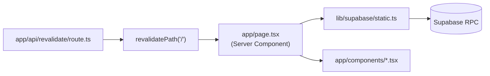
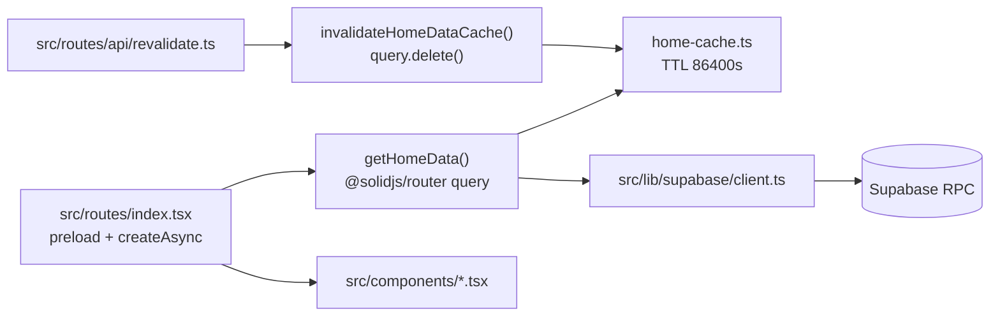

# Next.js → SolidStart 移行手順 — tech-blog

このドキュメントは `org-genai/tech-blog` を **Next.js 16 App Router** から **SolidStart 1.x** に移行するための実用手順です。Phase 0〜6 の順に作業を進めて完了します。

---

## 1. 移行の背景とゴール

### なぜ SolidStart か

| 要件 | Next.js | SolidStart |
|------|---------|------------|
| SSR / SSG | App Router + `force-static` | Vinxi + Nitro、route preload |
| API Route | `app/api/revalidate/route.ts` | `src/routes/api/revalidate.ts` |
| データ取得 | Server Component で直接 RPC | `query()` + route `preload` |
| キャッシュ | `revalidate: 86400` + `revalidatePath` | 自前 TTL cache + invalidation |
| UI | React 19 + MUI（一部） | solid-js + inline SVG |
| ビルド | `next build` | `vinxi build` |

このプロジェクトは **シングルページ（トップのみ）** + Supabase RPC + オンデマンド revalidate という構成。Next.js の App Router 機能の一部しか使っていないため、SolidStart 1.x で十分再現できる。

### ゴール

- 現行と同等のトップページ（記事一覧、タグフィルタ、ページネーション、メンバーカルーセル）
- Supabase RPC 3本（`get_tags`, `get_members`, `get_articles`）の維持
- `POST /api/revalidate` によるオンデマンドキャッシュ更新
- SEO メタ（title, OGP, Google 検証）の維持

### 非ゴール

- Solid 2.0 RC / start mode への移行
- 記事詳細ページ・認証・管理画面の追加
- MUI の Solid 移植（Pagination のアイコン 2 つだけ SVG 化）
- Supabase スキーマ・RPC の変更
- デザイン刷新

### 前提

| 項目 | 内容 |
|------|------|
| ベースブランチ | `develop` |
| Node.js | **22.x 以上** |
| パッケージマネージャ | npm |
| リンター | Biome |

---

## 2. アーキテクチャ概要

### 移行前（Next.js）



### 移行後（SolidStart）



### ディレクトリ構成の変化

```
移行前                          移行後
app/                            src/
├── page.tsx                    ├── routes/
├── layout.tsx                  │   ├── index.tsx
├── globals.css                 │   └── api/revalidate.ts
├── api/revalidate/route.ts     ├── app.tsx
└── components/*.tsx            ├── app.css
lib/                            ├── components/*.tsx
└── supabase/                   ├── lib/
    ├── static.ts               │   ├── blog-data.ts
    └── storage.ts              │   ├── home-cache.ts
next.config.ts                  │   └── supabase/
                                │       ├── client.ts
                                │       └── storage.ts
                                ├── types/index.ts
                                └── entry-*.tsx
app.config.ts (new)
```

---

## 3. 環境変数

### 名前の対応

| 現行 (Next.js) | SolidStart (Vite) | 取得元 | 公開範囲 |
|---|---|---|---|
| `NEXT_PUBLIC_SUPABASE_URL` | `VITE_SUPABASE_URL` | Supabase Dashboard → Settings → API → Project URL | クライアント公開 |
| `NEXT_PUBLIC_SUPABASE_ANON_KEY` | `VITE_SUPABASE_ANON_KEY` | 同画面の anon public キー | クライアント公開 |
| `REVALIDATE_TOKEN` | `REVALIDATE_TOKEN`（変更なし） | 既存値をそのまま | サーバー秘密 |

**値は同じ。キー名だけ変える。** `REVALIDATE_TOKEN` に `VITE_` を付けない。

### コードでの参照

```ts
// クライアント / ビルド時に公開される値
import.meta.env.VITE_SUPABASE_URL
import.meta.env.VITE_SUPABASE_ANON_KEY

// サーバー API ルートのみ
process.env.REVALIDATE_TOKEN
```

### Supabase クライアント（Phase 1）

ビルド時に env が空だと Nitro がクラッシュするため、runtime フォールバックを入れる:

```ts
// src/lib/supabase/client.ts
function env(name: "VITE_SUPABASE_URL" | "VITE_SUPABASE_ANON_KEY"): string {
  const fromVite = import.meta.env[name];
  if (fromVite) return fromVite;
  return process.env[name] ?? "";
}

const supabaseUrl = env("VITE_SUPABASE_URL") || "https://placeholder.supabase.co";
const supabaseAnonKey = env("VITE_SUPABASE_ANON_KEY") || "placeholder";

export const supabase = createClient(supabaseUrl, supabaseAnonKey);
```

### ローカル設定

```bash
cp .env.example .env
# 以下を設定:
# VITE_SUPABASE_URL=https://xxxx.supabase.co
# VITE_SUPABASE_ANON_KEY=eyJ...
# REVALIDATE_TOKEN=your-secret-token
```

---

## 4. React → Solid 変換パターン

このプロジェクトで実際に使った変換ルール。

| React | Solid | 注意点 |
|-------|-------|--------|
| `useState(x)` | `createSignal(x)` | 読み取りは `x()`、書き込みは `setX(v)` |
| `useEffect(fn, [])` | `onMount(fn)` + `onCleanup` | mount/unmount の分離が明確 |
| `useEffect(fn, [dep])` | `createEffect(() => { ... })` | 依存は自動追跡 |
| `useMemo(fn, [deps])` | `createMemo(fn)` | 通常は `useMemo` 不要（Solid は細粒度） |
| `useRef(el)` | `let el: HTMLElement` or callback ref | |
| `useCallback(fn, [])` | 関数をそのまま定義 | 再生成コストが低い |
| `className` | `class` | JSX 属性名が異なる |
| `"use client"` | 不要 | Solid はコンポーネント単位で分離 |
| `next/image` | `` | width/height は HTML 属性 |
| `next/link` | `<a>` | 外部リンクはそのまま |
| `next/font` | CSS `@import` | `src/app.css` に記述 |
| `metadata` export | `@solidjs/meta` | `MetaProvider` + `<Title>` / `<Meta>` |

### 具体例: Header（スクロール連動）

**Before（React / Next.js）:**

```tsx
"use client";
const [isScrolled, setIsScrolled] = useState(false);

useEffect(() => {
  const onScroll = () => setIsScrolled(window.scrollY > 10);
  onScroll();
  window.addEventListener("scroll", onScroll, { passive: true });
  return () => window.removeEventListener("scroll", onScroll);
}, []);

// JSX: className={isScrolled ? "p-3" : ""}
```

**After（Solid）:**

```tsx
import { createSignal, onCleanup, onMount } from "solid-js";

const [isScrolled, setIsScrolled] = createSignal(false);

onMount(() => {
  const onScroll = () => setIsScrolled(window.scrollY > 10);
  onScroll();
  window.addEventListener("scroll", onScroll, { passive: true });
  onCleanup(() => window.removeEventListener("scroll", onScroll));
});

// JSX: class={isScrolled() ? "p-3" : ""}
```

### 具体例: トップページ（データ取得）

**Before（Next.js Server Component）:**

```tsx
// app/page.tsx
export const dynamic = "force-static";
export const revalidate = 86400;

export default async function Home() {
  const { data: tags } = await supabase.rpc("get_tags");
  const { data: members } = await supabase.rpc("get_members");
  const { data: articles } = await supabase.rpc("get_articles");
  return ( /* ... */ );
}
```

**After（SolidStart）:**

```tsx
// src/routes/index.tsx
import { createAsync } from "@solidjs/router";
import { getHomeData } from "@/lib/blog-data";

export const route = {
  preload: () => getHomeData(),
};

export default function Home() {
  const data = createAsync(() => getHomeData());
  return (
    <Show when={data()}>
      {(home) => (
        <>
          <Members members={home().members} />
          <Articles tags={home().tags} articles={home().articles} />
        </>
      )}
    </Show>
  );
}
```

```ts
// src/lib/blog-data.ts
import { query } from "@solidjs/router";

async function loadHomeData(): Promise<HomeData> {
  "use server";
  const cached = readHomeCache<HomeData>();
  if (cached) return cached;
  // ... Supabase RPC 3本を Promise.all で取得
  writeHomeCache(value);
  return value;
}

export const getHomeData = query(loadHomeData, "home-data");
```

---

## 5. コンポーネント別移行メモ

| ファイル | 難易度 | 主な変更 |
|---------|--------|----------|
| `Footer-text.tsx` | 低 | `React.ReactNode` → children |
| `Tag.tsx` | 低 | `React.FC` 除去、`<p onClick>` → `<button>` 推奨 |
| `Footer.tsx` | 低 | `next/image` → ``, `next/link` → `<a>` |
| `HeroSection.tsx` | 低 | `next/image` → `` |
| `ArticleCard.tsx` | 低 | image/link 置換 |
| `TeamMember.tsx` | 低 | `next/image` fill → CSS `position: absolute` |
| `Pagination.tsx` | 低 | MUI `ChevronLeft`/`ChevronRight` → inline SVG |
| `ScrollDown.tsx` | 中 | `useState`+`useEffect` → `createSignal`+`createEffect`、SVG ローテーション |
| `Header.tsx` | 中 | hooks → signals、`onMount`/`onCleanup` |
| `Articles.tsx` | 中 | `useState`/`useRef` → signals、タグフィルタ + 10件/ページ |
| `AnimatedText.tsx` | 高 | IntersectionObserver + stagger を Solid リアクティビティで再実装 |
| `Menbers.tsx` → `Members.tsx` | 高 | 横スクロール + カスタムスクロールバーの状態管理 |

### RPC レスポンス型（変更なし）

```ts
// src/types/index.ts
type TagType = { id: number; name: string };
type MemberType = { id: number; name: string; role: string };
type ArticleType = {
  id: number;
  title: string;
  member_id: number;
  members_name: string;
  date: string;
  url: string;
  source: string;
  tags: string[];
};
```

---

## 6. Phase 別手順

### Phase 0: スキャフォールド

**Goal:** 空の SolidStart プロジェクトが起動・ビルドできる。

#### 変更ファイル

| ファイル | 操作 | 内容 |
|---------|------|------|
| `package.json` | 更新 | SolidStart 依存に切り替え |
| `app.config.ts` | 新規 | Vite alias `@` → `src/` |
| `src/app.tsx` | 新規 | ルートレイアウト骨格 |
| `src/app.css` | 新規 | `app/globals.css` をコピー |
| `src/entry-client.tsx` | 新規 | Vinxi クライアントエントリ |
| `src/entry-server.tsx` | 新規 | Vinxi サーバーエントリ |
| `src/routes/index.tsx` | 新規 | プレースホルダー |
| `src/vite-env.d.ts` | 新規 | `VITE_*` 型定義 |
| `tsconfig.json` | 更新 | `jsx: "preserve"`, paths, exclude `app`/`lib` |
| `tailwind.config.cjs` | 更新 | content を `src/**` に |
| `.gitignore` | 更新 | `.vinxi/`, `.output/` 追加 |

#### package.json（主要依存）

```json
{
  "scripts": {
    "dev": "vinxi dev",
    "build": "vinxi build",
    "start": "vinxi start"
  },
  "dependencies": {
    "@solidjs/meta": "^0.29.4",
    "@solidjs/router": "^0.15.3",
    "@solidjs/start": "^1.1.7",
    "@supabase/supabase-js": "^2.54.0",
    "solid-js": "^1.9.5",
    "vinxi": "^0.5.7"
  },
  "engines": { "node": ">=22" }
}
```

#### app.config.ts

```ts
import { fileURLToPath } from "node:url";
import { defineConfig } from "@solidjs/start/config";

const srcDir = fileURLToPath(new URL("./src", import.meta.url));

export default defineConfig({
  ssr: true,
  vite: {
    resolve: { alias: { "@": srcDir } },
  },
});
```

#### 注意

- Phase 0〜5 では **Next.js の `app/` と `lib/` は残す**（比較用）
- `tsconfig.json` の `exclude: ["app", "lib"]` で SolidStart の型チェックを通す
- `.cursor/environment.json` と `.cursor/install-omega.sh` は保持

#### 検証

```bash
npm install
npx tsc --noEmit
npx biome check src app.config.ts
npm run build
npm run dev   # 「GenAi TECH BLOG」+ Tailwind 適用を確認
```

---

### Phase 1: データ層

**Goal:** サーバーで Supabase RPC を叩き、トップページにデータを渡す。

#### 追加ファイル

| ファイル | 内容 |
|---------|------|
| `src/types/index.ts` | RPC レスポンス型 |
| `src/lib/supabase/client.ts` | `createClient`（`VITE_*` + runtime fallback） |
| `src/lib/supabase/storage.ts` | `getPublicImageUrl(bucket, path)` |
| `src/lib/blog-data.ts` | `getHomeData` query（3 RPC を `Promise.all`） |
| `src/routes/index.tsx` | `preload` + `createAsync` でデータ表示 |
| `.env.example` | 環境変数テンプレ |

#### Storage URL ヘルパー

```ts
// src/lib/supabase/storage.ts
const PUBLIC_URL = import.meta.env.VITE_SUPABASE_URL || process.env.VITE_SUPABASE_URL;

export function getPublicImageUrl(bucket: string, path: string): string {
  if (!PUBLIC_URL) return "";
  return `${PUBLIC_URL}/storage/v1/object/public/${bucket}/${path}`;
}
```

#### 検証

```bash
npm run build                    # env 未設定でも成功（件数 0）
npm run dev                      # env 設定後、RPC データが表示される
```

---

### Phase 2: 静的 UI

**Goal:** インタラクション不要な UI を再現。

#### 移植コンポーネント

- `HeroSection.tsx` — ヒーロー画像 + ScrollDown プレースホルダ
- `Footer.tsx` / `Footer-text.tsx` — フッター
- `Tag.tsx` — タグ表示（Phase 3 でクリック対応）
- `ArticleCard.tsx` — 記事カード（外部リンク）
- `TeamMember.tsx` — メンバーカード（Storage 画像）

#### 主な置換

| Next.js | SolidStart |
|---------|------------|
| `<Image src="..." width={} height={} />` | `` |
| `<Link href="...">` | `<a href="...">` |
| `className` | `class` |

#### 検証

- メンバーアバター（Supabase Storage）と記事カードが表示
- 記事カードの外部リンク（Zenn 等）が動作
- env なしでもヒーロー + フッターは表示

---

### Phase 3: インタラクティブ UI

**Goal:** クライアント側の状態管理・演出を再現。

#### 追加コンポーネント

| コンポーネント | 機能 |
|---|---|
| `Header.tsx` | スクロール連動でヘッダーがコンパクト化 |
| `ScrollDown.tsx` | SVG テキストのローテーションアニメーション |
| `AnimatedText.tsx` | IntersectionObserver + 文字単位の stagger |
| `Articles.tsx` | タグフィルタ + 10件/ページのページネーション |
| `Members.tsx` | 横スクロール + カスタムスクロールバー |
| `Pagination.tsx` | 前へ/次へ（MUI Icons → inline SVG） |

#### Articles の状態管理（概要）

```tsx
const [selectedTags, setSelectedTags] = createSignal<string[]>([]);
const [currentPage, setCurrentPage] = createSignal(1);

const filteredArticles = createMemo(() => {
  const tags = selectedTags();
  const all = props.articles;
  if (tags.length === 0) return all;
  return all.filter((a) => tags.every((t) => a.tags.includes(t)));
});

const pagedArticles = createMemo(() => {
  const start = (currentPage() - 1) * 10;
  return filteredArticles().slice(start, start + 10);
});
```

#### 検証（ブラウザ必須）

- [ ] タグクリックで記事フィルタ
- [ ] 記事 10 件超でページネーション
- [ ] メンバーカルーセルのドラッグ / スクロールバー
- [ ] スクロール後ヘッダーのコンパクト表示
- [ ] ScrollDown ローテーション、AnimatedText の文字アニメーション

---

### Phase 4: キャッシュ + revalidate API

**Goal:** ISR 相当のキャッシュとオンデマンド再生成。

#### キャッシュ実装

```ts
// src/lib/home-cache.ts
const TTL_MS = 86_400_000; // 1 day (= Next.js revalidate: 86400)

let entry: { value: unknown; expiresAt: number } | null = null;

export function readHomeCache<T>(): T | null { /* TTL チェック */ }
export function writeHomeCache<T>(value: T) { /* ... */ }
export function invalidateHomeDataCache() { entry = null; }
```

Next.js の `revalidatePath` に相当する処理:

```ts
// src/routes/api/revalidate.ts（成功時）
invalidateHomeDataCache();
query.delete(getHomeData.key);
```

#### revalidate API 仕様（Next.js 互換）

| 項目 | 内容 |
|------|------|
| メソッド | `POST` |
| 認証 | Bearer / `?token=` / JSON `{ "token": "..." }` |
| 許可パス | `/` のみ |
| 成功 | `{ "revalidated": true, "path": "/", "now": <timestamp> }` |
| 不正 token | 401 |
| 許可外パス | 400 |

#### 検証

```bash
npm run build
REVALIDATE_TOKEN=test-token node .output/server/index.mjs

# 別ターミナル
curl -X POST "http://localhost:3000/api/revalidate?token=test-token"
# → {"revalidated":true,"path":"/","now":...}

curl -X POST "http://localhost:3000/api/revalidate?token=wrong"
# → 401
```

---

### Phase 5: SEO メタ + デプロイノート

**Goal:** SEO と本番デプロイを整える。

#### メタデータ（@solidjs/meta）

```tsx
// src/app.tsx
<MetaProvider>
  <Title>{siteTitle}</Title>
  <Meta name="description" content={siteDescription} />
  <Meta name="google-site-verification" content="..." />
  <Meta property="og:title" content={siteTitle} />
  <Meta property="og:description" content={siteDescription} />
  <Meta name="twitter:card" content="summary_large_image" />
  {/* ... */}
</MetaProvider>
```

#### フォント

```css
/* src/app.css */
@import url("https://fonts.googleapis.com/css2?family=Noto+Sans+JP:wght@400;500;700;900&display=swap");
```

#### OGP 画像

- 旧 `layout.tsx` は `/ogp.png` を参照していたが、**ファイルはリポジトリに存在しない**
- image メタタグは省略（404 回避）
- 必要なら `public/ogp.png` を追加してメタを有効化

#### 追加ドキュメント

- `SOLIDSTART.md` — デプロイ手順（Node / Vercel）

#### 検証

```bash
npm run build
# SSR HTML に <title>, description, twitter/og, google-site-verification
# ビルド CSS に Google Fonts @import
```

---

### Phase 6: カットオーバー

**Goal:** Next.js を完全除去し SolidStart に一本化。

#### 削除

| 対象 | 理由 |
|------|------|
| `app/` 全体 | Next.js App Router |
| `lib/` 全体 | `src/lib/` に移行済み |
| `next.config.ts` | `app.config.ts` に置換 |
| `next-env.d.ts` | 不要 |

#### 更新

| ファイル | 内容 |
|---------|------|
| `README.md` | SolidStart 向けに書き換え |
| `package.json` | `next` / `react` / MUI 依存を完全除去 |
| `.gitignore` | `.next` → `.vinxi` / `.output` |
| `public/favicon.ico` | `app/favicon.ico` から移動 |

#### 検証

```bash
grep -c '"next"' package.json   # → 0
npm run build && npm run dev
npm start                       # 本番相当
```

---

## 7. Vercel デプロイ

### 現状の問題

Vercel プロジェクトの Framework Preset が **Next.js** のまま。SolidStart 移行後の Preview デプロイが以下で失敗する:

```
No Next.js version detected.
```

ローカル `npm run build` は成功する。**Framework 設定の不一致が原因。**

### 対応 A: Dashboard 権限がある場合

| 設定 | 値 |
|---|---|
| Framework Preset | **Other** |
| Build Command | `npm run build` |
| Output Directory | （空 — Nitro が管理） |
| Install Command | `npm install` |
| Node.js Version | **22.x** |
| 環境変数 | `VITE_SUPABASE_URL`, `VITE_SUPABASE_ANON_KEY`, `REVALIDATE_TOKEN` |

Production / Preview 両方に env を設定する。

### 対応 B: Dashboard 権限がない場合

リポジトリ側で Nitro の Vercel preset を有効化:

```ts
// app.config.ts
export default defineConfig({
  server: { preset: "vercel" },
});
```

または Vercel 管理者に `NITRO_PRESET=vercel` 環境変数の追加を依頼。

### 本番起動

```bash
npm run build    # → .output/ に Nitro ビルド成果物
npm start        # → node .output/server/index.mjs
```

---

## 8. ファイル対応早見表

| Next.js | SolidStart | 変更内容 |
|---|---|---|
| `app/page.tsx` | `src/routes/index.tsx` | async Server Component → preload + createAsync |
| `app/layout.tsx` | `src/app.tsx` | metadata → @solidjs/meta |
| `app/globals.css` | `src/app.css` | ほぼコピー + フォント @import |
| `app/api/revalidate/route.ts` | `src/routes/api/revalidate.ts` | revalidatePath → cache invalidation |
| `app/types/index.tsx` | `src/types/index.ts` | 型定義そのまま |
| `lib/supabase/static.ts` | `src/lib/supabase/client.ts` | env 名変更 + fallback |
| `lib/supabase/storage.ts` | `src/lib/supabase/storage.ts` | env 名変更 |
| `app/components/*.tsx` | `src/components/*.tsx` | React → Solid 変換 |
| `next.config.ts` | `app.config.ts` | Vinxi / SolidStart 設定 |

---

## 9. トラブルシューティング

| 症状 | 原因 | 対処 |
|---|---|---|
| Vercel: `No Next.js version detected` | Framework Preset が Next.js | §7 の設定変更 |
| ビルド成功だがデータ 0 件 | `VITE_*` env 未設定 | `.env` または Vercel env |
| revalidate 401 | `REVALIDATE_TOKEN` 不一致 | サーバー env（`VITE_` 付けない） |
| OGP 画像なし | `public/ogp.png` 不在 | 画像追加 or メタ省略（現状） |
| `tsc` エラー（Next.js ファイル） | Phase 0〜5 で `app/` 残存 | `tsconfig` exclude。Phase 6 で解消 |
| Nitro クラッシュ（空 env） | ビルド時 `VITE_*` が空 | client.ts の runtime fallback |
| メンバースクロールが動かない | ブラウザ未確認 | Phase 3 の手動テスト |
| `background-attachment: fixed` | モバイル表示差分 | 目視確認、必要なら CSS 調整 |

---

## 10. 移行完了チェックリスト

- [ ] Phase 0〜6 の作業が完了している
- [ ] 環境変数を `VITE_*` 名で Vercel / ローカルに設定
- [ ] Vercel Framework Preset を Other に変更（または `preset: "vercel"`）
- [ ] Node.js 22.x
- [ ] `npm run build` 成功
- [ ] トップページ: タグフィルタ・ページネーション・メンバースクロール
- [ ] `POST /api/revalidate` が 200
- [ ] SSR HTML に SEO メタ
- [ ] `package.json` に `next` / `react` がない

---

## 関連ドキュメント

- `SOLIDSTART.md` — リポジトリ内デプロイノート（Phase 5 で追加）
- `.env.example` — 環境変数テンプレ（Phase 1 で追加）
- [SolidStart 移行計画](cursor.agent://project/context/docs/solidstart-migration-plan.md) — Project Context（詳細な設計判断）
- [プロジェクト概要](cursor.agent://project/context/docs/project-overview.md) — 移行前の Next.js 構成
