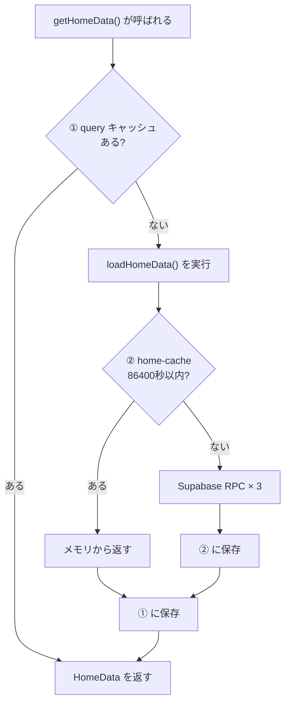

## はじめに

最近寒いですね〜今年はそこまで酷暑って感じでもなかったので、よかったですね〜（東京にいる感じ）
GenAi TECH BLOG は **Next.js 16 App Router** から **Solid 2.0 RC + Vite start mode** へ移行しました〜

移行を決めた理由は、Next.js から Solid 2 に移行した場合がどんな感じになるか知りたかったからです！（そんな理由で変更するのは私だけな気がする…）

そしてこの記事めっちゃ長いので、気になるところだけ見るのを強く推奨します！

## このブログの構成

移行前後で変わっていない要件は次のとおりです。

- **シングルページ**（トップのみ）
- Supabase RPC 3本（`fetch_categories`, `fetch_users`, `fetch_items`）
- 86400秒 TTL 相当のキャッシュ + `POST /api/refresh` によるオンデマンド更新
- SEO メタ（title, OGP, Google Search Console 検証）
- UI: 記事一覧、タグフィルタ、ページネーション、メンバーカルーセル

## なぜ Solid 2 start mode か

| 要件 | Next.js | Solid 2 start mode |
|------|---------|---------------------|
| SSR | Server Component + `force-static` | Vite SSR + route `preload` |
| API Route | `app/api/refresh/route.ts` | `src/routes/api/refresh.ts` + middleware |
| データ取得 | Server Component で RPC | `query()` + `preload` + `createMemo` |
| キャッシュ | `revalidate: 86400` + `revalidatePath` | 自前 TTL + `revalidate(key)` |
| ビルド | `next build` | `vite build` → `dist/client` + `dist/server` |

**SolidStart は使いません** Solid チームは「Start mode replaces SolidStart」と説明しており、Solid 2 移行の正本は `@solidjs/vite-plugin` の `start` オプションです。

| 名称 | 実体 |
|------|------|
| **SolidStart**（Vinxi / Nitro） | 旧フレームワークです。Solid 2 移行では経由しません。 |
| **SolidStart v2** | Solid **1.x** 向けです。Node **24** 必須です。メンテナンスモードです。 |
| **Solid 2 start mode** | `@solidjs/vite-plugin` の `start`。Node **>=22.12.0** |

## スタック

**主要依存:**

- `solid-js@^2.0.0-rc.9`
- `@solidjs/web`（JSX / SSR）
- `@solidjs/vite-plugin`（start + ssr + serverFunctions）
- `@solidjs/router@^2.0.0-next.26`
- `@solidjs/meta@^1.0.0-next.2`
- `filesystem-routing`, `vite@^8.1.5`, `@tailwindcss/vite`

**使わないもの:** `@solidjs/start`, `vinxi`, `Nitro`

## 設定の要点

移行で触る設定ファイルは、役割ごとに 1:1 で対応しているわけではありません。Next.js は `app/` にページ・レイアウト・API をまとめる一方、Solid 2 start mode は **Vite 設定 + エントリ 3 枚 + ファイルベースルート** に分かれます。

### ファイル対応一覧

| 役割 | Next.js | Solid 2 start mode |
|------|---------|---------------------|
| ビルド・SSR 設定 | `next.config.ts` | `vite.config.ts` |
| ルート定義 | `app/` ディレクトリ（規約ベース） | `src/routes/` + `filesystem-routing` |
| HTML シェル（`<html>` / `<body>`） | `app/layout.tsx` の外側 | `src/Document.tsx` |
| 共通レイアウト・メタ・Router | `app/layout.tsx` の内側 | `src/App.tsx` |
| トップページ | `app/page.tsx`（Server Component） | `src/routes/index.tsx` |
| API Route | `app/api/refresh/route.ts` | `src/routes/api/refresh.ts` |
| エッジ / サーバー middleware | `middleware.ts`（任意） | `src/middleware.ts`（API ハンドラ登録） |
| サーバー関数の初期化 | 不要（RSC がそのままサーバー実行） | `src/server-config.ts` |
| Router インスタンス | フレームワーク内蔵 | `src/router.ts` |

---

### `vite.config.ts` → `next.config.ts`

**Next.js では:** `next.config.ts` に `images`, `rewrites`, `experimental` などを書きます。ビルドは `next build` が内部で webpack / Turbopack を呼びます。SSR・静的生成・API Route はすべて Next のランタイムが担います。

**Solid 2 では:** Vite の設定ファイルがビルドの中心です。`@solidjs/vite-plugin` の `start` オプションで SSR サーバーと Node 本番起動を有効化し、`filesystem-routing` で `src/routes/` をルートに変換します。

```ts
// vite.config.ts
export default defineConfig({
  plugins: [
    tailwindcss(),                    // Next の PostCSS 設定に相当（Tailwind v4 は @tailwindcss/vite）
    solid({
      start: {
        middleware: "./src/middleware.ts",  // API ハンドラの登録先
        node: true,                           // dist/server/node.js を生成（本番は npm start）
      },
      ssr: true,                              // SSR を有効化（Next のデフォルト SSR に相当）
      serverFunctions: {
        configure: "./src/server-config.ts",  // "use server" 関数のサーバー側初期化
      },
    }),
    fileRoutes({ httpMethods: true }),  // routes/api/*.ts を HTTP メソッド別ハンドラに変換
  ],
});
```

| オプション | Next.js での相当 | このプロジェクトでの用途 |
|-----------|-----------------|------------------------|
| `start.node` | `next start` の Node サーバ | `node dist/server/node.js` で本番起動します。 |
| `start.middleware` | `middleware.ts` + Route Handlers | `POST /api/refresh` を Node サーバに載せます。 |
| `ssr: true` | App Router の SSR / SSG | トップページをサーバー描画します。 |
| `serverFunctions` | Server Component / Server Actions | `getPageData()` の `"use server"` を有効化します。 |
| `fileRoutes` | `app/**/page.tsx`, `route.ts` | `routes/index.tsx` → `/`、`routes/api/refresh.ts` → `/api/refresh` |

---

### `src/routes/` → `app/`

**Next.js では:** `app/page.tsx` が `/`、`app/api/refresh/route.ts` が `/api/refresh` になります。ディレクトリ名とファイル名が URL に直結します（App Router の規約ルーティング）。

**Solid 2 では:** `filesystem-routing` が `src/routes/` を走査し、`virtual:file-routes` として Vite に注入します。ページはデフォルト export、API は `GET` / `POST` などの名前付き export です。

| URL | Next.js | Solid 2 |
|-----|---------|---------|
| `/` | `app/page.tsx` | `src/routes/index.tsx` |
| `/api/refresh` | `app/api/refresh/route.ts` | `src/routes/api/refresh.ts`（`export const POST`） |

#### トップページ: `app/page.tsx` → `src/routes/index.tsx`

Next.js は async Server Component で Supabase RPC を直呼びし、`export const revalidate` で ISR を宣言します。

```tsx
// app/page.tsx（移行前）
export const dynamic = "force-static";
export const revalidate = 86400; // 1 day (on-demand revalidate for instant updates)

export default async function Home() {
	const { data: tags } = await supabase.rpc("fetch_categories");
	const { data: members } = await supabase.rpc("fetch_users");
	const { data: articles } = await supabase.rpc("fetch_items");

	return (
		<main
			className="min-h-screen mx-auto px-4"
			style={{
				backgroundImage: "url(/images/tech-blog-bg.png)",
				backgroundSize: "cover",
				backgroundPosition: "center",
				backgroundRepeat: "no-repeat",
				backgroundAttachment: "fixed",
			}}
		>
			<div className="max-w-[960px] mx-auto">
				<Header />
				<HeroSection />
				<Menbers members={members} />
				<Articles tags={tags} articles={articles} />
				<Footer />
			</div>
		</main>
	);
}
```

Solid 2 は通常の関数コンポーネントです。データは `query()` で包んだサーバー関数（`getPageData`）を `route.preload` で先行取得し、`createMemo(() => getPageData())` で参照します。未解決中は `<Loading>` がフォールバック UI になります。

```tsx
// src/routes/index.tsx（移行後）
export const route = {
	preload: () => {
		void getPageData();
	},
} satisfies RouteDefinition;

export default function Home() {
	const data = createMemo(() => getPageData());

	return (
		<main
			class="min-h-screen mx-auto px-4"
			style={{
				"background-image": "url(/images/tech-blog-bg.png)",
				"background-size": "cover",
				"background-position": "center",
				"background-repeat": "no-repeat",
				"background-attachment": "fixed",
			}}
		>
			<div class="max-w-[960px] mx-auto">
				<Header />
				<HeroSection />
				<Loading>
					<Show when={data()}>
						{(home) => (
							<>
								<Members members={home().members} />
								<Articles tags={home().tags} articles={home().articles} />
							</>
						)}
					</Show>
				</Loading>
				<Footer />
			</div>
		</main>
	);
}
```

| Next.js | Solid 2 |
|---------|---------|
| `export const revalidate = 86400` | `page-cache.ts` のプロセス内 TTL（86400秒） |
| `async function Home()` + `await supabase.rpc(...)` | `route.preload` + `query()` サーバー関数 |
| データ取得完了までサーバーでブロックします。 | `<Loading>` でストリーミング的に描画します。 |

#### API Route: `app/api/refresh/route.ts` → `src/routes/api/refresh.ts`

Next.js は `route.ts` に `export async function POST` を書き、`revalidatePath` で ISR キャッシュを破棄します。

```ts
// app/api/refresh/route.ts（移行前）

export async function POST(req: NextRequest) {
	const auth = req.headers.get("authorization");
	const bearer = auth?.startsWith("Bearer ") ? auth.slice(7) : undefined;
	let token = bearer;

	const url = new URL(req.url);
	const qpToken = url.searchParams.get("token") ?? undefined;
	if (!token && qpToken) token = qpToken;

	if (!token) {
		try {
			const body = await req.json();
			token = body?.token;
		} catch {
			// ignore
		}
	}

	if (!token || token !== process.env.REFRESH_SECRET) {
		return NextResponse.json({ message: "Unauthorized" }, { status: 401 });
	}

	const path = url.searchParams.get("path") || "/";
	const allowed = new Set(["/"]);
	if (!allowed.has(path)) {
		return NextResponse.json({ message: "Path not allowed", path }, { status: 400 });
	}

	try {
		revalidatePath(path, "page");
		return NextResponse.json({ refreshed: true, path, now: Date.now() });
	} catch (e) {
		return NextResponse.json(
			{ refreshed: false, error: (e as Error).message },
			{ status: 500 },
		);
	}
}
```

Solid 2 は同名パスに `export const POST: APIHandler` を書きます。自前 TTL キャッシュの `invalidatePageCache()` と、Router の `revalidate(getPageData.key)` を呼びます。

```ts
// src/routes/api/refresh.ts（移行後）

function json(data: unknown, status: number) {
	return new Response(JSON.stringify(data), {
		status,
		headers: { "Content-Type": "application/json" },
	});
}

async function readToken(request: Request): Promise<string | undefined> {
	const auth = request.headers.get("authorization");
	const bearer = auth?.startsWith("Bearer ") ? auth.slice(7) : undefined;
	let token = bearer;

	const url = new URL(request.url);
	const qpToken = url.searchParams.get("token") ?? undefined;
	if (!token && qpToken) token = qpToken;

	if (!token) {
		try {
			const body = (await request.json()) as { token?: string };
			token = body?.token;
		} catch {
			// ignore invalid or empty JSON
		}
	}

	return token;
}

export const POST: APIHandler = async ({ request }) => {
	const url = new URL(request.url);
	const token = await readToken(request);

	if (!token || token !== process.env.REFRESH_SECRET) {
		return json({ message: "Unauthorized" }, 401);
	}

	const path = url.searchParams.get("path") || "/";
	const allowed = new Set(["/"]);
	if (!allowed.has(path)) {
		return json({ message: "Path not allowed", path }, 400);
	}

	try {
		invalidatePageCache();
		revalidate(getPageData.key);
		return json({ refreshed: true, path, now: Date.now() }, 200);
	} catch (e) {
		return json({ refreshed: false, error: (e as Error).message }, 500);
	}
};
```

| Next.js | Solid 2 |
|---------|---------|
| `export async function POST(req)` | `export const POST: APIHandler` |
| `NextResponse.json(...)` | `new Response(JSON.stringify(...))` |
| `revalidatePath(path, "page")` | `invalidatePageCache()` + `revalidate(getPageData.key)` |

ページ固有の UI（Header, Hero, Articles など）は Next と同様コンポーネントに分割します。配置先が `app/components/` から `src/components/` に変わるだけです。

---

### `src/Document.tsx` → `app/layout.tsx`（HTML 外側）

**Next.js では:** `app/layout.tsx` が `<html>` / `<head>` / `<body>` を含みます。`metadata` export や `next/font` もここに置くことが多いです。

**Solid 2 では:** HTML ドキュメントの骨格だけを `Document.tsx` に分離します。SSR 時にサーバーがこのコンポーネントで `<html>` を描画し、クライアントでは `<HydrationScript />` でハイドレーション用スクリプトを差し込みます。

```tsx
// Document.tsx — Next の layout.tsx から <html>〜<body> 部分を切り出したイメージ
export default function Document(props: ParentProps) {
  return (
    <html lang="ja">
      <head>
        <meta charset="utf-8" />
        <meta name="viewport" content="width=device-width, initial-scale=1" />
        <link rel="icon" href="/favicon.ico" />
        <HydrationScript />
      </head>
      <body>{props.children}</body>
    </html>
  );
}
```

---

### `src/App.tsx` → `app/layout.tsx`（共通 UI 内側）

**Next.js では:** `layout.tsx` の `{children}` 周りにヘッダー・フッター・フォント・グローバル CSS を置きます。全ページ共通のラッパーです。

**Solid 2 では:** `App.tsx` がアプリのルートコンポーネントです。`<Router>` をマウントし、サイト共通のメタタグ・グローバルスタイル・`<Loading>` フォールバックをここで定義します。各ルートの `children` は Router 経由で流れ込みます。

```tsx
// App.tsx — layout.tsx の {children} より外側（Router + 共通メタ）
export default function App() {
  return (
    <Router>
      {(props) => (
        <>
          <Title>GenAi TECH BLOG | ...</Title>
          <Meta name="description" content="..." />
          {/* OGP, Twitter Card, google-site-verification など */}
          <div class="font-sans antialiased min-h-screen ...">
            <Loading>{props.children}</Loading>
          </div>
        </>
      )}
    </Router>
  );
}
```

| Next.js | Solid 2 |
|---------|---------|
| `export const metadata = { title, openGraph, ... }` | `<Title>` + `<Meta>`（`@solidjs/meta`） |
| `import "./globals.css"` | `import "./app.css"` |
| `{children}` をそのまま描画 | `<Router>` → `props.children` |

`export const metadata` の Before/After は上のコード例と変換表を参照してください。SEO メタは Document ではなくここ（`App.tsx`）に置きます。

---

### `src/middleware.ts`

**Next.js では:** プロジェクトルートの `middleware.ts` でリクエストを横断的に処理します（認証リダイレクト、ヘッダー付与など）。tech-blog では移行前も revalidate 専用の middleware は不要でした。

**Solid 2 では:** start mode の `middleware` オプションで指定するファイルです。ここでは `filesystem-routing/api` の `createAPIHandler` を登録し、`/api/*` へのリクエストを Node サーバで受けます。

```ts
// middleware.ts
import routes from "virtual:file-routes";
import { createAPIHandler } from "filesystem-routing/api";

export default [createAPIHandler(routes)];
```

Next の Edge Middleware とは別物です。ページ SSR 用の前処理ではなく、**API Route を start mode サーバに載せるためのフック**として使っています。

---

### `src/server-config.ts`

**Next.js では:** 相当ファイルはありません。Server Component はビルド時にサーバー境界が自動で切られます。

**Solid 2 では:** `"use server"` 付き関数（サーバー関数）のサーバー側初期化を行います。`@solidjs/router` の Flight データ収集を Router に紐づけます。

```ts
// server-config.ts
import { createFlightDataCollector } from "@solidjs/router/server";
import { configureServerFunctionsServer } from "@solidjs/web/server-functions/server";
import { Router } from "./router";

configureServerFunctionsServer({
  collectFlightData: createFlightDataCollector(Router),
});
```

`getPageData()` が `"use server"` でサーバー実行され、クライアントの `createMemo` から透過的に呼べるのは、この設定と `vite.config.ts` の `serverFunctions` がセットになっているためです。

---

### `src/router.ts`

**Next.js では:** ルーティングはフレームワーク内蔵です。`app/` のファイル構造がそのままルートテーブルになります。

**Solid 2 では:** `@solidjs/router` のインスタンスを明示的に生成します。`virtual:file-routes` から `fileRoutes()` でルート定義を組み立て、`App.tsx` の `<Router>` に渡します。

```ts
// router.ts
import { pageRoutes } from "virtual:file-routes";
import { createRouter } from "@solidjs/router";
import { fileRoutes } from "@solidjs/router/fs";

export const Router = createRouter({ routes: fileRoutes(pageRoutes) });
```

Next における「規約ルーティングの結果をコードで触る」場所が、この 1 ファイルに集約されます。

## React / Next.js → Solid 2 の変換

設定ファイルの対応表（前節）に加え、**コンポーネント API** は次のとおり置き換えました。各項目に tech-blog で実際に触った Before / After を載せておきます。

| React / Next.js | Solid 2 |
|-----------------|---------|
| `useState` | `createSignal` |
| `useEffect(fn, [])` | `onSettled` / `onMount` + return cleanup |
| `useEffect(fn, [deps])` | `createEffect`（関数内で `foo()` を読むと自動追跡） |
| `useRef` | `let el` + `ref={el}` |
| `className` | `class` |
| `next/image` | `` |
| `next/link` | `<a href>` |
| `metadata` export | `@solidjs/meta` の `<Title>` / `<Meta>` |
| `NEXT_PUBLIC_*` | `VITE_*` + `import.meta.env` |
| Server Component の async | `query()` + `"use server"` |
| `Suspense` | `Loading` |
| `JSX` 型 from `react` | from `@solidjs/web` |

`"use client"` ディレクティブは Solid では不要です。コンポーネントはデフォルトでクライアント実行可能です。

---

### `useState` → `createSignal`

**Next.js では:** `useState` でローカル状態を持ちます。更新は `setXxx(value)` または `setXxx(prev => ...)` です。読み取りは変数をそのまま参照します（`isScrolled`）。

**Solid 2 では:** `createSignal` で `[getter, setter]` を得ます。setter の書き方は React とほぼ同じですが、**読み取りは `getter()` を呼ぶ**必要があります（関数呼び出しが必須です）。

| | React | Solid |
|---|---|---|
| 返り値 | `[値, setter]` | `[getter, setter]` |
| 読み取り | `isScrolled` | `isScrolled()` |
| 更新 | `setIsScrolled(true)` | `setIsScrolled(true)` |

getter が関数である理由は、Solid の細かい粒度のリアクティビティにあります。`isScrolled()` を呼んだとき Solid は「この場所は `isScrolled` に依存している」と記録し、`setIsScrolled(...)` で値が変わったとき **その依存箇所だけ** 再評価します。`()` を付け忘れると `isScrolled` は関数オブジェクトなので常に truthy になり、スクロールしても見た目が変わらないなど意図しない挙動になります。

#### 例 1: `Header.tsx` — スクロール状態の 1 変数

```tsx
// app/components/Header.tsx（移行前）
const [isScrolled, setIsScrolled] = useState(false);
// JSX — isScrolled は boolean
<header className={`... ${isScrolled ? "p-3" : ""}`}>

// src/components/Header.tsx（移行後）
const [isScrolled, setIsScrolled] = createSignal(false);
// JSX — isScrolled は getter。参照するたびに () が必要
<header class={`... ${isScrolled() ? "p-3" : ""}`}>
```

setter（`setIsScrolled(...)`）は移行前後で同じです。変わるのは **読み取り側の `()`** だけです。スクロール監視の副作用は次節の `onSettled` で置き換えました。

#### 例 2: `Articles.tsx` — 複数 signal と派生値

```tsx
// app/components/Articles.tsx（移行前）
const [selectedTagIds, setSelectedTagIds] = useState<number[]>([]);
const [currentPage, setCurrentPage] = useState(1);
const [showAllTags, setShowAllTags] = useState(false);

const handleTagClick = (tagId: number) => {
  setSelectedTagIds((prev) =>
    prev.includes(tagId) ? prev.filter((id) => id !== tagId) : [...prev, tagId],
  );
  setCurrentPage(1);
};

// 派生値 — selectedTagIds / currentPage を変数として直接参照
const filteredArticles =
  selectedTagIds.length === 0
    ? articles
    : articles.filter((article) =>
        selectedTagIds.some((id) => tagIds.includes(id)),
      );
const totalPages = Math.ceil(filteredArticles.length / articlesPerPage);
const currentArticles = filteredArticles.slice(startIndex, endIndex);

// JSX
<Tag isSelected={selectedTagIds.includes(tag.id)} />
<Pagination currentPage={currentPage} totalPages={totalPages} />
```

```tsx
// src/components/Articles.tsx（移行後）
const [selectedTagIds, setSelectedTagIds] = createSignal<number[]>([]);
const [currentPage, setCurrentPage] = createSignal(1);
const [showAllTags, setShowAllTags] = createSignal(false);

const handleTagClick = (tagId: number) => {
  setSelectedTagIds((prev) =>
    prev.includes(tagId) ? prev.filter((id) => id !== tagId) : [...prev, tagId],
  );
  setCurrentPage(1);
};

// 派生値 — signal を読むときも () が必要。createMemo で包む
const filteredArticles = createMemo(() => {
  const selected = selectedTagIds();
  if (selected.length === 0) return props.articles;
  return props.articles.filter((article) =>
    selected.some((id) => tagIds.includes(id)),
  );
});
const totalPages = createMemo(() =>
  Math.max(1, Math.ceil(filteredArticles().length / articlesPerPage)),
);
const currentArticles = createMemo(() => {
  const startIndex = (currentPage() - 1) * articlesPerPage;
  return filteredArticles().slice(startIndex, startIndex + articlesPerPage);
});

// JSX
<Tag isSelected={selectedTagIds().includes(tag.id)} />
<Pagination currentPage={currentPage()} totalPages={totalPages()} />
```

`setSelectedTagIds((prev) => ...)` の関数型更新は React と同じ形で書けます。移行で増えるのは主に **読み取りの `()`** と、派生値を `createMemo` に切り出す点です（トップページの `createMemo(() => getPageData())` も同じ考え方です）。

---

### `useEffect` → `onSettled` / `createEffect`

**Next.js では:** `useEffect(() => { ...; return cleanup }, [deps])` で副作用とクリーンアップを書きます。依存配列 `[deps]` で「いつ再実行するか」を明示します。

**Solid 2 では:** `useEffect` に 1:1 で置き換える API はありません。**依存配列の有無**で使う API が分かれます。

| React | Solid 2 | いつ走る |
|-------|---------|----------|
| `useEffect(fn, [])` | `onSettled` / `onMount` | 一度だけ |
| `useEffect(fn, [deps])` | `createEffect` | 関数内で `foo()` として読んだ signal が変わったときです。 |

#### `onSettled` — 一度だけ走る副作用

初期のリアクティブ更新が落ち着いたあとに **1 回だけ** 実行します。return で cleanup を返せます。`useEffect(fn, [])` の置き換え先です。`Header.tsx` のスクロール監視は次のとおりです。

```tsx
// Before — useEffect(fn, [])
useEffect(() => {
  const onScroll = () => setIsScrolled(window.scrollY > 10);
  onScroll();
  window.addEventListener("scroll", onScroll, { passive: true });
  return () => window.removeEventListener("scroll", onScroll);
}, []);

// After — onSettled（signal の定義は前節の Header 例）
onSettled(() => {
  if (typeof window === "undefined") return;
  const onScroll = () => setIsScrolled(window.scrollY > 10);
  onScroll();
  window.addEventListener("scroll", onScroll, { passive: true });
  return () => window.removeEventListener("scroll", onScroll);
});
```

本プロジェクトでは `Header.tsx`（スクロール監視）、`AnimatedText.tsx`（`IntersectionObserver`）、`Members.tsx`（リサイズ監視）、`ScrollDown.tsx`（`setInterval`）がすべてこのパターンです。いずれも「DOM に登録して、あとはイベントで動く」だけなので `createEffect` は不要です。

`onMount` もブラウザ専用で一度だけ走りますが、SSR ガードが不要な点で `window` 操作には向きます。本プロジェクトでは DOM ref の代入を待つために `onSettled` を採用しました。

**移行後だけ `typeof window === "undefined"` がある理由:**

- **移行前（`useEffect`）:** コールバックはクライアント専用です。SSR 中には一度も走らないので、`window` は常に存在します。
- **移行後（`onSettled`）:** Solid 2 start mode は Vite SSR でコンポーネントをサーバーでも実行します。`onSettled` はリアクティブ更新が落ち着いたタイミングで走るため、サーバー側でもコールバックが呼ばれます。Node.js には `window` がないのでガードが必要です。

#### `createEffect` — signal の変化に追従する副作用

依存配列 `[deps]` 付きの `useEffect` の置き換え先です。関数内で `count()` のように **getter を `()` で読む**と、Solid がその signal を自動追跡します。依存配列は不要です。

```tsx
// React — currentPage が変わったら再実行
useEffect(() => {
  document.title = `Page ${currentPage}`;
}, [currentPage]);

// Solid — currentPage() を読んだ瞬間に依存登録される
createEffect(() => {
  document.title = `Page ${currentPage()}`;
});
```

`()` を付け忘れると `currentPage` は関数オブジェクトそのものを参照するだけで、値の変化を追跡できません（`useState` → `createSignal` の節と同じ罠です）。

tech-blog ではページネーションやタグフィルタの変更は JSX の再描画（`createMemo` + `currentPage()`）で済んでおり、signal の変化に連動する副作用（`document.title` の更新、外部ライブラリの再初期化など）はなかったため、`createEffect` の使用箇所はありません。

---

### `useRef` → `let` + `ref`

**Next.js では:** `useRef<HTMLDivElement>(null)` で DOM 参照を保持し、`ref.current` でアクセスします。

**Solid 2 では:** コンポーネントスコープの `let el` に `ref={el}` で代入します。`.current` はありません。

```tsx
// Before
const containerRef = useRef<HTMLDivElement>(null);
// ...
if (containerRef.current) observer.observe(containerRef.current);

// After（AnimatedText.tsx）
let containerEl: HTMLDivElement | undefined;
// ...
<div ref={containerEl} class="flex ...">
```

---

### `className` → `class`

React の `className` は `class` に、`style` のキーは camelCase から kebab-case（`backgroundImage` → `"background-image"`）へ変えます。トップページの Before/After は「`src/routes/` → `app/`」のトップページ比較を参照してください。

---

### `next/image` → ``

**Next.js では:** `<Image>` で最適化・`priority`・`width`/`height` を宣言します。

**Solid 2 では:** 通常の `` を使います。このプロジェクトは静的 SVG 中心のため、最適化レイヤは不要と判断しました。

```tsx
// app/components/Header.tsx（移行前）
import Image from "next/image";
<Image src="/images/header-genai-logo.svg" alt="..." width={204} height={40} priority className="..." />

// src/components/Header.tsx（移行後）

```

---

### `NEXT_PUBLIC_*` → `VITE_*`

**Next.js では:** クライアントに露出する env は `NEXT_PUBLIC_` プレフィックスです。`process.env.NEXT_PUBLIC_SUPABASE_URL` で読みます。

**Solid 2 では:** Vite の `VITE_` プレフィックスを使います。`import.meta.env.VITE_*` が基本です。サーバー関数内では `process.env` にフォールバックします。

```ts
// lib/supabase/static.ts（移行前）
createClient(
  process.env.NEXT_PUBLIC_SUPABASE_URL!,
  process.env.NEXT_PUBLIC_SUPABASE_ANON_KEY!,
);

// src/lib/supabase/client.ts（移行後）
function env(name: "VITE_SUPABASE_URL" | "VITE_SUPABASE_ANON_KEY"): string {
  const fromVite = import.meta.env[name];
  if (fromVite) return fromVite;
  return process.env[name] ?? "";
}
```

型定義は `src/vite-env.d.ts` の `ImportMetaEnv` に追加します。

---

### `Suspense` → `Loading`

**Next.js / SolidStart 1.x では:** `<Suspense fallback={...}>` で未解決 UI を待ちます。

**Solid 2 では:** `solid-js` の `<Loading>` に置き換えます。`fallback` prop はなく、子が未解決の間はデフォルトのローディング UI が出ます。

```tsx
// src/app.tsx（SolidStart 1.x、移行前）
import { Suspense } from "solid-js";
<Suspense>{props.children}</Suspense>

// src/App.tsx（Solid 2、移行後）
import { Loading } from "solid-js";
<Loading>{props.children}</Loading>
```

トップページでの `<Loading>` 用法は「`src/routes/` → `app/`」のトップページ比較を参照してください。

---

### `JSX` 型

**Next.js / React では:** `import type { ReactNode } from "react"` や `JSX.Element` を使います。

**Solid 2 では:** DOM JSX の型は `@solidjs/web` から import します（`solid-js` ではありません）。

```tsx
// Before
import type { ReactNode } from "react";
const FooterText = ({ children }: { children: ReactNode }) => { ... };

// After（Footer-text.tsx）
import type { JSX } from "@solidjs/web";
const FooterText = (props: { children: JSX.Element }) => { ... };
```

---

### データ取得とキャッシュ

**ユーザーから見える挙動は移行前後同じ** — 86400秒キャッシュ + Webhook で即更新です。変わったのは「誰が・どこでキャッシュするか」だけです。

| | Next.js | Solid 2 |
|---|---------|---------|
| キャッシュの数 | **1 箇所**（ISR） | **2 箇所**（query + home-cache） |
| データ取得 | page.tsx が直接 `await rpc` | `getHomeData()` 経由 |
| 描画 | データ全部待ってから HTML です。 | Header/Hero を先、記事は後です。 |

#### 通常アクセス（GET `/`）の順番

| # | Next.js | Solid 2 |
|---|---------|---------|
| 1 | ブラウザが `/` をリクエストします。 | 同左 |
| 2 | ISR キャッシュ（86400秒）を確認します。 | `preload()` で `getHomeData()` を**開始**します。 |
| 3 | **HIT** → 保存済み HTML をそのまま返します。 | Header / Hero を**先に**描画します。 |
| 4 | **MISS** → `page.tsx` が Supabase RPC × 3 を `await` します。 | `createMemo` が `getHomeData()` を subscribe します。 |
| 5 | RPC 完了後、HTML を一括生成します。 | ① **query キャッシュ**にあればそれを使います。 |
| 6 | ISR に 86400秒保存します。 | ② なければ **home-cache**（86400秒）を確認します。 |
| 7 | — | ③ なければ Supabase RPC × 3 → **①② 両方**に保存します。 |
| 8 | — | Members / Articles を表示します（`<Loading>` 解除）。 |

Solid 2 で迷いやすいのは **キャッシュが 2 段** ある点です。下の図のとおり、外側（query）→ 内側（home-cache）→ Supabase の順に見ます。



> `preload()` と `createMemo` はどちらも `getHomeData()` を呼びますが、**同じ query なので `loadHomeData` は 1 回だけ**実行されます。

#### 手動更新（Webhook）の順番

記事更新時、Supabase 等から Webhook が飛びます。キャッシュを消して次のアクセスで再取得させます。

| # | Next.js | Solid 2 |
|---|---------|---------|
| 1 | `POST /api/refresh` + token | `POST /api/revalidate` + token |
| 2 | トークン検証します。 | トークン検証します。 |
| 3 | `revalidatePath("/")` — **ISR 1 箇所を消します**。 | `invalidateHomeDataCache()` — **② を消します**。 |
| 4 | — | `revalidate(getHomeData.key)` — **① を消します**。 |
| 5 | 次回 GET `/` で RPC 再取得 → ISR に再保存します。 | 次回 GET `/` で RPC 再取得 → ①② に再保存します。 |

#### 実装の対応関係

| 役割 | Next.js | Solid 2 |
|------|---------|---------|
| ページ | `app/page.tsx`（async Server Component） | `src/routes/index.tsx`（`preload` + `createMemo`） |
| データ取得 | コンポーネント内 `await supabase.rpc(...)` | `src/lib/blog-data.ts` の `getHomeData`（`query()` + `"use server"`） |
| 86400秒 TTL | `export const revalidate = 86400` | `src/lib/home-cache.ts` |
| 再検証 API | `app/api/refresh/route.ts` | `src/routes/api/revalidate.ts` |

コード全文は「`src/routes/` → `app/`」節を参照してください。

#### 結果として

| 観点 | Next.js | Solid 2 |
|------|---------|---------|
| キャッシュの所在 | ビルド / ISR 基盤 | Node プロセス内メモリ（`home-cache.ts`） |
| データ取得のモデル | RSC の `async` + `await supabase.rpc(...)` | `query()` サーバー関数 + `preload` + `createMemo` |
| 初回描画 | RPC 完了までサーバーでブロックします。 | `<Loading>` で Header / Hero を先に描画します。 |
| 手動更新 | `revalidatePath("/")` のみ | `invalidateHomeDataCache()` + `revalidate(getHomeData.key)` |
| 運用上の注意 | フレームワークがキャッシュ寿命を管理します。 | プロセス再起動でメモリキャッシュは消えます（ISR より揮発性が高いです）。 |

> 上記コード例（「`src/routes/` → `app/`」節）では `getPageData` / `page-cache.ts` / `/api/refresh` と表記していますが、実装は `getHomeData` / `home-cache.ts` / `/api/revalidate` です。

## 振り返り

- **要件の絞り込み**: シングルページ + RPC + revalidate だけなら、Next.js の機能を全部使う必要がありませんでした。
- **start mode 直採用**: SolidStart / Vinxi を経由せず、Vite 一本で SSR + サーバー関数 + API を構成できました。
- **`solid-migration-assistant`**: 移行前に変更点を洗い出し、移行後に検出ゼロを確認できました。
- **自前 TTL**: Next.js ISR と同等のキャッシュ戦略を start mode でも維持できました。

同規模のシングルページ + Supabase 構成なら、Next.js を維持するより Solid 2 start mode の方がシンプルになる、というのが今回の結論です。

## 参考リンク

- [Solid 2.0 Migration Guide](https://github.com/solidjs/solid/blob/next/documentation/solid-2.0/MIGRATION.md)
- [Solid 2.0 RC: The Big Reveal](https://www.solidjs.com/blog/solid-2-0-rc-the-big-reveal)
